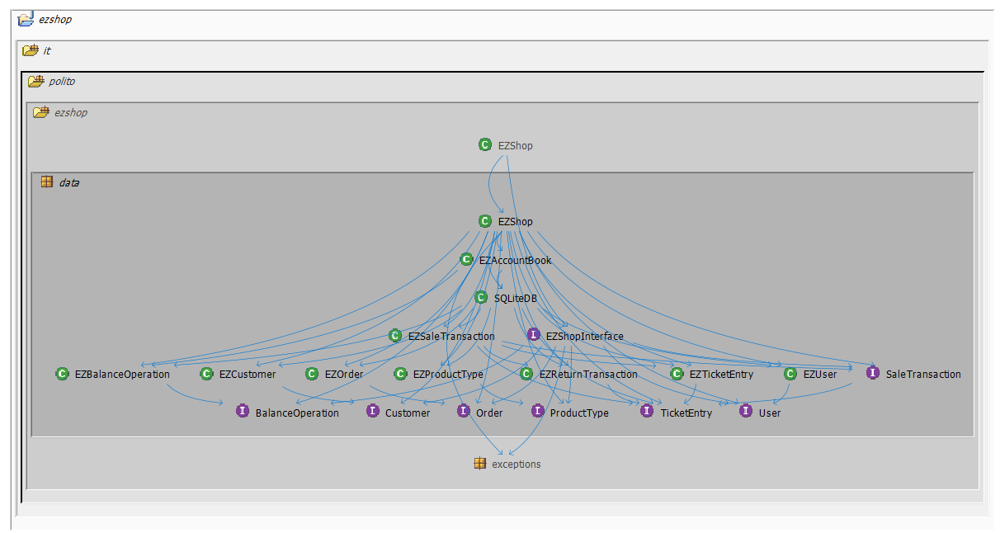
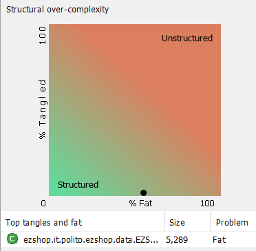
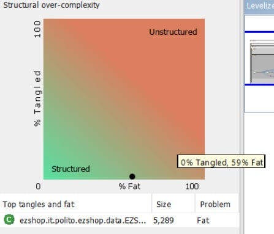
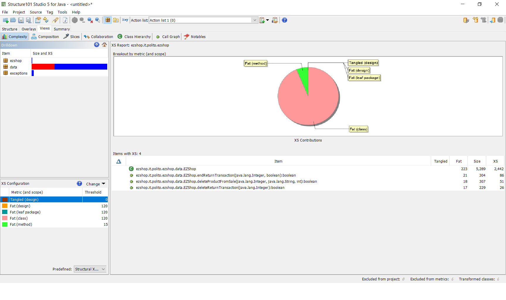

# Design assessment


```
<The goal of this document is to analyse the structure of your project, compare it with the design delivered
on April 30, discuss whether the design could be improved>
```

# Levelized structure map
```
<Applying Structure 101 to your project, version to be delivered on june 4, produce the Levelized structure map,
with all elements explosed, all dependencies, NO tangles; and report it here as a picture>
```


# Structural over complexity chart
```
<Applying Structure 101 to your project, version to be delivered on june 4, produce the structural over complexity chart; and report it here as a picture>
```



# Size metrics

```
<Report here the metrics about the size of your project, collected using Structure 101>
```


| Metric                                    | Measure     |
| ----------------------------------------- | ----------- |
| Packages                                  |    5        |
| Classes (outer)                           |    39       |
| Classes (all)                             |    39       |
| NI (number of bytecode instructions)      |    8986     |
| LOC (non comment non blank lines of code) |   ~ 3864    |


# Items with XS

```
<Report here information about code tangles and fat packages>
```

| Item | Tangled | Fat  | Size | XS   |
| ---- | ------- | ---- | ---- | ---- |
|  ezshop.it.polito.ezshop.data.EZShop                                                                          |-|223|5289|2442|
|  ezshop.it.polito.ezshop.data.EZShop.endReturnTransaction(java.lang.Integer, boolean):boolean                 |-|21 |304 |86  |
|  ezshop.it.polito.ezshop.data.EZShop.deleteProductFromSale(java.lang.Integer, java.lang.String, int):boolean  |-|18 |307 |51  |
|  ezshop.it.polito.ezshop.data.EZShop.deleteReturnTransaction(java.lang.Integer):boolean                       |-|17 |229 |26  |


# Package level tangles

```
<Report screen captures of the package-level tangles by opening the items in the "composition perspective" 
(double click on the tangle from the Views->Complexity page)>
```



Since classes and interfaces are in the same package, there are no package-level tangles.

# Summary analysis
```
<Discuss here main differences of the current structure of your project vs the design delivered on April 30>
<Discuss if the current structure shows weaknesses that should be fixed>
```

Differences:
* Removed BalanceOpType Enum
* Removed LoyaltyCard class
* We did not consider DB's class in first design

Weaknesses:
* Code readability
* Complex code maintainability

These weaknesses are due to the fatness of EZShop class and the methods endReturnTransaction, deleteProductFromSale and deleteReturnTransaction.

