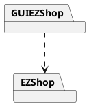
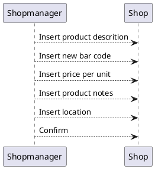

# Design Document 


Authors: 

Date:

Version:


# Contents

- [High level design](#package-diagram)
- [Low level design](#class-diagram)
- [Verification traceability matrix](#verification-traceability-matrix)
- [Verification sequence diagrams](#verification-sequence-diagrams)

# Instructions

The design must satisfy the Official Requirements document, notably functional and non functional requirements

# High level design 

<discuss architectural styles used, if any>
<report package diagram>



GUIEZShop contains view and controller, while EZShop contains model and logic. The architetural pattern choosed is MVC.

# Low level design

<for each package, report class diagram>

```plantuml
@startuml
left to right direction

:Administrator: --> ShopManager

class Shop{
    +createNewProduct()
    +createCustomerRecord()
    +createOrder()
    +startSaleTransaction()
}

class UserAccount{
    +username
    +password
    +privilege
    +getUsername()
    +getPassword()
}

Shop -- "*" UserAccount

class AccountBook 
AccountBook - Shop
class FinancialTransaction {
 +description
 +amount
 +date
}
AccountBook -- "*" FinancialTransaction

class Credit 
class Debit

Credit --|> FinancialTransaction
Debit --|> FinancialTransaction

class Order
class Sale
class Return

Order --|> Debit
Sale --|> Credit
Return --|> Debit


class ProductType{
    +barCode
    +description
    +sellPrice
    +quantity
    +discountRate
    +notes
}

Shop - "*" ProductType

class SaleTransaction {
    +ID 
    +date
    +time
    +cost
    +paymentType
    +discount rate
}
SaleTransaction - "*" ProductType

class Quantity {
    +quantity
}
(SaleTransaction, ProductType)  .. Quantity

class LoyaltyCard {
    +ID
    +points
}

class Customer {
    +name
    +surname
}

LoyaltyCard "0..1" - Customer

SaleTransaction "*" -- "0..1" LoyaltyCard

class Product {
    
}

class Position {
    +aisleID
    +rackID
    +levelID
}

ProductType - "0..1" Position

ProductType -- "*" Product : describes

class Order {
  +supplier
  +pricePerUnit
  +quantity
  +status
}

Order "*" - ProductType

class ReturnTransaction {
  +quantity
  +returnedValue
}

ReturnTransaction "*" - SaleTransaction
ReturnTransaction "*" - ProductType

note "ID is a number on 10 digits " as N1  
N1 .. LoyaltyCard
note "bar code is a number on 12 to 14  digits, compliant to GTIN specifications, see  https://www.gs1.org/services/how-calculate-check-digit-manually " as N2  
N2 .. ProductType
note "ID is a unique identifier of a transaction,  printed on the receipt (ticket number) " as N3
N3 .. SaleTransaction
@enduml
```


# Verification traceability matrix

\<for each functional requirement from the requirement document, list which classes concur to implement it>


# Verification sequence diagrams 
\<select key scenarios from the requirement document. For each of them define a sequence diagram showing that the scenario can be implemented by the classes and methods in the design>

