# Design Document 

Authors:

- Mattia Lisciandrello s286329
- Christian Casalini s281823
- Palmucci Leonardo s288126
- Dario Lanfranco s287524

Date: 18/05/2021

| Version | Changes |
| ------- |---------|
| 1 | Added first version of design document. |
| 2 | Added functions in Shop |
| 3 | Added sequence diagrams |
| 4 | Added sequence diagrams for UC9, fixed the class diagram along with the new requirements |
| 5 | Updated class diagram |
| 6 | Fixed some sequence diagrams, added method to AccountBook |
| 7 | Modified use case diagrams, class diagram and verification matrix |
| 8 | Last fixes. Final version |
| 9 | Post-coding fixes|

# Contents

- [High level design](#high-level-design)
- [Low level design](#low-level-design)
- [Verification traceability matrix](#verification-traceability-matrix)
- [Verification sequence diagrams](#verification-sequence-diagrams)

# Instructions

The design must satisfy the Official Requirements document, notably functional and non functional requirements

# High level design 

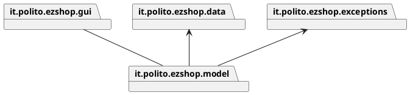

it.polito.ezshop.gui contains view and controller. The architetural pattern choosed is MVC+3 tier. 

it.polito.ezshop.exceptions contains the exceptions used in the API.


# Low level design

## EZShop Class Diagram

The packages are related in this way:

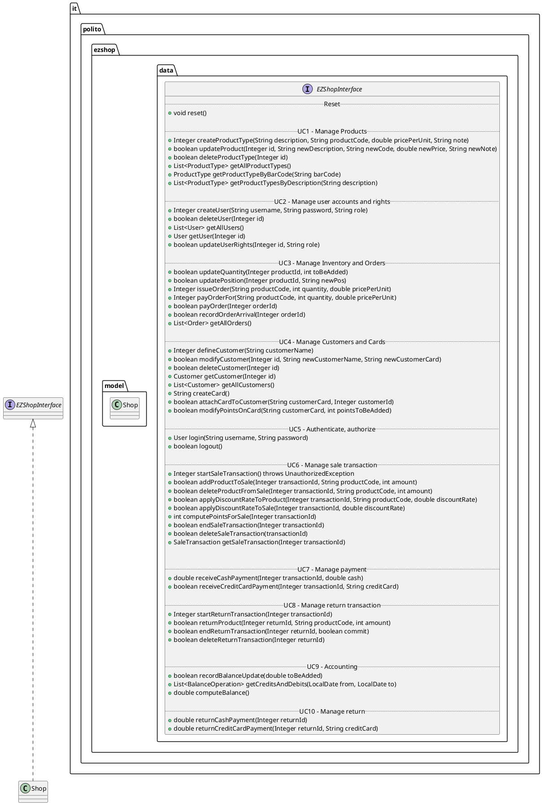

The model contains the following classes, which are persistent:

```plantuml
@startuml
package it.polito.ezshop.model{
class Shop{
    +shopDB: SQLiteDB
    +currUser: User
    +accountingBook: AccountBook
    +loadDataFromDB(void)
    +clearData(void)
    +isValidPosition(String position)
    +isValidCard(String card)
    +getSaleTransactionById(Integer saleNumber)
    +getReturnTransactionById(Integer returnId)
    +isValidCreditCard(String creditCard)
    +getCreditInTXTbyCardNumber(String cardNumber)
    +updateCreditInTXTbyCardNumber(String cardNumber, double toBeAdded)
}

Class SQLiteDB {
    +connect(void)
    +isConnected(void)
    +closeConnection(void)
    +createNewDatabase(void)
    +initDatabase(void)
    +clearDatabase(void)
    +clearTable(String tableName)
    +lastInsertRowId(void)
    +createCustomersTable(void)
    +selectAllCustomers(void)
    +insertCustomer(String customerName, String customerCard)
    +deleteCustomer(Integer id)
    +updateCustomer(Integer customerId, String customerName, String customerCard)
    +createBalanceOperationsTable(void)
    +selectAllBalanceOperations(void)
    +insertBalanceOperation(LocalDate date, double money, String type)
    +deleteBalanceOperation(Integer id)
    +updateBalanceOperation(Integer id, LocalDate date, double money, String type)
    +selectTotalBalance(void)
    +createOrdersTable(void)
    +selectAllOrders(void)
    +insertOrder(Integer balanceId, String productCode, double pricePerUnit, int quantity, String status)
    +updateOrder(Integer id, Integer balanceId, String productCode, double pricePerUnit, int quantity, String status)
    +createUsersTable(void)
    +selectAllUsers(void)
    +insertUser(String userName, String password, String role)
    +deleteUser(Integer id)
    +updateUser(Integer id, String userName, String password, String role)
    +createCardsTable(void)
    +selectAllCards(void)
    +insertCard(Integer points)
    +deleteCard(String cardCode)
    +updateCard(String cardCode, Integer points)
    +createProductTypesTable(void)
    +selectAllProductTypes(void)
    +insertProductType(Integer quantity, String location, String note, String productDescription, String barCode, double pricePerUnit)
    +deleteProductType(Integer id)
    +updateProductType(Integer id, Integer quantity, String location, String note, String productDescription, String barCode, double pricePerUnit)
    +createTransactionsTable(void)
    +selectAllSaleTransactions(void)
    +selectAllReturnTransactions(void)
    +insertSaleTransaction(List<TicketEntry> entries, double discountRate, double price, String status)
    +insertReturnTransaction(List<TicketEntry> entries, int saleID, double price, String status)
    +deleteTransaction(Integer transactionID)
    +updateSaleTransaction(Integer transactionID, double discountRate, double price, String status)
    +updateReturnTransaction(Integer transactionID, int saleID, double price, String status)
    +createProductsPerSaleTable(void)
    +insertProductPerSale(String barCode, Integer transactionID, int amount, double discountRate)
    +deleteProductPerSale(String barCode, Integer transactionID)
    +deleteAllProductsPerSale(Integer transactionID)
    +updateProductPerSale(String barCode, Integer transactionID, int amount, double discountRate)
}
Shop -- SQLiteDB

class ProductType{
    +productID: Integer
    +barCode: String
    +location: String
    +description: String
    +pricePerUnit: double
    +quantity: int
    +discountRate: float
    +notes: String
    +editQuantity(int toBeAdded)
}

class User{
    +userID: Integer
    +username: String
    +password: String
    +role: UserRoleEnum
    +hasRequiredRole(String ...requiredRoles)
}

Enum UserRoleEnum {
    Cashier
    ShopManager
    Administrator
}

User -[hidden]-> UserRoleEnum

Shop -- "*" User

class AccountBook {
 +currentBalance: double
 +nextBalanceId: int
 +boolean addBalanceOperation(Integer transactionID)
 +boolean updateBalance(double toBeAdded)
 }
AccountBook -down- Shop
class BalanceOperation {
 +balanceId: int
 +date: LocalDate 
 +money: double
 +type: String
}
AccountBook -up- "*" BalanceOperation

Enum BalanceOpTypeEnum {
    Credit
    Debit
}

BalanceOperation -[hidden]-> BalanceOpTypeEnum

Order -- BalanceOperation
SaleTransaction -- BalanceOperation
ReturnTransaction -- BalanceOperation



Shop -down- "*" ProductType

class SaleTransaction {
    +ticketNumber: Integer
    +time: LocalDate
    +paymentType: String
    +discountRate: double
    +price: double
    +status: String
    +attachedCard: String
    +hasRequiredStatus(String ...requiredStatus)
    +getTicketEntryByBarCode(String barCode)
    +updatePrice(double toBeAdded)
}
SaleTransaction - "*" ProductType

class TicketEntry {
    +barCode: String
    +productDescription: String
    +amount: int
    +pricePerUnit: double
    +discountRate: double
}
SaleTransaction -up-"*" TicketEntry
ReturnTransaction -up-"*" TicketEntry

class Customer {
    +id: Integer
    +customerName: String
    +customerCard: String
    +points: Integer
}


class Order {
  +orderId: Integer  
  +balanceId: Integer
  +productCode: String
  +pricePerUnit: double
  +quantity: int
  +status: OrderStatusEnum
}

Order "*" - ProductType

Enum OrderStatusEnum {
    Issued
    Payed
    Completed
}

Order -[hidden]-> OrderStatusEnum


class ReturnTransaction {
  +returnId: Integer  
  +quantity: int
  +returnedValue: double
  +saleTransactionId: Integer
  +status: String
}

Shop -down- "*" Customer

ReturnTransaction "*" - SaleTransaction
ReturnTransaction "*" - ProductType

note "bar code is a number on 12 to \n14 digits, compliant to GTIN \nspecifications, see https://www.gs1\n.org/services/how-calculate-check\n-digit-manually " as N2  
N2 .. ProductType
note "ID is a unique identifier of a transaction, \nprinted on the receipt (ticket number) " as N3
N3 .right. SaleTransaction

note "Map to \nimplement 1..n" as N6
note "Map to \nimplement 1..n" as N7
note "Map to \nimplement 1..n" as N8
note "Map to \nimplement 1..n" as N9
note "Map to \nimplement 1..n" as N10
note "Map to \nimplement 1..n" as N11
note "Map to \nimplement 1..n" as N12
note "Map to \nimplement 1..n" as N13
note "Map to \nimplement 1..n" as N14


AccountBook .. N6
N6 .. BalanceOperation
Shop .. N7
N7 .. Customer
N8 .. SaleTransaction
ProductType .. N9
N9 .. Shop
Shop .. N10
N10 .. User
Shop .. N11
SaleTransaction .. N12
N12 .. ReturnTransaction
TicketEntry .. N13
N13 .. SaleTransaction
TicketEntry .. N14
N14 .. ReturnTransaction
}
@enduml
```


# Verification traceability matrix

| FR ID | Shop | User | Administrator | Order | ProductType | SaleTransaction | Customer | ReturnTransaction | AccountBook | Balance Operation |
|:-------:|:------:|:------:|:---------------:|:-------:|:-------------:|:----------:|:-----------------:|:-------------:|:----------:|:-------------------:|:-------------:|-------------------:|
| FR1   | X    | X    | X             |       |             |                 |          |                   |             |                   |
| FR3   | X    | X    | X             |       | X           |                 |          |                   |             |                   |
| FR4   | X    | X    | X             | X     | X           |                 |          |                   | X           | X                 |
| FR5   | X    | X    | X             |       |             |                 | X        |                   |             |                   |
| FR6   | X    | X    | X             |       | X           | X               |          | X                 | X           | X                 |
| FR7   | X    | X    | X             |       |             | X               |          | X                 | X           | X                 |
| FR8   | X    | X    | X             |       |             | X               |          |        X          | X           | X                 |

# Verification sequence diagrams 

The User will communicate with the GUI, which will invoke Shop's methods (instead of making the User communicate with the Shop directly).

## UC1 

### Scenario 1-1

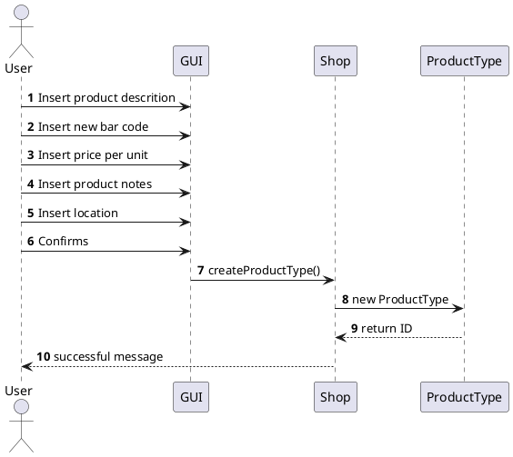

### Scenario 1-2

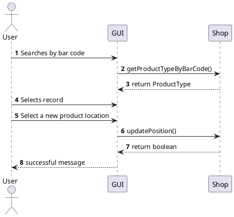


## UC2 
### Scenario 2-1
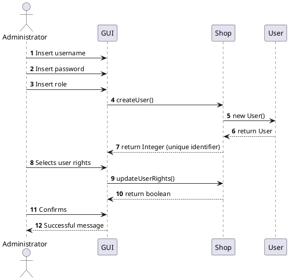


### Scenario 2-2
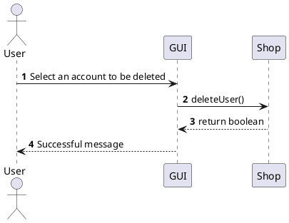


### Scenario 2-3
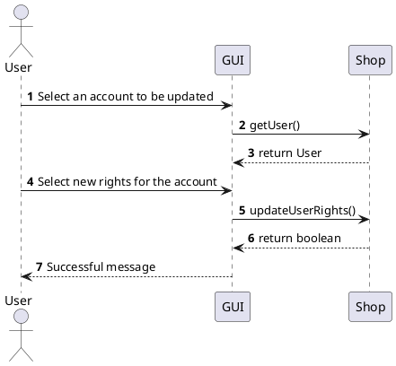


#
## UC3
### Scenario 3-1
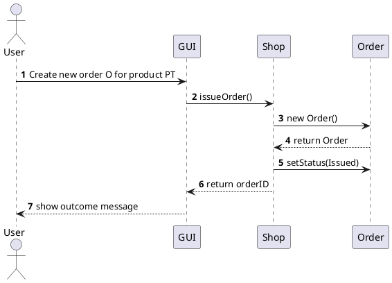

### Scenario 3-2
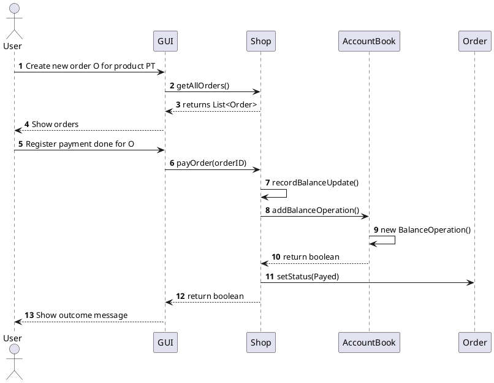

#
## UC4
### Scenario 4-1
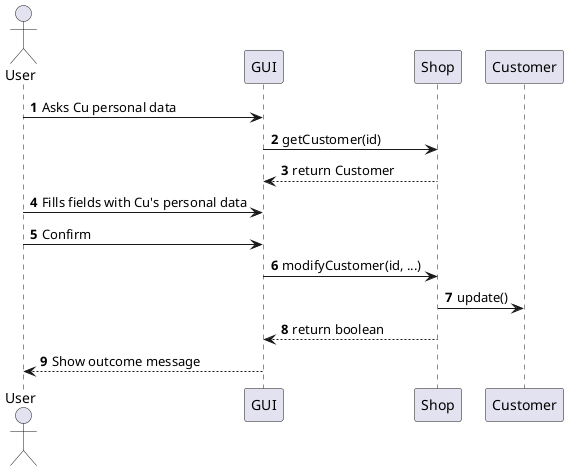

### Scenario 4-2
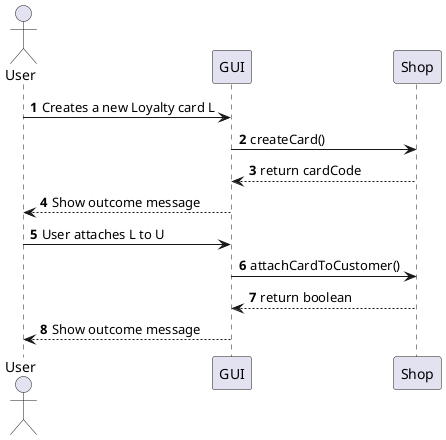

### Scenario 4-3
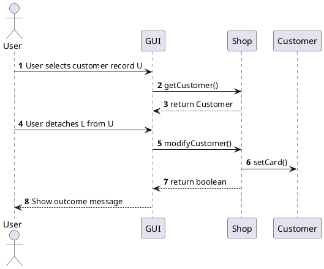


## UC5 

### Scenario 5-1

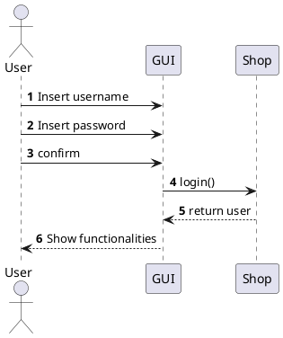

### Scenario 5-2

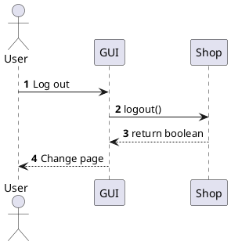

## UC6 

### Scenario 6-1

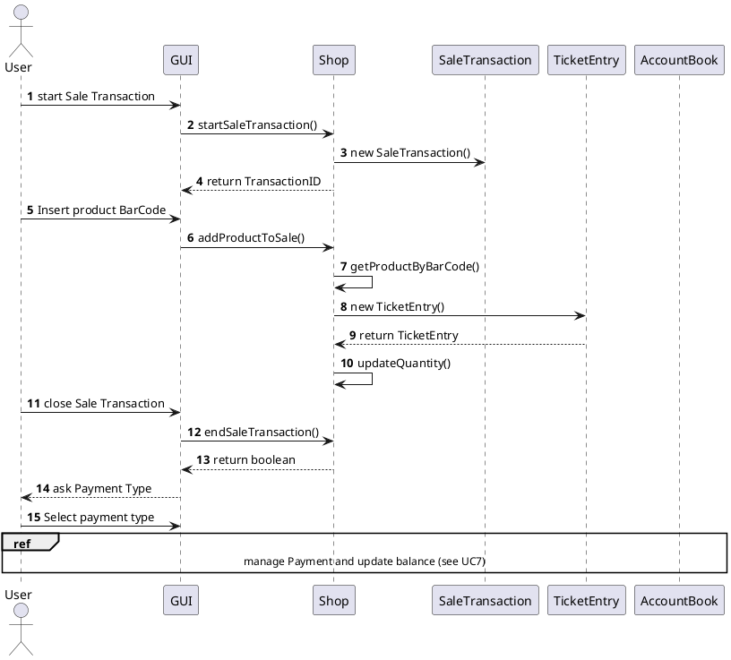

### Scenario 6-3

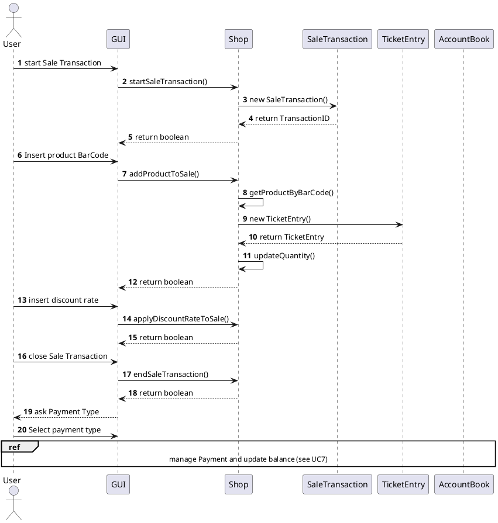

## UC7

### Scenario 7-1

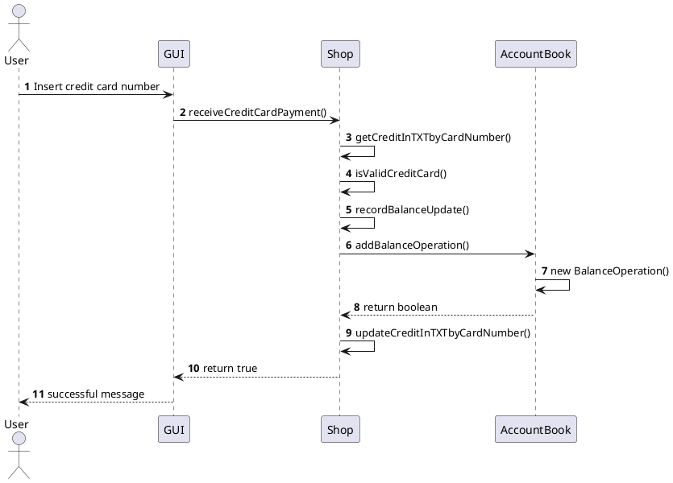

### Scenario 7-4

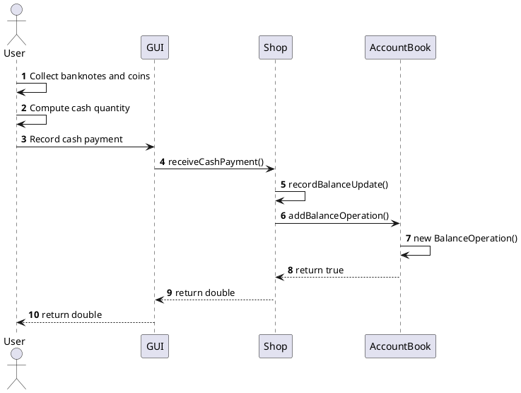

## UC8

### Scenario 8-1

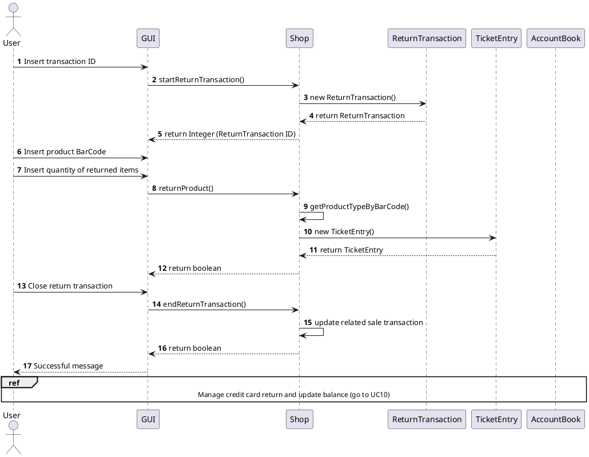

## UC9

### Scenario 9-1

```plantuml
@startuml
Actor User
autonumber
User -> GUI: Selects a start date
User -> GUI: Selects an end date
User -> GUI: Send transaction list request
GUI -> Shop: getCreditsAndDebits()
Shop --> GUI: return transactions list
GUI --> User: display list
@enduml
```

## UC10 

### Scenario 10-1

```plantuml
@startuml
Actor User
autonumber
User -> GUI: Insert credit card number
GUI -> Shop: returnCreditCardPayment()
Shop -> Shop: getCreditInTXTbyCardNumber()
Shop -> Shop: isValidCreditCard()
Shop -> Shop: recordBalanceUpdate()
Shop -> AccountBook: addBalanceOperation()
AccountBook -> AccountBook: new BalanceOperation()
AccountBook --> Shop: return boolean
Shop -> Shop: updateCreditInTXTbyCardNumber()
Shop --> GUI: Amount returned
GUI --> User: Successful message
@enduml
```

### Scenario 10-2

```plantuml
@startuml
Actor User
autonumber
User -> User: Collect banconotes and coins
User -> GUI: Record cash return
GUI -> Shop: returnCashPayment()
Shop -> Shop: recordBalanceUpdate()
Shop -> AccountBook: addBalanceOperation()
AccountBook -> AccountBook: new BalanceOperation()
AccountBook --> Shop: return true
Shop --> GUI: Amount returned
GUI --> User: Successful message
@enduml
```

