# Design Document 

Authors:

- Mattia Lisciandrello s286329
- Christian Casalini s281823
- Palmucci Leonardo s288126
- Dario Lanfranco s287524

Date: 25/04/2021

| Version | Changes |
| ------- |---------|
| 1 | Added first version of design document. |
| 2 | Added functions in Shop | 
| 3 | Added sequence diagrams |
| 4 | Added sequence diagrams for UC9, fixed the class diagram along with the new requirements |

# Contents

- [High level design](#package-diagram)
- [Low level design](#class-diagram)
- [Verification traceability matrix](#verification-traceability-matrix)
- [Verification sequence diagrams](#verification-sequence-diagrams)

# Instructions

The design must satisfy the Official Requirements document, notably functional and non functional requirements

# High level design 

<discuss architectural styles used, if any>
<report package diagram>

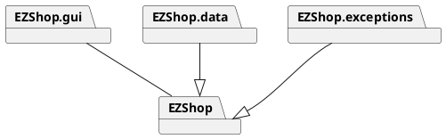

EZShop.gui contains view and controller, while EZShop contains model and logic. The architetural pattern choosed is MVC.

# Low level design

## EZShop Class Diagram

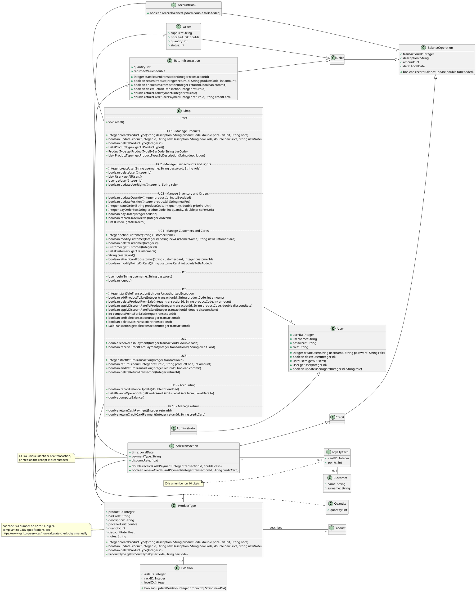

# Verification traceability matrix

\<for each functional requirement from the requirement document, list which classes concur to implement it>

!!! Useful link:    https://www.tablesgenerator.com/markdown_tables# 

| FR ID | Shop | User | Administrator | Order | ProductType | Product | Position | SaleTransaction | Quantity | LoyaltyCard | Customer | ReturnTransaction | AccountingBook | FinancialTransaction | Credit | Debit | 
|:-----:|:----:|:-----------:|:-------------:|:-----:|:-----------:|:-------:|:--------:|:---------------:|:--------:|:-----------:|:--------:|:-----------------:|:-----------:|:--------------------:|:------:|:-----:|
|  FR1  |   X  |      X      |       X       |       |             |         |          |                 |          |             |          |                   |             |                      |        |       |
|  FR3  |   X  |             |               |       |             |         |          |                 |          |             |          |                   |             |                      |        |       |
|  FR4  |   X  |             |               |       |             |         |          |                 |          |             |          |                   |             |                      |        |       |
|  FR5  |   X  |             |               |       |             |         |          |                 |          |             |          |                   |             |                      |        |       |
|  FR6  |   X  |      X      |       X       |       |      X      |         |          |                 |          |             |          |         X         |      X      |                      |        |       |
|  FR7  |   X  |      X      |       X       |       |      X      |         |          |                 |          |             |          |         X         |      X      |                      |        |       |
|  FR8  |   X  |      X      |       X       |       |             |         |          |                 |          |             |          |                   |      X      |           X          |    X   |   X   |

# Verification sequence diagrams 
\<select key scenarios from the requirement document. For each of them define a sequence diagram showing that the scenario can be implemented by the classes and methods in the design>

## UC1 

### Scenario 1-1

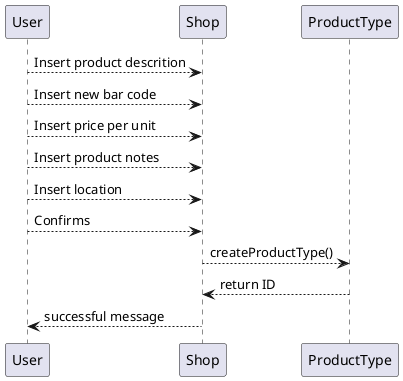

### Scenario 1-2

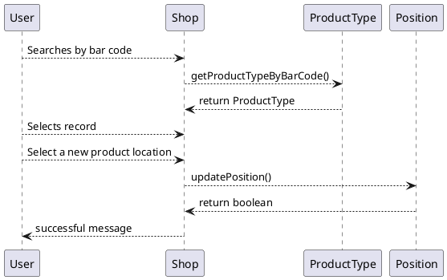

### Scenario 1-3

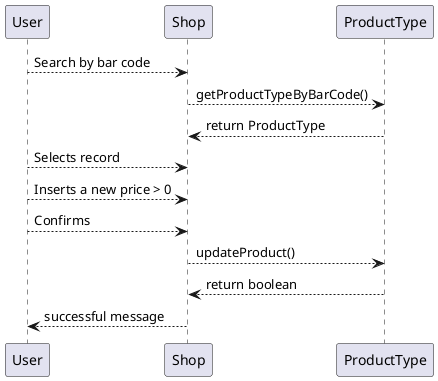

## UC2 
### Scenario 2-1
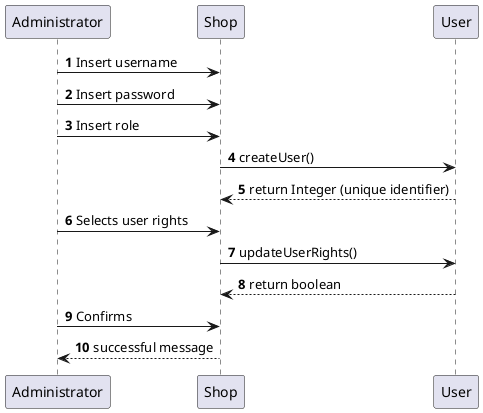

### Scenario 2-2
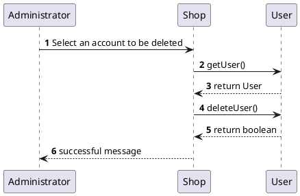

### Scenario 2-3
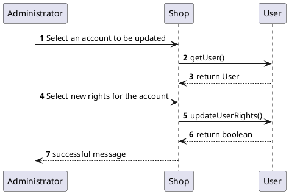

## UC3

## UC4

## UC5 

### Scenario 5-1

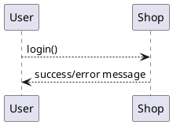

### Scenario 5-2

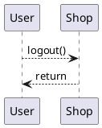

## UC6 

### Scenario 6-1

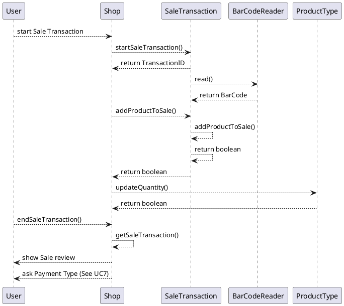

### Scenario 6-4

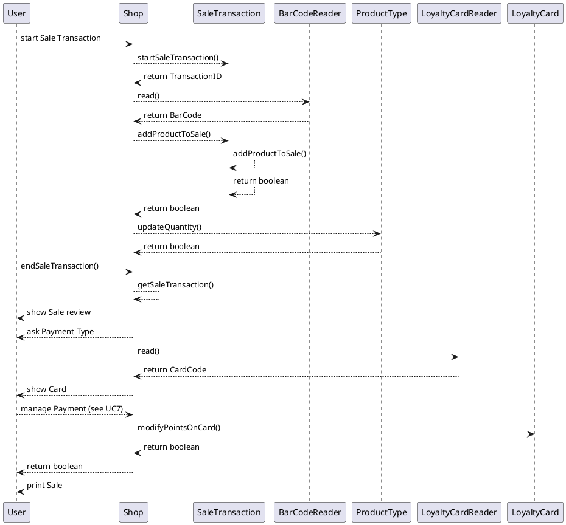

## UC7

### Scenario 7-1

[//]: # "Dubbi su questo scenario e i successivi"

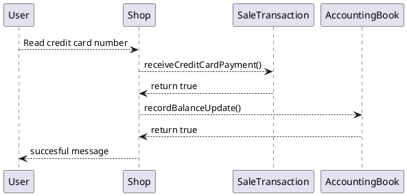

### Scenario 7-4

## UC8

### Scenario 8-1

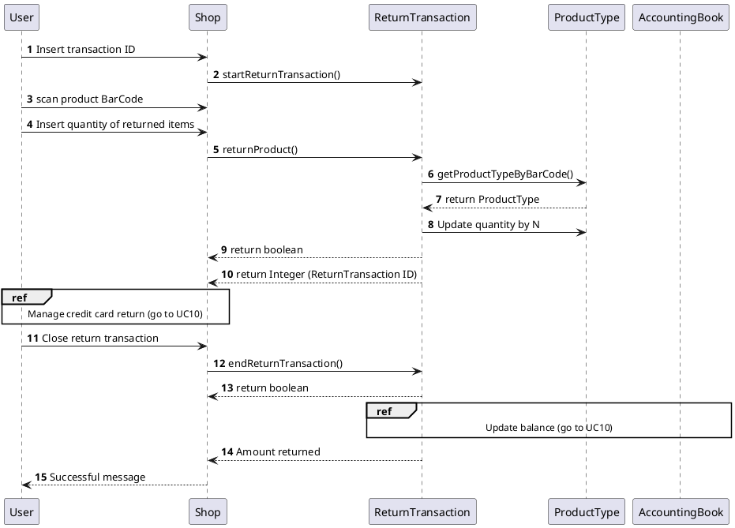

### Scenario 8-2

## UC9

### Scenario 9-1

| Scenario |  List credits and debits |
| ------------- |:-------------:| 
|  Precondition     | Manager C exists and is logged in |
|  Post condition     | Transactions list displayed  |
| Step#        | Description  |
|  1    |  C selects a start date |  
|  2    |  C selects an end date |
|  3    |  C sends transaction list request to the system |
|  4    |  The system returns the transactions list |
|  5    |  The list is displayed  |

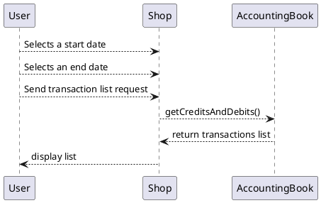

## UC10 

### Scenario 10-1

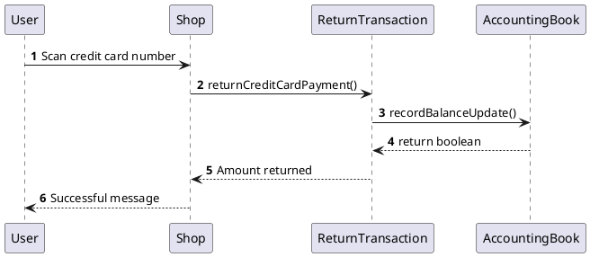

### Scenario 10-2

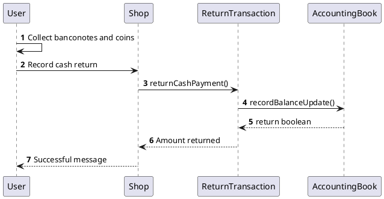

