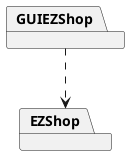
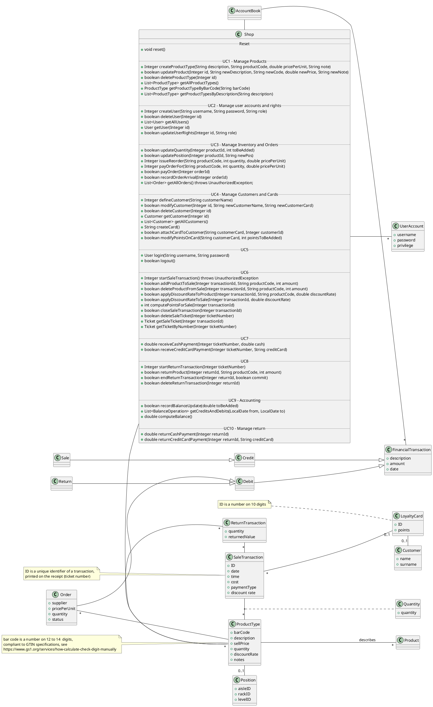
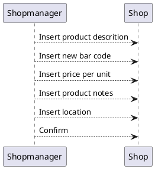

# Design Document 

Authors:

- Mattia Lisciandrello s286329
- Christian Casalini s281823
- Palmucci Leonardo s288126
- Dario Lanfranco s287524

Date: 25/04/2021

| Version | Changes |
| ------- |---------|
| 1 | Added first version of design document. |

# Contents

- [High level design](#package-diagram)
- [Low level design](#class-diagram)
- [Verification traceability matrix](#verification-traceability-matrix)
- [Verification sequence diagrams](#verification-sequence-diagrams)

# Instructions

The design must satisfy the Official Requirements document, notably functional and non functional requirements

# High level design 

<discuss architectural styles used, if any>
<report package diagram>

GUIEZShop contains view and controller, while EZShop contains model and logic. The architetural pattern choosed is MVC.

# Low level design

<for each package, report class diagram>

# Verification traceability matrix

\<for each functional requirement from the requirement document, list which classes concur to implement it>

!!! Useful link:    https://www.tablesgenerator.com/markdown_tables# 

| FR ID | Shop | UserAccount | Administrator | Order | ProductType | Product | Position | SaleTransaction | Quantity | LoyaltyCard | Customer | ReturnTransaction | AccountBook | FinancialTransaction | Credit | Debit | Sale | Return |
|:-----:|:----:|:-----------:|:-------------:|:-----:|:-----------:|:-------:|:--------:|:---------------:|:--------:|:-----------:|:--------:|:-----------------:|:-----------:|:--------------------:|:------:|:-----:|:----:|:------:|
|  FR1  |   X  |      X      |       X       |       |             |         |          |                 |          |             |          |                   |             |                      |        |       |      |        |
|  ---  |      |             |               |       |             |         |          |                 |          |             |          |                   |             |                      |        |       |      |        |
|  FR3  |   X  |             |               |       |             |         |          |                 |          |             |          |                   |             |                      |        |       |      |        |
|  FR4  |   X  |             |               |       |             |         |          |                 |          |             |          |                   |             |                      |        |       |      |        |
|  FR5  |   X  |             |               |       |             |         |          |                 |          |             |          |                   |             |                      |        |       |      |        |
|  FR6  |   X  |      X      |       X       |       |             |         |          |                 |          |             |          |         X         |             |                      |        |       |      |        |
|  FR7  |   X  |      X      |       X       |       |             |         |          |                 |          |             |          |         X         |             |                      |        |       |      |        |
|  FR8  |   X  |      X      |       X       |       |             |         |          |                 |          |             |          |                   |      X      |           X          |    X   |   X   |   X  |    X   |

# Verification sequence diagrams 
\<select key scenarios from the requirement document. For each of them define a sequence diagram showing that the scenario can be implemented by the classes and methods in the design>

