# Design Document 

Authors:

- Mattia Lisciandrello s286329
- Christian Casalini s281823
- Palmucci Leonardo s288126
- Dario Lanfranco s287524

Date: 09/06/2021

| Version | Changes |
| ------- |---------|
| 1  | Added first version of design document. |
| 2  | Added functions in EZShop |
| 3  | Added sequence diagrams |
| 4  | Added sequence diagrams for UC9, fixed the class diagram along with the new requirements |
| 5  | Updated class diagram |
| 6  | Fixed some sequence diagrams, added method to AccountBook |
| 7  | Modified use case diagrams, class diagram and verification matrix |
| 8  | Last fixes. Final version |
| 9  | Post-coding fixes |
| 10 | Post-testing fixes |
| 11 | Updated according to final design |
| 12 | Updated according to the Change Request regarding RFIDs |

# Contents

- [High level design](#high-level-design)
- [Low level design](#low-level-design)
- [Verification traceability matrix](#verification-traceability-matrix)
- [Verification sequence diagrams](#verification-sequence-diagrams)

# Instructions

The design must satisfy the Official Requirements document, notably functional and non functional requirements

# High level design 

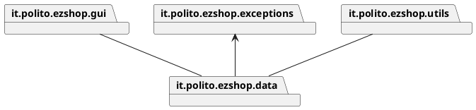

it.polito.ezshop.gui contains view and controller. The architetural pattern choosed is MVC+3 tier. 

it.polito.ezshop.exceptions contains the exceptions used in the API.


# Low level design

## EZShop Class Diagram

The packages are related in this way:

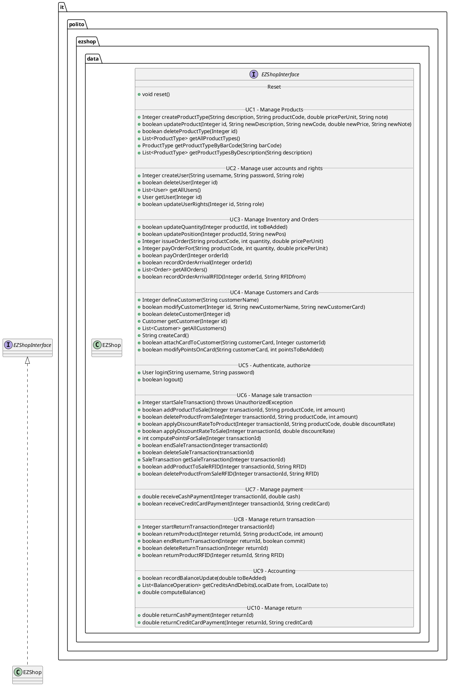
<br/><br/>
The data package contains the following persistent classes.<br/>

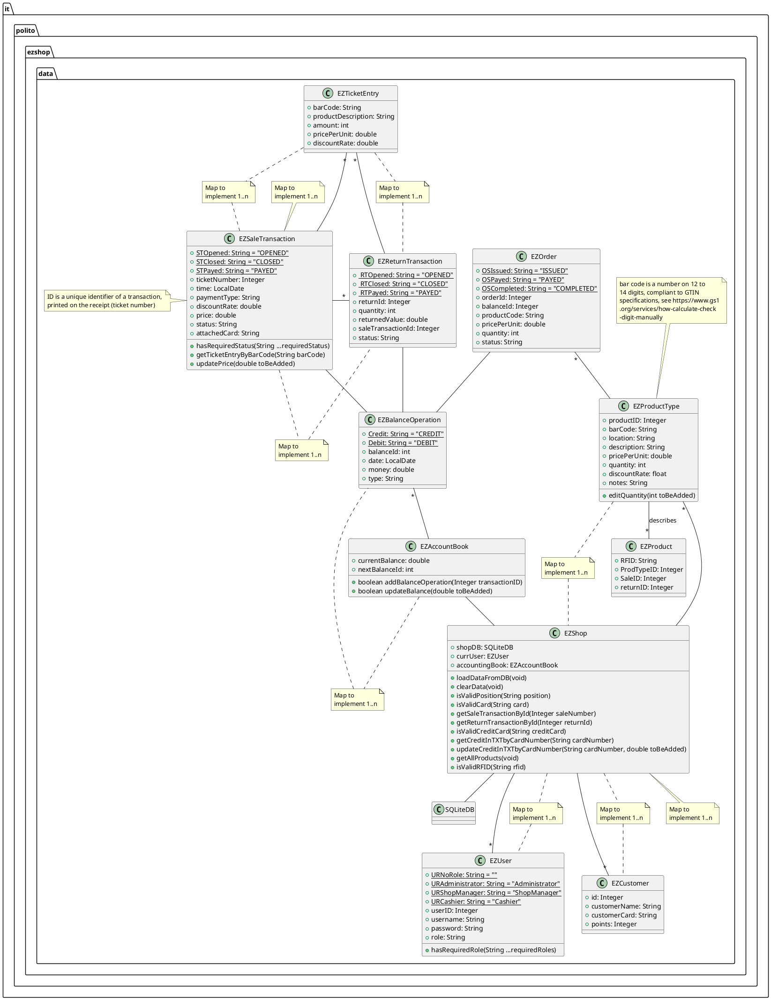
In order to have a readable diagram, we chose not to include the following Interfaces:
* BalanceOperation
* Customer
* Order
* ProductType
* SaleTransaction
* TicketEntry
* User
<br/><br/>

SQLite DB class has been separated for diagram's readability:

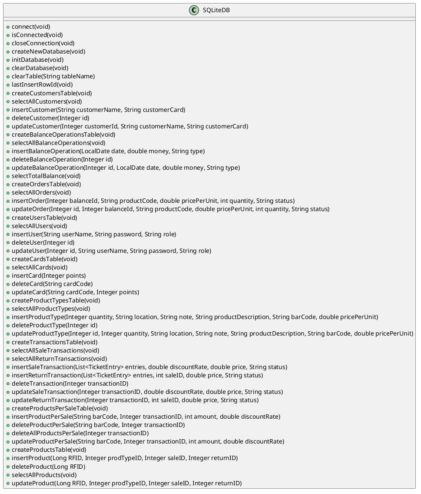

### Scenario 1-2

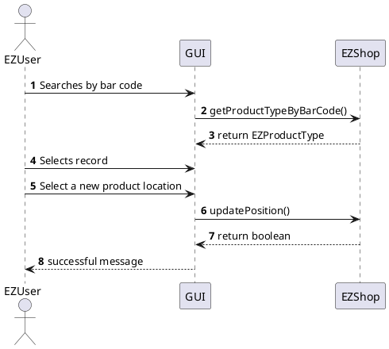


## UC2 
### Scenario 2-1
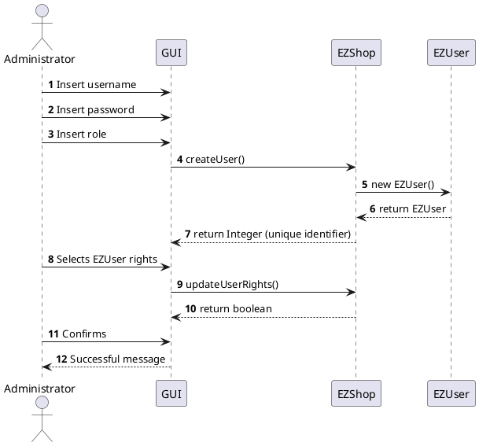


### Scenario 2-2
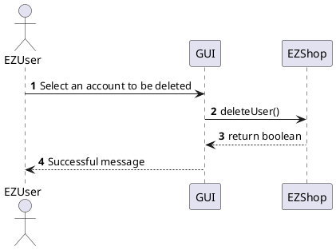


### Scenario 2-3
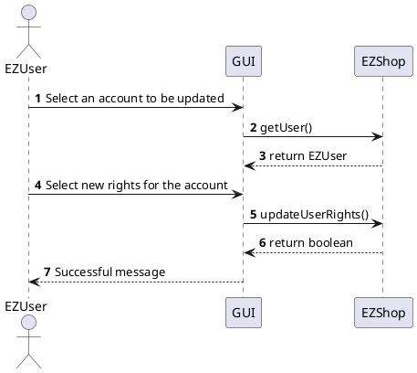


#
## UC3
### Scenario 3-1
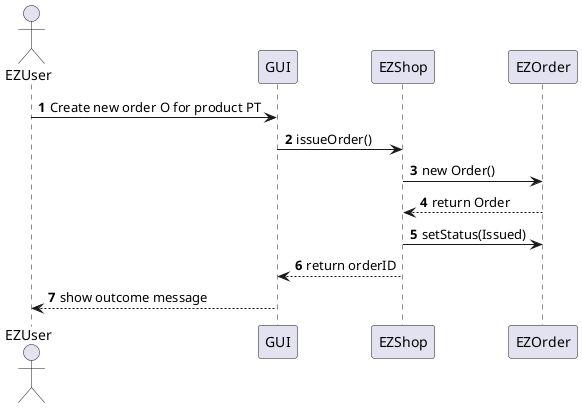

### Scenario 3-2
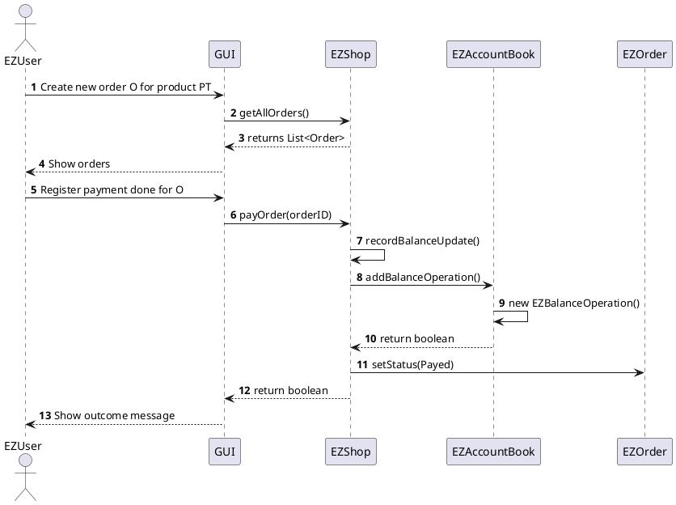

### Scenario 3-5
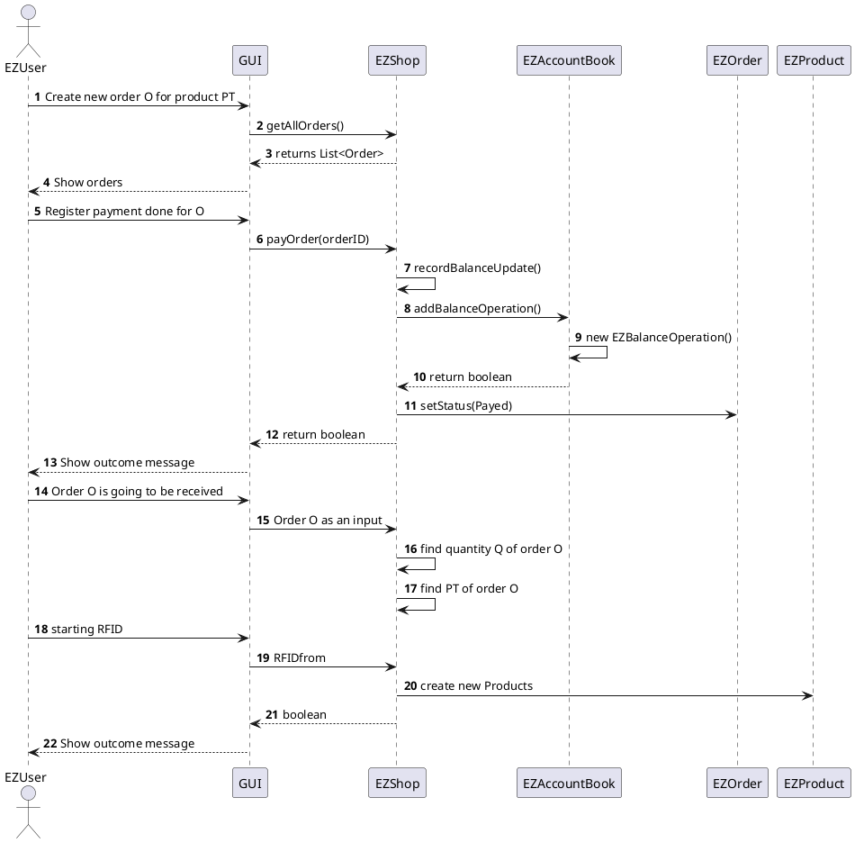

#
## UC4
### Scenario 4-1
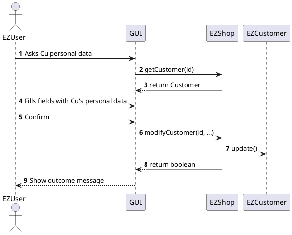

### Scenario 4-2
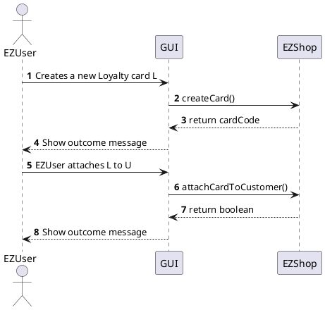

### Scenario 4-3
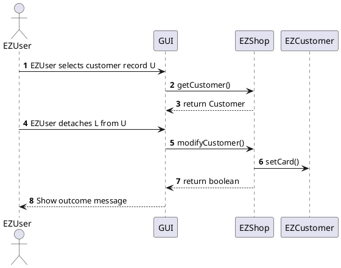


## UC5 

### Scenario 5-1

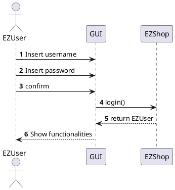

### Scenario 5-2

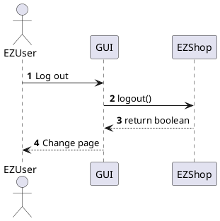

## UC6 

### Scenario 6-1

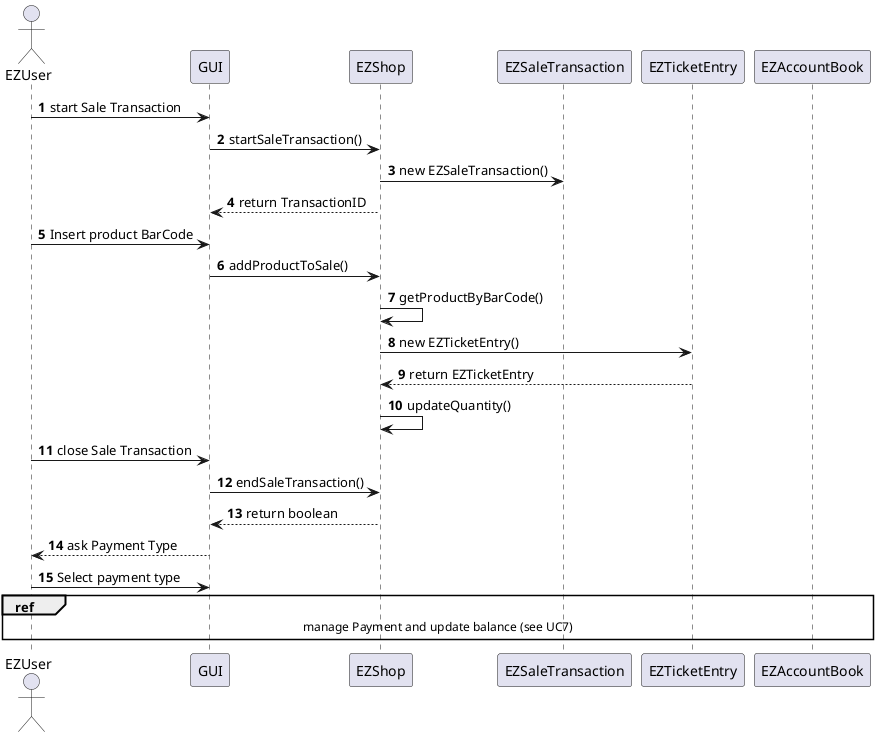

### Scenario 6-3

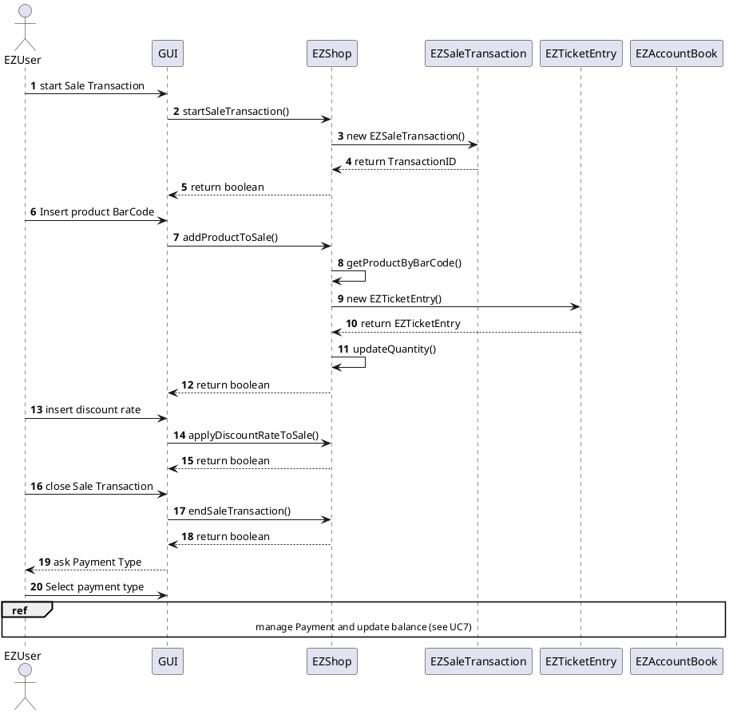

### Scenario 6-8

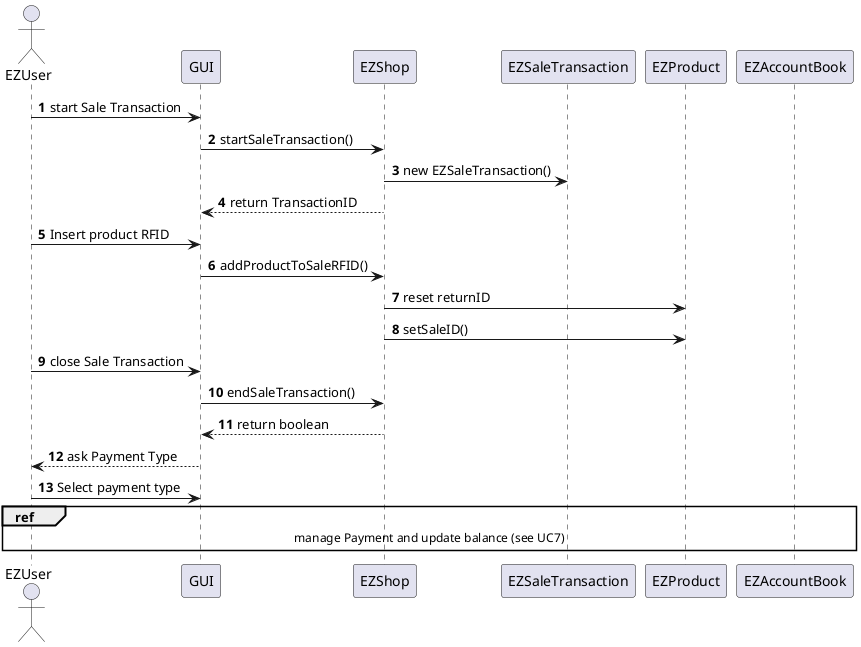

## UC7

### Scenario 7-1

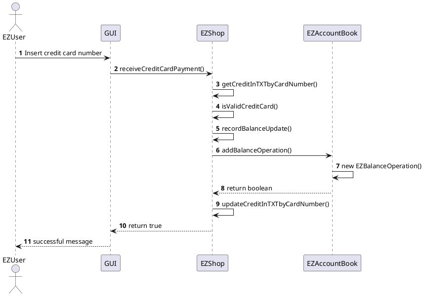

### Scenario 7-4

```plantuml
@startuml
Actor EZUser
autonumber
EZUser -> EZUser: Collect banknotes and coins
EZUser -> EZUser: Compute cash quantity
EZUser -> GUI: Record cash payment
GUI -> EZShop: receiveCashPayment()
EZShop -> EZShop: recordBalanceUpdate()
EZShop -> EZAccountBook: addBalanceOperation()
EZAccountBook -> EZAccountBook: new EZBalanceOperation()
EZAccountBook --> EZShop: return true
EZShop --> GUI: return double
GUI --> EZUser: return double
@enduml
```

## UC8

### Scenario 8-1

```plantuml
@startuml
Actor EZUser
autonumber
EZUser -> GUI: Insert transaction ID
GUI -> EZShop: startReturnTransaction()
EZShop -> EZReturnTransaction: new EZReturnTransaction()
EZReturnTransaction --> EZShop: return EZReturnTransaction
EZShop --> GUI: return Integer (EZReturnTransaction ID)
EZUser -> GUI: Insert product BarCode
EZUser -> GUI: Insert quantity of returned items
GUI -> EZShop: returnProduct()
EZShop -> EZShop: getProductTypeByBarCode()
EZShop -> EZTicketEntry: new EZTicketEntry()
EZTicketEntry --> EZShop: return EZTicketEntry
EZShop --> GUI: return boolean
EZUser -> GUI: Close return transaction
GUI -> EZShop: endReturnTransaction()
EZShop -> EZShop: update related sale transaction
EZShop --> GUI: return boolean
GUI --> EZUser: Successful message
ref over GUI, EZUser, EZShop, EZAccountBook
Manage credit card return and update balance (go to UC10)
end ref
@enduml
```

### Scenario 8-4

```plantuml
@startuml
Actor EZUser
autonumber
EZUser -> GUI: Insert transaction ID
GUI -> EZShop: startReturnTransaction()
EZShop -> EZReturnTransaction: new EZReturnTransaction()
EZReturnTransaction --> EZShop: return EZReturnTransaction
EZShop --> GUI: return Integer (EZReturnTransaction ID)
EZUser -> GUI: Insert product RFID
GUI -> EZShop: returnProductRFID()
EZShop -> EZProduct: setReturnID()
EZShop -> EZProduct: reset saleID
EZShop --> GUI: return boolean
EZUser -> GUI: Close return transaction
GUI -> EZShop: endReturnTransaction()
EZShop -> EZShop: update related sale transaction
EZShop --> GUI: return boolean
GUI --> EZUser: Successful message
ref over GUI, EZUser, EZShop, EZAccountBook
Manage credit card return and update balance (go to UC10)
end ref
@enduml
```

## UC9

### Scenario 9-1

```plantuml
@startuml
Actor EZUser
autonumber
EZUser -> GUI: Selects a start date
EZUser -> GUI: Selects an end date
EZUser -> GUI: Send transaction list request
GUI -> EZShop: getCreditsAndDebits()
EZShop --> GUI: return transactions list
GUI --> EZUser: display list
@enduml
```

## UC10 

### Scenario 10-1

```plantuml
@startuml
Actor EZUser
autonumber
EZUser -> GUI: Insert credit card number
GUI -> EZShop: returnCreditCardPayment()
EZShop -> EZShop: getCreditInTXTbyCardNumber()
EZShop -> EZShop: isValidCreditCard()
EZShop -> EZShop: recordBalanceUpdate()
EZShop -> EZAccountBook: addBalanceOperation()
EZAccountBook -> EZAccountBook: new EZBalanceOperation()
EZAccountBook --> EZShop: return boolean
EZShop -> EZShop: updateCreditInTXTbyCardNumber()
EZShop --> GUI: Amount returned
GUI --> EZUser: Successful message
@enduml
```

### Scenario 10-2

```plantuml
@startuml
Actor EZUser
autonumber
EZUser -> EZUser: Collect banconotes and coins
EZUser -> GUI: Record cash return
GUI -> EZShop: returnCashPayment()
EZShop -> EZShop: recordBalanceUpdate()
EZShop -> EZAccountBook: addBalanceOperation()
EZAccountBook -> EZAccountBook: new EZBalanceOperation()
EZAccountBook --> EZShop: return true
EZShop --> GUI: Amount returned
GUI --> EZUser: Successful message
@enduml
```

