# Design Document 

Authors:

- Mattia Lisciandrello s286329
- Christian Casalini s281823
- Palmucci Leonardo s288126
- Dario Lanfranco s287524

Date: 29/04/2021

| Version | Changes |
| ------- |---------|
| 1 | Added first version of design document. |
| 2 | Added functions in Shop | 
| 3 | Added sequence diagrams |
| 4 | Added sequence diagrams for UC9, fixed the class diagram along with the new requirements |
| 5 | Updated class diagram |
| 6 | Fixed some sequence diagrams, added method to AccountBook |

# Contents

- [High level design](#package-diagram)
- [Low level design](#class-diagram)
- [Verification traceability matrix](#verification-traceability-matrix)
- [Verification sequence diagrams](#verification-sequence-diagrams)

# Instructions

The design must satisfy the Official Requirements document, notably functional and non functional requirements

# High level design 

<discuss architectural styles used, if any>
<report package diagram>

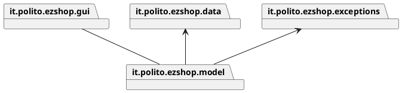

it.polito.ezshop.gui contains view and controller. The architetural pattern choosed is MVC+3 tier. 

it.polito.ezshop.exceptions contains the exceptions used in the API.


# Low level design

## EZShop Class Diagram

The packages are related in this way:

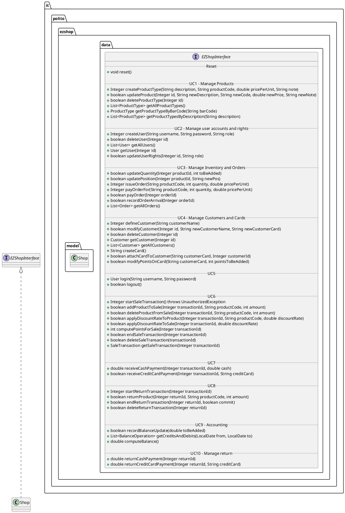

The model contains the following classes, which are persistent:

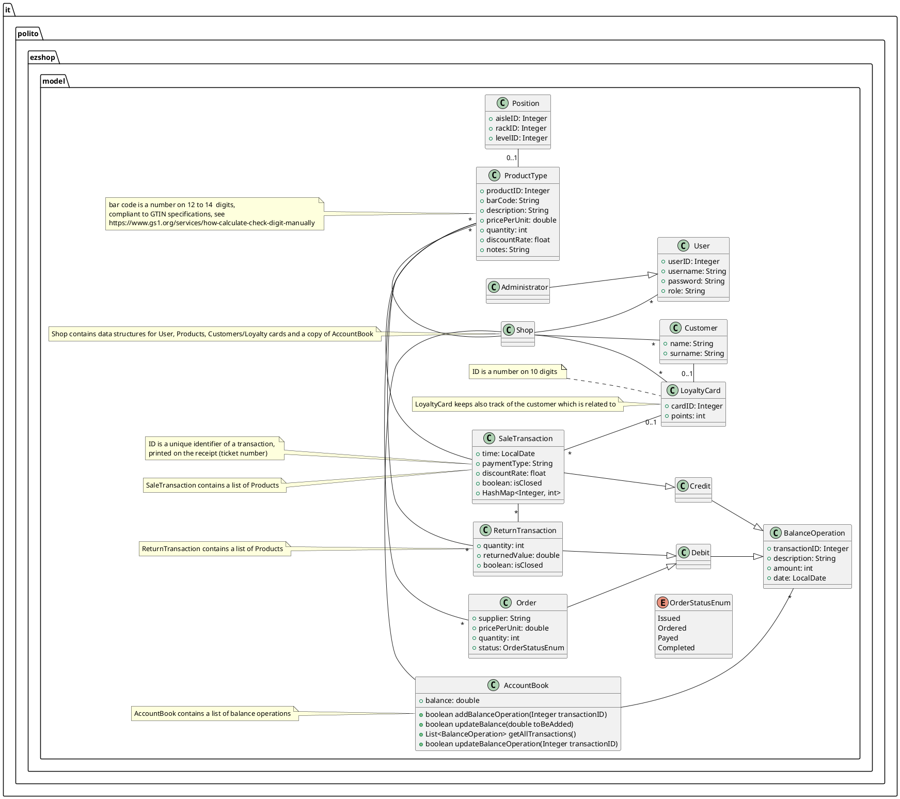


# Verification traceability matrix

\<for each functional requirement from the requirement document, list which classes concur to implement it>


!!! Useful link:    https://www.tablesgenerator.com/markdown_tables# 


| FR ID | Shop | User | Administrator | Order | ProductType | Product | Position | SaleTransaction | Quantity | LoyaltyCard | Customer | ReturnTransaction | AccountBook | FinancialTransaction | Credit | Debit | 
|:-----:|:----:|:-----------:|:-------------:|:-----:|:-----------:|:-------:|:--------:|:---------------:|:--------:|:-----------:|:--------:|:-----------------:|:-----------:|:--------------------:|:------:|:-----:|
|  FR1  |   X  |      X      |       X       |       |             |         |          |                 |          |             |          |                   |             |                      |        |       |
|  FR3  |   X  |             |               |       |             |         |          |                 |          |             |          |                   |             |                      |        |       |
|  FR4  |   X  |             |               |       |             |         |          |                 |          |             |          |                   |             |                      |        |       |
|  FR5  |   X  |             |               |       |             |         |          |                 |          |             |          |                   |             |                      |        |       |
|  FR6  |   X  |      X      |       X       |       |      X      |         |          |        X        |     X    |      X      |          |         X         |      X      |                      |        |       |
|  FR7  |   X  |      X      |       X       |       |             |         |          |                 |          |             |          |                   |      X      |                      |        |       |
|  FR8  |   X  |      X      |       X       |       |             |         |          |                 |          |             |          |                   |      X      |           X          |    X   |   X   |


# Verification sequence diagrams 
\<select key scenarios from the requirement document. For each of them define a sequence diagram showing that the scenario can be implemented by the classes and methods in the design>

The User will communicate with the GUI, which will invoke Shop's methods (instead of making the User communicate with the Shop directly).

## UC1 

### Scenario 1-1

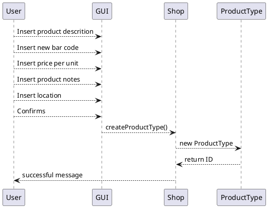

### Scenario 1-2

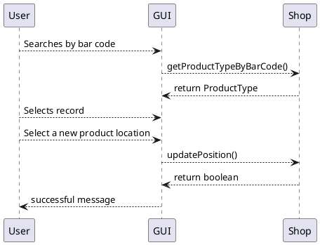


## UC2 
### Scenario 2-1
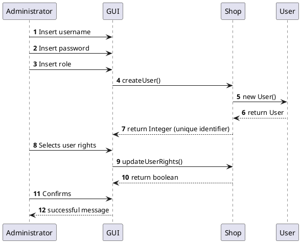


### Scenario 2-2
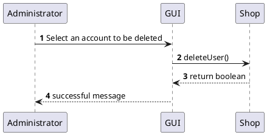


### Scenario 2-3
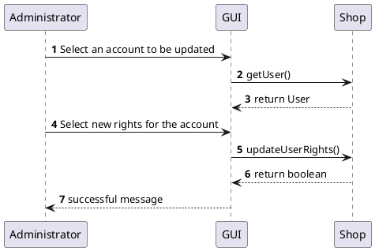


#
## UC3

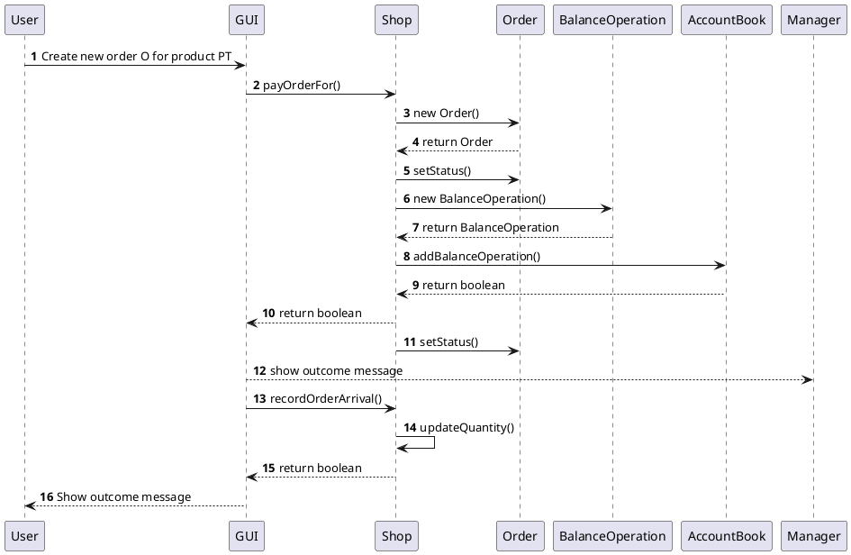

### Scenario 3-1
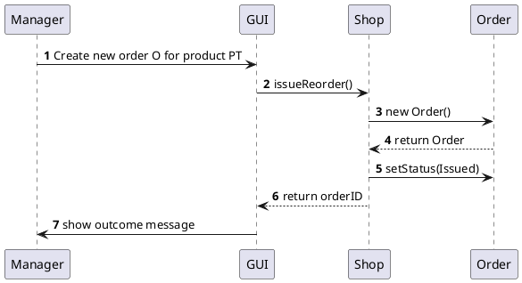

### Scenario 3-2
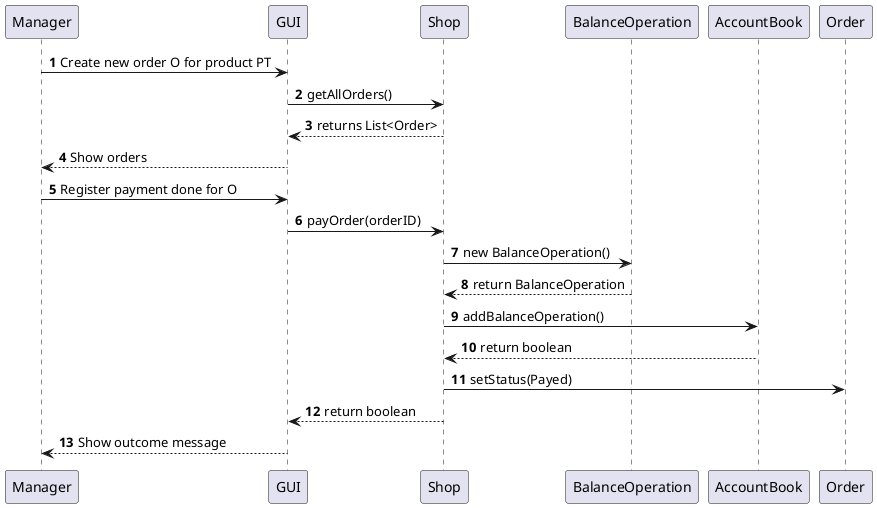

#
## UC4
### Scenario 4-1
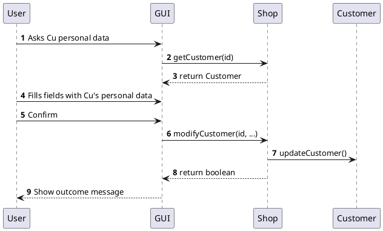

### Scenario 4-2
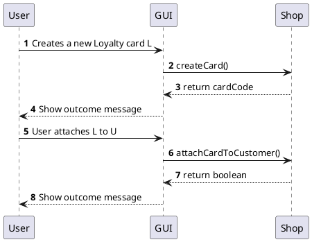

### Scenario 4-3
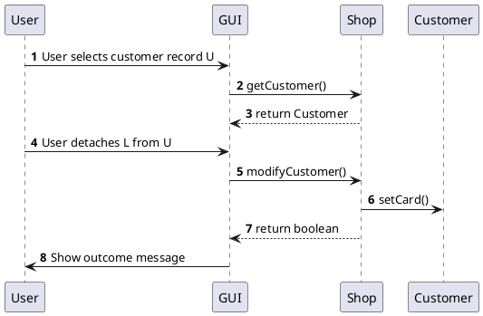


## UC5 

### Scenario 5-1

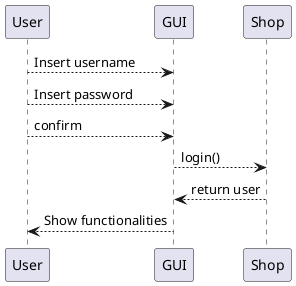

### Scenario 5-2

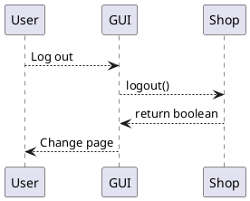

## UC6 

### Scenario 6-1

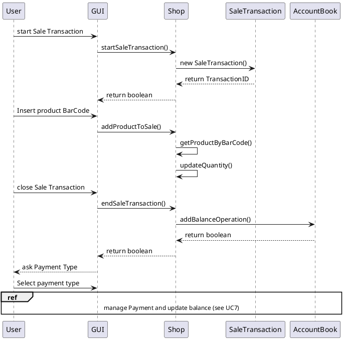

### Scenario 6-3

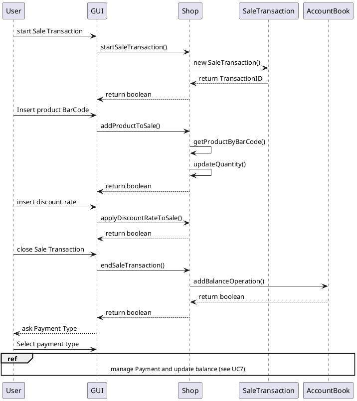


## UC7

### Scenario 7-1

[//]: # "Dubbi su questo scenario e i successivi"

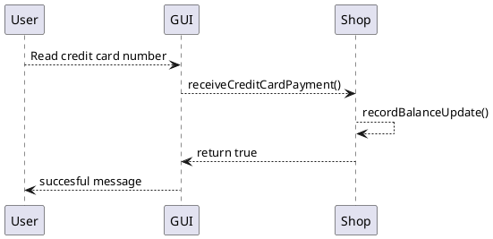

### Scenario 7-4

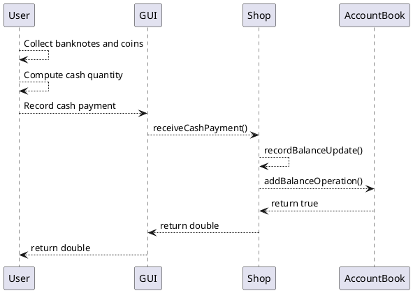

## UC8

### Scenario 8-1

```plantuml
@startuml
autonumber
User -> GUI: Insert transaction ID
GUI -> Shop: startReturnTransaction()
Shop -> ReturnTransaction: new ReturnTransaction()
ReturnTransaction --> Shop: return ReturnTransaction
User -> GUI: Insert product BarCode
User -> GUI: Insert quantity of returned items
GUI -> Shop: returnProduct()
Shop -> Shop: getProductTypeByBarCode()
Shop -> Shop : updateQuantity()
Shop --> GUI: return boolean
Shop --> GUI: return Integer (ReturnTransaction ID)
ref over GUI, User, Shop, AccountBook
Manage credit card return and update balance (go to UC10)
end ref
User -> GUI: Close return transaction
GUI -> Shop: endReturnTransaction()
Shop -> AccountBook: updateBalanceOperation()
AccountBook --> Shop: return boolean
Shop --> GUI: return boolean
GUI --> User: Successful message
@enduml
```

## UC9

### Scenario 9-1


```plantuml
@startuml
User --> GUI: Selects a start date
User --> GUI: Selects an end date
User --> GUI: Send transaction list request
GUI --> Shop: getCreditsAndDebits()
Shop --> AccountBook: getAllTransactions()
AccountBook --> Shop: return transaction list
Shop --> GUI: return transactions list
GUI --> User: display list
@enduml
```

## UC10 

### Scenario 10-1

```plantuml
@startuml
autonumber
User -> GUI: Insert credit card number
GUI -> Shop: returnCreditCardPayment()
Shop --> Shop: recordBalanceUpdate()
Shop -> AccountBook: addBalanceOperation()
AccountBook --> Shop: return boolean
Shop --> GUI: Amount returned
GUI --> User: Successful message
@enduml
```

### Scenario 10-2

```plantuml
@startuml
autonumber
User -> User: Collect banconotes and coins
User -> GUI: Record cash return
GUI -> Shop: returnCashPayment()
Shop --> Shop: recordBalanceUpdate()
Shop -> AccountBook: addBalanceOperation()
AccountBook --> Shop: return boolean
Shop --> GUI: Amount returned
GUI --> User: Successful message
@enduml
```

