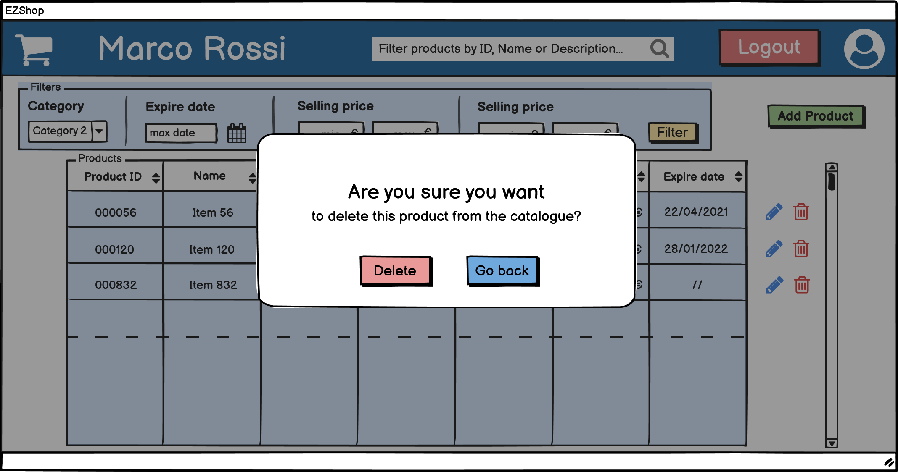
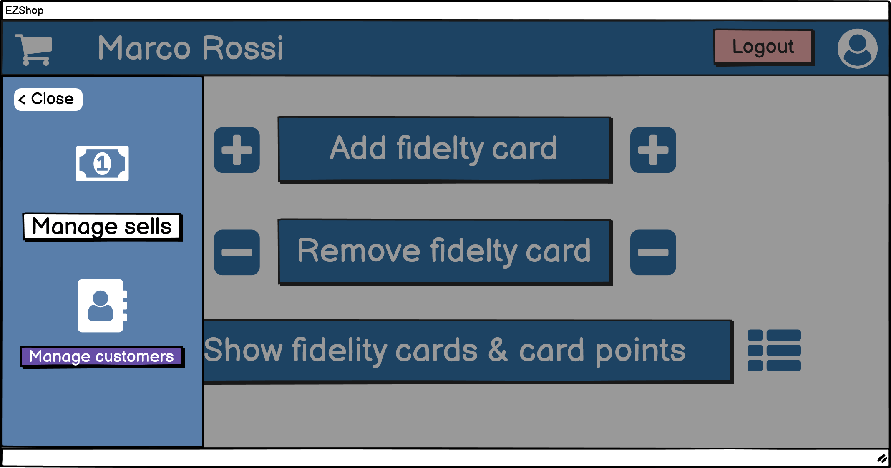
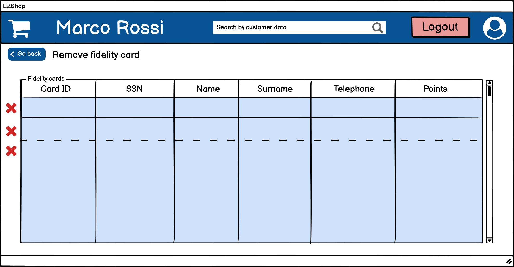

# Graphical User Interface Prototype  

Authors: 
- Mattia Lisciandrello s286329
- Christian Casalini s281823
- Palmucci Leonardo s288126
- Dario Lanfranco s287524 

Date: 16/04/2021

| Version | Changes |
| ------- |---------|
| 1 | Added template|

\<Report here the GUI that you propose. You are free to organize it as you prefer. A suggested presentation matches the Use cases and scenarios defined in the Requirement document. The GUI can be shown as a sequence of graphical files (jpg, png)  >

# Login

# Sales management
## Idle cash

## Provide shopping cart

## Product not recognized

[add others]

# Warehouse management

## Inventory management

### Show products

### Add product to inventory

### Remove product from inventory

### Update product

### Manage Low Stock Threshold

## Manage orders

### Show orders

### Place new order

### Cancel existing order

### Edit existing order

# Catalogue management

## Scenario 17.1 - Show products in the catalogue

## Scenario 14.1 - Update selling price of product

## Scenario 15.1 - Product added correctly

## Scenario 15.2 - Product already present

## Scenario 16.1 - Remove product

# Customers management

## Scenario 20.1 - Show fidelity cards & card points

## Scenario 18.1 - Card added

## Scenario 18.2 - Card already present

## Scenario 19.1 - Remove fidelity card

# Support accounting

## Add invoice (passive)

## Add credit note

## Show statistics

### Scenario 23.1 - Show revenue and expenses in a timeframe

### Scenario 23.2 - Show best selling products

## Show accounting data

### Scenario  x
[aggiungere scenari di accounting data]

# Accounts management

## Add account

## Remove account

## Update account

# Logout
