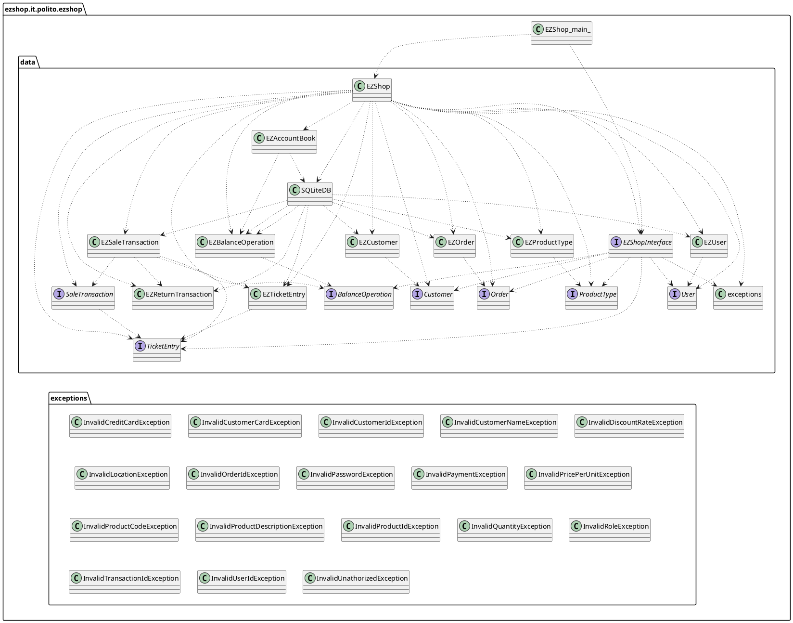

# Integration and API Test Documentation

Authors:
- Mattia Lisciandrello s286329
- Christian Casalini s281823
- Leonardo Palmucci s288126
- Dario Lanfranco s287524

Date: 24/05/2021

| Version | Changes |
| ------- |---------|
| 1 | Added first version of IntegrationAPITestReport.md |

# Contents

- [Dependency graph](#dependency graph)

- [Integration approach](#integration)

- [Tests](#tests)

- [Scenarios](#scenarios)

- [Coverage of scenarios and FR](#scenario-coverage)
- [Coverage of non-functional requirements](#nfr-coverage)

# Dependency graph

# Integration approach
The integration sequence we adopted is bottom-up. We started with unit-testing, where we tested all the leaf classes and their methods (EZCustomer, EZProductType...), including the DB class (SQLiteDB).
These test are documented in UnitTestReport.md.
Then, we proceeded to test AccountBook which is the only intermediate class, followed by the API testing (Which consist in testing the class EZShop)

#  Tests

## Step 1
| Classes             | JUnit test cases             |
|---------------------|------------------------------|
| EZBalanceOperation  | TestEZShop_BalanceOperation  |
| EZCustomer          | TestEZShop_Customer          |
| EZOrder             | TestEZShop_Order             |
| EZProductType       | TestEZShop_ProductType       |
| EZReturnTransaction | TestEZShop_ReturnTransaction |
| EZSaleTransaction   | TestEZShop_SaleTransaction   |
| EZSQLiteDB          | TestEZShop_SQLiteDB          |
| EZTicketEntry       | TestEZShop_TicketEntry       |
| EZUser              | TestEZShop_User              |
| EZShop              | TestEZShop_getCreditInTXTbyCardNumber                |
| EZShop              | TestEZShop_updateCreditInTXTbyCardNumber             |
| EZShop              | TestEZShop_isValidCreditCard                               |
| EZShop              | TestEZShop_isValidCard                               |
| EZShop              | TestEZShop_isValidPosition                           |
| EZShop              | TestEZShop_VerifyBarCode                             |

## Step 2
| Classes     | JUnit test cases     |
|-------------|----------------------|
|EZAccountBook|TestEZShop_AccountBook|

## Step 3
| Classes  | JUnit test cases            |
|----------|-----------------------------|
|EZShop    | TestEZShopFR1               |
|          | TestEZShopFR1_DeleteUser    |
|          | TestEZShopFR3               |
|          | TestEZShopFR4               |
|          | TestEZShopFR5               |
|          | TestEZShopFR6               |
|          | TestEZShopFR7               |
|          | TestEZShopFR8               |
 

# Scenarios

## Scenario UC1.4

| Scenario       |  Modify product type quantity      |
| -------------- | :--------------------------------: |
| Precondition   | Employee C exists and is logged in |
|                | Product type X exists              |
| Post condition | X.quantity = newQuantity           |
| Step#          | Description                        |
|  1             | C searches X via bar code          |
|  2             | C selects X's record               |
|  3             | C sets a new product quantity      |

## Scenario UC4.5

| Scenario |  Delete customer record |
| ------------- |:-------------:| 
|  Precondition     | Account U for Customer Cu existing  |
|  Post condition     | Account U is deleted |
| Step#        | Description  |
|  1    |  User selects customer record U |
|  2    |  U deleted from the system | 

## Scenario UC8.3

| Scenario |  Return of all the sold products of a product type, cash |
| ------------- |:-------------:|
|  Precondition     | Cashier C exists and is logged in |
| | Product Type X exists |
| | SaleTransaction T exists and has exactly N units of X |
| | Transaction T was paid cash |
|  Post condition     | Balance -= N*T.priceForProductX  |
| | X.quantity += N |
| Step#        | Description  |
|  1    |  C inserts T.transactionId |
|  2    |  Return transaction starts |
|  3    |  C reads bar code of X |
|  4    |  C adds N units of X to the return transaction |
|  5    |  X available quantity is increased by N |
|  6    |  Manage cash return (go to UC 10) |
|  7   |  Return  successful |
|  8   |  C confirms the return transaction and closes it  |
|  9   |  Transaction is updated |
|  10   |  Balance is updated |

## Scenario UC9.2

| Scenario | Manage Return Payment by invalid credit card |
| ------------- |:-------------:|
|  Precondition     | User with "Administrator" or "ShopManager" privilege is logged in |
|  | toBeAdded < 0 |
|  Post condition     | A Debit is registered with toBeAdded as its amount |
| Step#        | Description  |
|  1    | The user orders the system to register a Debit of toBeAdded |
|  2    | The system registers the Debit in the Accounting Book |

## Scenario UC9.3

| Scenario | Manage Return Payment by invalid credit card |
| ------------- |:-------------:|
|  Precondition     | User with "Administrator" or "ShopManager" privilege is logged in |
|       | toBeAdded >= 0 |
| Post condition | A Credit is registered with toBeAdded as its amount |
| Step#        | Description  |
|  1    | The user orders the system to register a Credit of toBeAdded |
|  2    | The system registers the Credit in the Accounting Book |

## Scenario UC9.4

| Scenario | Manage Return Payment by invalid credit card |
| ------------- |:-------------:|
|  Precondition     | A User is logged in |
|  Post condition     | The Balance is computed correctly and provided to the User |
| Step#        | Description  |
|  1    | The User asks the system the total balance |
|  2    | The system computes the balance summing all Debits and Credits |
|  3    | The total balance is provided to the User |

## Scenario UC10.3

| Scenario | Manage Return Payment by invalid credit card |
| ------------- |:-------------:|
|  Precondition     | Credit card C does not exist  |
|  Post condition     |   |
| Step#        | Description  |
|  1    |  Read C.number |
|  2    |  Validate C.number with Luhn algorithm |
|  3    |  C.number invalid, issue warning |
|  4    |  Exit with error |

# Coverage of Scenarios and FR
For Scenario 4.3 - Detach Loyalty card from customer record, there isn't a method in the API regarding this.

| Scenario ID  | Functional Requirements covered | JUnit  Test(s)                              |
| ------------ | ------------------------------- | ------------------------------------------- |
| 1.1          | FR3                             | TestEZShopFR3.testCreateProductType         |
| 1.2          | FR4                             | TestEZShopFR4.testUpdatePosition            |
| 1.3          | FR3                             | TestEZShopFR3.testUpdateProduct             |
| 1.4          | FR4                             | TestEZShopFR3.testUpdateQuantity            |
| 2.1          | FR1                             | TestEZShopFR1.testCreateUser                |  
| 2.2          | FR1                             | TestEZShopFR1_DeleteUser.testDeleteUser     |
| 2.3          | FR1                             | TestEZShopFR1.testUpdateUserRight           |
| 3.1          | FR4                             | TestEZShopFR4.testIssueOrder                |
| 3.2          | FR4                             | TestEZShopFR4.testPayOrder                  |
| 3.3          | FR4                             | TestEZShopFR4.testRecordOrderArrival        |
| 4.1          | FR5                             | TestEZShopFR5.testCustomerEZShop            |
| 4.2          | FR5                             | TestEZShopFR5 testCardEZShop                |
| 4.4          | FR5                             | TestEZShopFR5.testCustomerEZShop            |
| 4.5          | FR5                             | TestEZShopFR5.testCustomerEZShop            |
| 5.1          | FR1                             | TestEZShopFR1.testLogin                     |
| 5.2          | FR1                             | TestEZShopFR1.testLogin                     |
| 6.1          | FR6                             | TestEZShopFR6                               |
| 6.2          | FR6                             | TestEZShopFR6                               |
| 6.3          | FR6                             | TestEZShopFR6                               |
| 6.5          | FR6                             | TestEZShopFR6                               |
| 6.6          | FR6                             | TestEZShopFR6                               |
| 7.1          | FR7                             | TestEZShopFR7.testReceiveCreditCardPayment  |
| 7.2          | FR7                             | TestEZShopFR7.testInvalidCardPayment        |
| 7.3          | FR7                             | TestEZShopFR7.testInsufficientCreditPayment |
| 7.4          | FR7                             | TestEZShopFR7.testReceiveCashPayment        |
| 8.1          | FR6                             | TestEZShopFR6                               |
| 8.2          | FR6                             | TestEZShopFR6                               |
| 8.3          | FR6                             | TestEZShopFR6                               |
| 9.1          | FR8                             | TestEZShopFR8.testGetAllCreditsAndDebits    |
| 9.2          | FR8                             | TestEZShopFR8.testRecordDebit               |
| 9.3          | FR8                             | TestEZShopFR8.testRecordCredit              |
| 9.4          | FR8                             | TestEZShopFR8.testComputeBalance            |
| 10.1         | FR7                             | TestEZShopFR7.testReturnCreditCardPayment   |
| 10.2         | FR7                             | TestEZShopFR7.testReturnCashPayment         |
| 10.3         | FR7                             | TestEZShopFR7.testReturnInvalidCardPayment  |

# Coverage of Non Functional Requirements

| Non Functional Requirement | Test name |
| -------------------------- | --------- |
| NFR2                       | Every test case. Test that involve the DB take a bit longer than 0.5sec, but they involve multiple DB methods.          |
| NFR3                       | TestEZShop_User     |
| NFR4                       | TestEZShop_VerifyBarCode |
| NFR5                       | TestEZShop_IsValidCreditCard |
| NFR6                       | TestEZShop_IsValidCardT |

