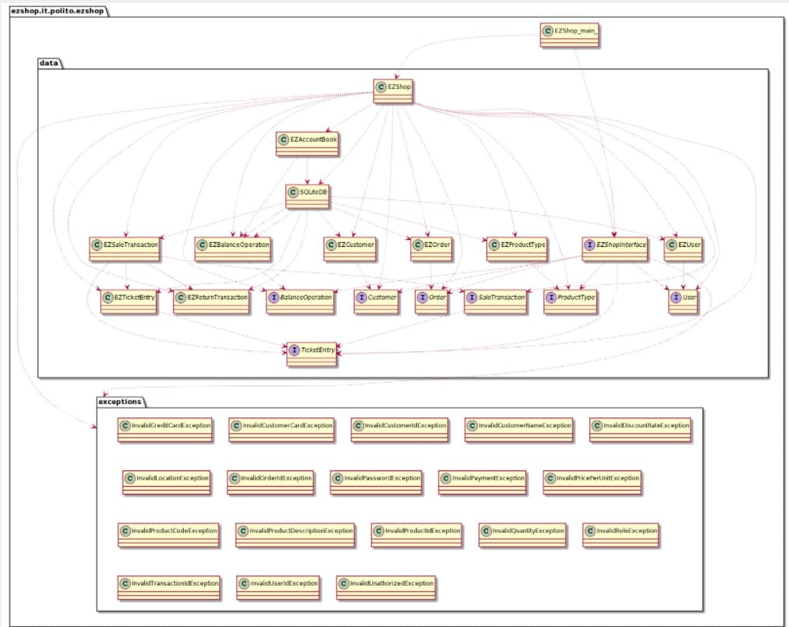

# Integration and API Test Documentation

Authors:
- Mattia Lisciandrello s286329
- Christian Casalini s281823
- Leonardo Palmucci s288126
- Dario Lanfranco s287524

Date: 24/05/2021

| Version | Changes |
| ------- |---------|
| 1 | Added first version of IntegrationAPITestReport.md |

# Contents

- [Dependency graph](#dependency graph)

- [Integration approach](#integration)

- [Tests](#tests)

- [Scenarios](#scenarios)

- [Coverage of scenarios and FR](#scenario-coverage)
- [Coverage of non-functional requirements](#nfr-coverage)

# Dependency graph

# Integration approach

    <Write here the integration sequence you adopted, in general terms (top down, bottom up, mixed) and as sequence
    (ex: step1: class A, step 2: class A+B, step 3: class A+B+C, etc)> 
    <Some steps may  correspond to unit testing (ex step1 in ex above), presented in other document UnitTestReport.md>
    <One step will  correspond to API testing>

The integration sequence we adopted is bottom-up. We started with unit-testing, where we tested all the leaf classes and their methods (EZCustomer, EZProductType...), including the DB class (SQLiteDB).
These test are documented in UnitTestReport.md.
Then, we proceeded to test AccountBook which is the only intermediate class, followed by the API testing (Which consist in testing the class EZShop)

#  Tests

   <define below a table for each integration step. For each integration step report the group of classes under test, and the names of
     JUnit test cases applied to them> JUnit test classes should be here src/test/java/it/polito/ezshop

## Step 1

| Classes             | JUnit test cases             |
|---------------------|------------------------------|
| EZBalanceOperation  | TestEZShop_BalanceOperation  |
| EZCustomer          | TestEZShop_Customer          |
| EZOrder             | TestEZShop_Order             |
| EZProductType       | TestEZShop_ProductType       |
| EZReturnTransaction | TestEZShop_ReturnTransaction |
| EZSaleTransaction   | TestEZShop_SaleTransaction   |
| EZSQLiteDB          | TestEZShop_SQLiteDB          |
| EZTicketEntry       | TestEZShop_TicketEntry       |
| EZUser              | TestEZShop_User              |

## Step 2
| Classes     | JUnit test cases     |
|-------------|----------------------|
|EZAccountBook|TestEZShop_AccountBook|

## Step 3
| Classes  | JUnit test cases |
|----------|------------------|
|EZShop    | TestEZShopFR1    |
|          | TestEZShopFR2    |
|          | TestEZShopFR3    |
|          | TestEZShopFR4    |
|          | TestEZShopFR5    |
|          | TestEZShopFR6    |
|          | TestEZShopFR7    |
|          | TestEZShopFR8    |

# Scenarios

<If needed, define here additional scenarios for the application. Scenarios should be named
 referring the UC in the OfficialRequirements that they detail>

## Scenario UC2.1

| Scenario |  Create user and define rights |
| ------------- |:-------------:|
|  Precondition     | Admin A exists and is logged in |
|  Post condition     | Account X is created |
| Step#        | Description  |
|  1    |  A defines the credentials of the new Account X |
|  2    |  A selects the access rights for the new account X |
|  3    |  C confirms the inserted data |

## Scenario UC2.2

| Scenario |  Delete user |
| ------------- |:-------------:|
|  Precondition     | Admin A exists and is logged in |
|  | Account X exists |
|  Post condition     | Account X deleted |
| Step#        | Description  |
|  1    |  A selects account X  |
|  2    |  X deleted from the system |

## Scenario UC2.3

| Scenario |  Modify user rights |
| ------------- |:-------------:|
|  Precondition     | Admin A exists and is logged in |
|  | Account X exists |
|  Post condition     | X's rights updated |
| Step#        | Description  |
|  1    |  A selects account X  |
|  2    |  A selects the access rights for X |
|  3    |  A confirms the inserted data |

## Scenario UC4.1

| Scenario |  Create customer record |
| ------------- |:-------------:|
|  Precondition     | Account U for Customer Cu not existing  |
|  Post condition     | U is  into the system  |
| Step#        | Description  |
|  1    |  User asks Cu personal data |
|  2    |  USer fills U's fields with Cu's personal data |
|  3    |  User confirms  |

## Scenario UC4.2

| Scenario |  Attach Loyalty card to customer record |
| ------------- |:-------------:|
|  Precondition     | Account U for Customer Cu existing  |
|  Post condition     | Loyalty card L attached to U |
| Step#        | Description  |
|  1    |  User creates a new L with a unique serial number |
|  2    |  User attaches L to U  |

## Scenario UC4.3

| Scenario |  Detach Loyalty card from customer record |
| ------------- |:-------------:|
|  Precondition     | Account U for Customer Cu existing  |
| | Loyalty card L attached to U |
|  Post condition     | Loyalty card L detached from U |
| Step#        | Description  |
|  1    |  User selects customer record U |
|  2    |  User  detaches L from U  |
|  3    |  U is updated |

## Scenario UC4.4

| Scenario |  Update customer record |
| ------------- |:-------------:|
|  Precondition     | Account U for Customer Cu existing  |
|  Post condition     | U updated |
| Step#        | Description  |
|  1    |  User selects customer record U |
|  2    |  User modifies personal data of Cu  |

## Scenario UC10.3

| Scenario | Manage Return Payment by invalid credit card |
| ------------- |:-------------:|
|  Precondition     | Credit card C does not exist  |
|  Post condition     |   |
| Step#        | Description  |
|  1    |  Read C.number |
|  2    |  Validate C.number with Luhn algorithm |
|  3    |  C.number invalid, issue warning |
|  4    |  Exit with error |

# Coverage of Scenarios and FR

<Report in the following table the coverage of  scenarios (from official requirements and from above) vs FR. 
Report also for each of the scenarios the (one or more) API JUnit tests that cover it. >

| Scenario ID  | Functional Requirements covered | JUnit  Test(s)        |
| ------------ | ------------------------------- | --------------------- |
|  2.1         | FR1                             | TestEZShopFR1         |
|  2.2         | FR1                             | TestEZShopFR1         |
|  2.3         | FR1                             | TestEZShopFR1         |
|  4.1         | FR5                             | TestEZShopFR5         |
|  4.2         | FR5                             | TestEZShopFR5         |
|  4.3         | FR5                             | TestEZShopFR5         |
|  4.4         | FR5                             | TestEZShopFR5         |
| 7.1   | FR7.2 | TestEZShopFR7.testReceiveCreditCardPayment |
| 7.2       | FR7.2 | TestEZShopFR7.testInvalidCardPayment |
| 7.3      | FR7.2 | TestEZShopFR7.testInsufficientCreditPayment |
| 7.4      | FR7.1 | TestEZShopFR7.testReceiveCashPayment |
| 10.1 | FR7.4 | TestEZShopFR7.testReturnCreditCardPayment |
| 10.2 | FR7.3 | TestEZShopFR7.testReturnCashPayment |
| 10.3 | FR7.4 | TestEZShopFR7.testReturnInvalidCardPayment |

# Coverage of Non Functional Requirements

<Report in the following table the coverage of the Non Functional Requirements of the application - only those that can be tested with automated testing frameworks.>

### 

| Non Functional Requirement | Test name |
| -------------------------- | --------- |
| NFR2                       | Every test case. Test that involve the DB take a bit longer than 0.5sec, but they involve multiple DB methods.          |
| NFR4                       | TestEZShop_VerifyBarCode |
| NFR5                       | TestEZShop_IsValidCreditCard |
| NFR6                       | TestEZShop_IsValidCardT |

