# Requirements Document 

Authors: 
- Mattia Lisciandrello s286329
- Christian Casalini s281823
- Palmucci Leonardo s288126
- Dario Lanfranco s287524 

Date: 14/04/2021

| Version | Changes |
| ------- |---------|
| 10 | Modified use cases, context diagram|

# Contents

- [Essential description](#essential-description)
- [Stakeholders](#stakeholders)
- [Context Diagram and interfaces](#context-diagram-and-interfaces)
	+ [Context Diagram](#context-diagram)
	+ [Interfaces](#interfaces) 
	
- [Stories and personas](#stories-and-personas)
- [Functional and non functional requirements](#functional-and-non-functional-requirements)
	+ [Functional Requirements](#functional-requirements)
	+ [Non functional requirements](#non-functional-requirements)
- [Use case diagram and use cases](#use-case-diagram-and-use-cases)
	+ [Use case diagram](#use-case-diagram)
	+ [Use cases](#use-cases)
    	+ [Relevant scenarios](#relevant-scenarios)
- [Glossary](#glossary)
- [System design](#system-design)
- [Deployment diagram](#deployment-diagram)

# Essential description

Small shops require a simple application to support the owner or manager. A small shop (ex a food shop) occupies 50-200 square meters, sells 500-2000 different item types, has one or a few cash registers 
EZShop is a software application to:
* manage sales
* manage inventory
* manage customers
* support accounting

# Stakeholders

| Stakeholder name  | Description |
| ----------------- | ----------- |
| Buyer | Shop that pays for the system. |
| Software Engineers | Engineers who will produce & design the software and the documentation. |
| Analyst | Who will produce the requirement document. |
| User | Who uses the system. It includes different user profiles. |
| Cashier (profile 1) | Cashier who uses the software. Manages sales. |
| Customer (profile 2) | Is affected indirectly through the cashier. |
| Warehouse manager (profile 3) | Manages inventory and orders through the software. |
| Accountant (profile 4) | Manages the accounting through the software. |
| Customers manager (profile 5) | Manages the customers. In most shops it could be the Cashier. |
| Shop director (profile 6) | Director of the shop. Manages the catalogue of products. |
| IT administrator (profile 7) | Who manages the software (Security/Accounts, DB). |
| Maintainers | Who will repair the software eventually. It could be part of the staff or external. |
| Marketing people | People who sell the software to shops. |
| Product | Involved indirectly and managed by the software. |
| Cash Register | The software involves the Cash Register since they are part of the output. |
| Fidelity Card | Fidelity Card associated to a Customer. |
| Credit card system | Is involved during the payment with a credit card |

# Context Diagram and interfaces

## Context Diagram

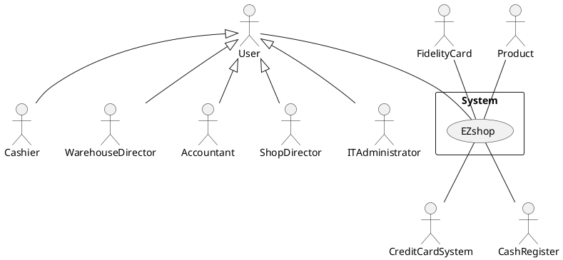

## Interfaces

| Actor 				| Logical Interface | Physical Interface  |
| --------------------- | -----------------	| ------------------- |
| Cashier 				| GUI 				| Screen, Keyboard, Mouse |
| Product 				| Bar code 			| Bar code reader |
| Cash register 		| GUI, API ([Cash Register API](https://developers.mypos.eu/en/doc/in_person_payments/v1_0/356-cash-register-remote-api))			| Screen, Keyboard, Printer |
| Credit card system 	| Web services ([Payment API](https://developers.mypos.eu/en/doc/in_person_payments/v1_0/243-payment-api))		| Internet, POS |
| Warehouse manager 	| GUI 				| Screen, Keyboard, Mouse |
| Accountant 			| GUI 				| Screen, Keyboard, Mouse |
| Shop director 		| GUI 				| Screen, Keyboard, Mouse |
| Fidelity card 		| Bar code 			| Bar code reader |
| ITAdministrator| GUI | Screen, Keyboard, Mouse | 

# Stories and personas

Tom, 50, has worked in its own shop for five years together with his daughter. He has always managed orders by himself, calling wholesalers and dictating orders. Tom updates his catalogue seldom, so he orders the same products almost all the time. He would really need something that could place orders for him.

Marco, 45, works as a cashier for a local grocery. She has always used a Cash Register to compute the price of every product, labelling each of them with its price. Erring is human, but when you have to deal with a shopping cart with 20 items, it can become obnoxious. It would be really helpful to compute prices automatically, saving time and energy.

Jacques, 35, is an experienced accountant, hired to the recently opened Electronics Store. He loves his job, but collecting receipts manually to keep track of incomes is the only thing that annoys him. In his previous work experience, he was used to have all the receipts he needed in his PC. He would like to repeat the same experience.   

Elisa, 32, has just opened a brand new gardening store, where she can earn money from her passion. Many friends of her are enthusiast of her bouquets and she would like to provide them with special discounts for the most loyal customers, maybe handing out Fidelity Cards for them. She would like an application that can manage "this sort of stuff".  

# Functional and non functional requirements

## Functional Requirements

| ID       		| Description  |
| ------------- | ------------ |
|  FR_1     	| Sales management |
|  FR_1.1   	| Provide Shopping Cart and Total Amount |
|  FR_1.1.1	| Scan Product |
|  FR_1.1.2	| Search Product Price in the Catalogue |
|  FR_1.1.3	| Apply Discounts |
|  FR_1.1.3.1	| Apply general Discounts (for any Customer) |
|  FR_1.1.3.2 	| Apply general Discount for Fidelity Card owners |
|  FR_1.1.3.3   | Apply Discounts for Fidelity Card owners according to Card Points |
|  FR_1.1.4	| Compute Total Amount |
|  FR_1.2	| Handle Fidelity Card |
|  FR_1.2.1	| Scan Fidelity Card |
|  FR_1.2.2	| Authenticate Fidelity Card |
|  FR_1.3	| Handle Payment (Cash or via Credit Card) |
|  FR_1.3.1	| Scan Credit Card (via Credit Card System) |
|  FR_1.3.2	| Notify Payment result|
|  FR_1.3.3	| Open the Cash Register|
|  FR_1.3.4	| Print Receipt |
|  FR_1.3.5	| Send Transaction information to Accounting|
|  FR_1.3.6	| Remove Shopping Cart elements from Inventory|
||
|  FR_2     	| Warehouse management |
|  FR_2.1   	| Inventory management |
|  FR_2.1.1 	| Add product |
|  FR_2.1.2 	| Remove product |
|  FR_2.1.3 	| Update product |
|  FR_2.1.4   	| Manage Low Stock Thresholds |
|  FR_2.1.5   	| Show products (inventory) |
|  FR_2.2   	| Order management |
|  FR_2.2.1 	| Place new order |
|  FR_2.2.2 	| Cancel order |
|  FR_2.2.3 	| Edit order |
|  FR_2.2.4 	| Show orders |
||
|  FR_3     	| Catalogue management |
|  FR_3.1   	| Update products selling price |
|  FR_3.2   	| Add product |
|  FR_3.3   	| Remove product  |
|  FR_3.4   	| Show products in the catalogue |
||
|  FR_4     	| Customers management |
|  FR_4.1   	| Add fidelity card |
|  FR_4.2   	| Remove fidelity card |
|  FR_4.3    	| Show fidelity cards & cards points |
||
|  FR_5     	| Support accounting |
|  FR_5.1   	| Update finance |
|  FR_5.1.1   	| Add invoice (passive) |
|  FR_5.1.2  	| Add credit note | //if wrong invoice committed --> correct with a negative-import credit note
|  FR_5.2 		| Show accounting data |
|  FR_5.2.1   	| Show invoices |
|  FR_5.2.2 	| Show suppliers |
|  FR_5.2.3 	| Show suppliers deadlines timetable |
|  FR_5.2.4 	| Show balance sheet |
|  FR_5.2.5   	| Show financial statement |
|  FR_5.3   	| Show statistics |
|  FR_5.3.1 	| Show revenue and expenses in a timeframe |
|  FR_5.3.2 	| Show best selling products |
|  FR_5.4 		| Show banking data |
||
|  FR_6     	| Accounts management |
|  FR_6.1   	| Add account |
|  FR_6.2   	| Remove account|
|  FR_6.3   	| Update account|
|  FR_6.4    	| Modify privileges | //Authorize access to functions to specific actors according to access rights
|  FR_7			| Authentication |
|  FR_7.1		| Login |
|  FR_7.2		| Logout |

FR_2 
Inventory management is focused solely on the actual items being held within a warehouse. Warehouse management, in contrast, is more related to the items movement.

FR_2.1.5
Allow to set, update or remove Low Stock Thresholds so that an alert is generated if a product's quantity goes below the desired threshold.

FR_4
Fidelity cards are managed totally by the shop. The customer can choose to get subscribe/unsubscribe and he will be given a card. He will just decide to use or not to use the points, which will be involved in giving discounts to the customer. If he wants to check how many points does he have, he has to get in contact with the shop by himself/with the cashier.

## Non Functional Requirements

| ID        |     Type 	    | 								Description  															| Refers to |
| --------- | ------------- | ----------------------------------------------------------------------------------------------------- | --------- |
| NFR_1     | Usability   	| User should learn how to use the software within 30 minutes of training 								| All FR 	|
| NFR_2     | Efficiency	| All functions should complete in less than 0.5s 														| All FR 	|
| NFR_3     | Localisation 	| Decimal numbers use . (dot) as decimal separator  													| All FR 	|
| NFR_4 	| Privacy 		| Customers data should not be accessible to users other than the ones who manage fidelity cards.       | All FR 	|
| NFR_5 	| Availability 	| At least 95% 																							| All FR 	|
| NFR_6     | Security      | User should have access only to functions and resources which they require 							| All FR 	|
| NFR_7		|Privacy| 	Customer credit card data must not be stored in the system |FR1|
| Domain 	| // 			| Currency is Euro  																					| All FR 	|

# Use case diagram and use cases

## Use case diagram

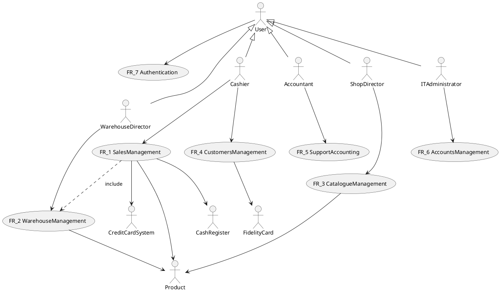

### Use Case diagram: Sales management

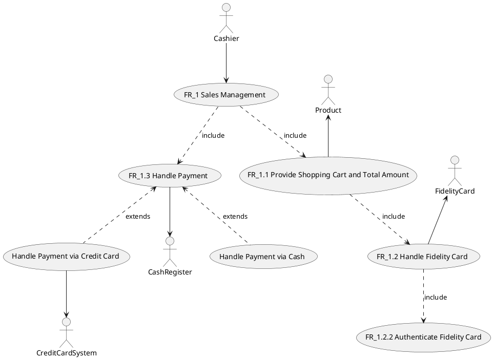

### Use Case diagram: Warehouse management

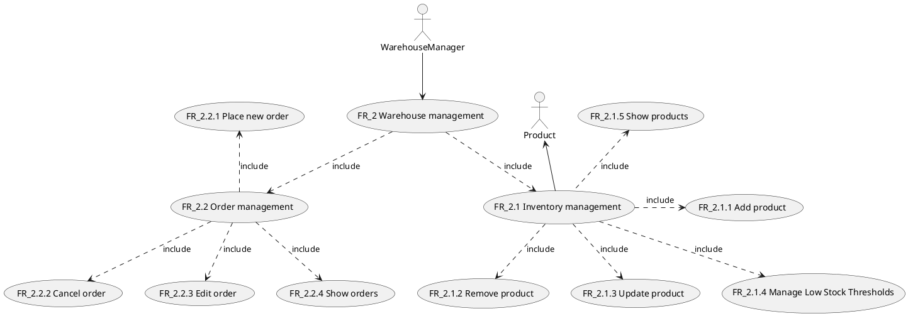

### Use Case diagram: Catalogue management

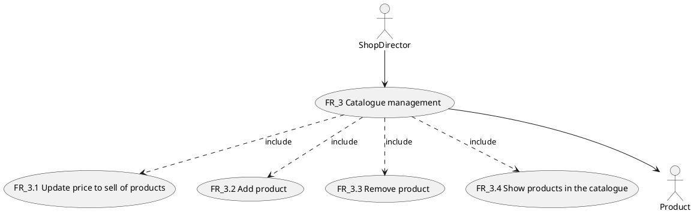

### Use Case diagram: Customers management

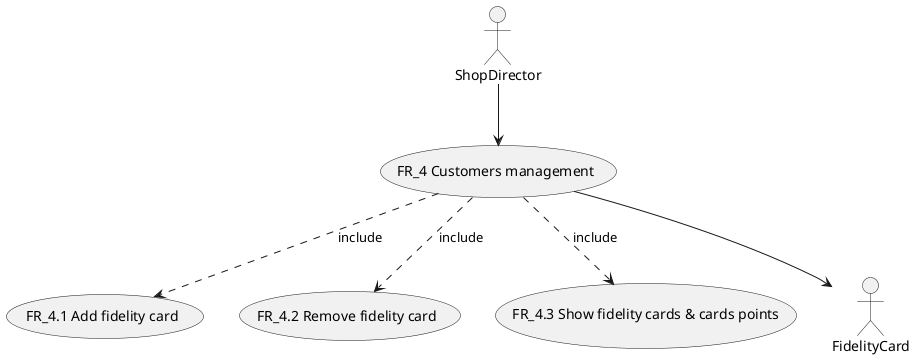

### Use Case diagram: Support accounting

We didn't include every FR (show accounting data) in order to make the UCD readable.

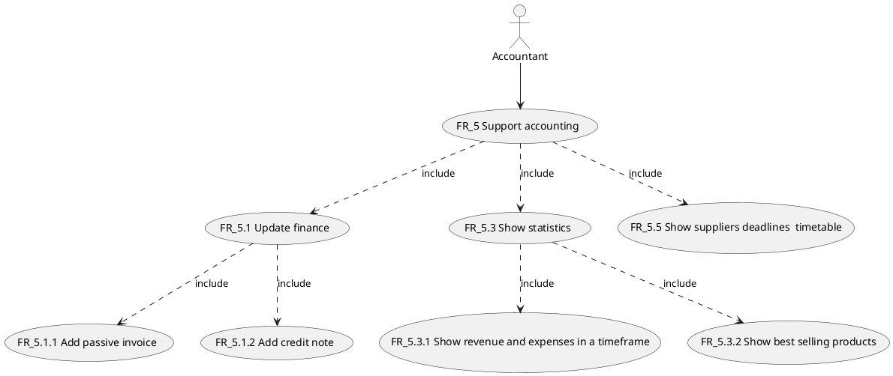

### Use Case diagram: Accounts management

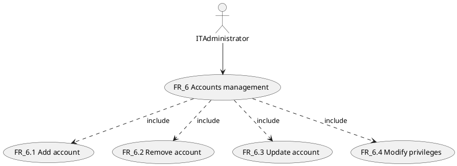

### Use Case diagram: Authentication

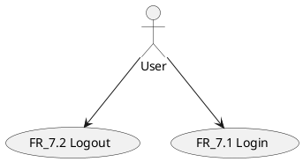

##  Sales management

In these Use Cases, the actor is the Cashier that has to deal with Shopping Carts and Payments. A Customer does not interact with the system: the Cashier manages everything.

### Use case 1, UC1 - Provide Shopping Cart and Total Amount (with a Fidelity Card)
| Actors Involved   | Cashier, Product, Fidelity Card |
| ----------------- | ------------- |
|  Precondition     | 1. Cashier account exists and is already authenticated  2. Product has a valid Bar Code  3. A Fidelity Card may be scanned (thus authenticated) at any time during the Nominal Scenario|
|  Post condition   | 1. The Shopping Cart is ready  2. The Total Amount to pay is computed and displayed|
|  Nominal Scenario | The Cashier defines the Shopping Cart and the Total Amount that the Customer has to pay |
|  Variants      	| - The Customer wants to subscribe at any time (new Fidelity Card must be created)   - The Bar Code Reader cannot scan a Product  - The Customer does not want to buy a Product anymore |

#### Scenario 1 - UC1 Nominal Scenario
| Scenario 			| Provide Shopping Cart and Total Amount (with a Fidelity Card) |
| ----------------- | --------------------------- |
|  Precondition     | 1. Cashier account exists and is already authenticated  2. Product has a valid Bar Code  3. A Fidelity Card may be scanned (thus authenticated) at any time during the Nominal Scenario|
|  Post condition   | 1. The Shopping Cart is ready  2. The Total Amount to pay is computed and displayed|
| Step#		| Description |
| 1		| For every Product in the Customer's cart:|
| 1.1		| The Cashier scans the Product using the Bar Code Reader and inputs the quantity of that Product|
| 1.2 		| The Application searches the Product in the Catalogue and retrieves its selling price |
| 1.3 		| If a general discount is present, it is applied to the Product |
| 1.4 		| If a Fidelity Card has been scanned: |
| 1.4.1 	| If a discount is present for Fidelity Card owners, it is applied to the Product |
| 1.4.2		| The Fidelity Card Points related to the Product are added to the Fidelity Card |
| 1.5		| The Application displays the price of the Product and the new partial amount to pay on the Cashier GUI|
| 2		| If a Fidelity Card is present, the Cashier selects whether to apply additional discounts, depending on the Card Points (not more than one at a time) |
| 2.1		| If the Cashier applies them, Fidelity Card Points are removed according to the previous step|
| 3 		| At the end, the final list of products and the total amount to pay is displayed on the Cashier GUI|

#### Scenario 1.1 - Creating New Fidelity Card during Sale 
| Scenario 			| Creating new Fidelity Card during Sale |
| ----------------- | --------------------------- |
| Precondition     	| 1. Cashier account exists and is already authenticated  2. The Cashier may have already scanned some Products |
| Post condition   	| 1. New Fidelity Card is created   2. Scanned Products have not to be scanned again|
| Step#        		| Description  |
| 1     		| Cashier suspends the Sale|
| 2    			| Cashier adds a new Fidelity Card as described in UC18|
| 3			| Cashier resumes the Sale |

#### Scenario 1.2 - Inserting Product/Card Code manually
| Scenario 			| Inserting Product/Card code manually |
| ----------------- | --------------------------- |
| Precondition     	| 1. Cashier account exists and is already authenticated   2. Product/Card has a valid Bar Code|
| Post condition   	| 1. Product/Card Code is read correctly   2. Product is added to the Shopping Cart/Card is authenticated|
| Step#        		| Description  |
| 1     		| Cashier inserts the Code using the Cashier GUI|
| 2    			| Product/Card is recognized: in case of Product, it is added to the Shopping Cart; in case of Card, it is authenticated |

#### Scenario 1.3 - Remove Product from Shopping Cart 
| Scenario 			| Creating new Fidelity Card during Sale |
| ----------------- | --------------------------- |
| Precondition     	| 1. Cashier account exists and is already authenticated  2. The Cashier has already scanned the Product to remove  3. A Fidelity Card may have been authenticated|
| Post condition   	| 1. Product is removed from the Shopping Cart   2. Total Amount is updated   3. Fidelity Card Points are updated (in case Precondition 3 is verified)| 
| Step#        		| Description  |
| 1     		| Cashier removes the Product using the Cashier GUI that displays all the Products scanned so far|
| 2			| The Product price is removed from the Total Amount |
| 3			| The Product points are removed from the Fidelity Card|

### Use case 2, UC2 - Authentication of a Fidelity Card
| Actors Involved   | Cashier, Fidelity Card |
| ----------------- | ------------- |
|  Precondition     | 1. Cashier account exists and is already authenticated  2. Fidelity Card has a valid Bar Code |
|  Post condition   | The Fidelity Card is recognized and the amount to pay is updated|
|  Nominal Scenario | The Cashier authenticates a Fidelity Card at any time during a Purchase |
|  Variants     	| - The Bar Code is valid, but the Bar Code Reader cannot read it correctly (see Scenario 1.2)|

#### Scenario 2 - Nominal Scenario for UC2
| Scenario 			| Authentication of a Fidelity Card |
| ----------------- | --------------------------- |
|  Precondition     | 1. Cashier account exists and is already authenticated  2. Fidelity Card has a valid Bar Code |
|  Post condition   | The Fidelity Card is recognized and the amount to pay is updated|
|  Step#       		| Description  |
|  1			| The Cashier scans the Fidelity Card using the Bar Code Reader and recognizes it|
|  2			| For every scanned Product so far: if a discount for Fidelity Card owners is present, it is applied.|
|  3			| The Amount to pay is updated according to the results of the previous step|

### Use case 3, UC3 - Handle a Payment via Credit Card
| Actors Involved   | Cashier, Cash Register, Credit Card System |
| ----------------- | ------------- |
|  Precondition     | 1. Cashier account exists and is already authenticated  2. Customer has a valid Credit Card  3. The Shopping Cart is known  4. The Total Amount to pay is known|
|  Post condition   | The customer has successfully paid   The receipt is printed   Accounting is updated   Inventory is updated|
|  Nominal Scenario | 1. The Credit Card System shows the amount to pay  2. The Credit Card system receives the Customer's Credit Card and recognizes it  3. The Credit Card System interacts with the Payment Gateway bypassing the Application  4. The Credit Card System notifies about the transaction result   5. The Cash Register is opened and prints the receipt   6. Transaction information is sent to the Accounting   7. Each Product in the list is removed from the Inventory|
|  Variants     	| - The Credit Card System is not able to recognize the Card  - Credit Card Payment does not terminate successfully   - Customer wants to change Payment Method|

#### Scenario 3 - Nominal Scenario for UC3
| Scenario 			| Handle a Payment via Credit Card |
| ----------------- | --------------------------- |
|  Precondition     | 1. Cashier account exists and is already authenticated  2. Customer has a valid Credit Card  3. The Shopping Cart is known  4. The Total Amount to pay is known|
|  Post condition   | The customer has successfully paid   The receipt is printed   Accounting is updated   Inventory is updated|
|  Step#		| Description |
|  1			| The Credit Card System shows the amount to pay|
|  2			| The Credit Card System receives the Customer's Credit Card and recognizes it|
|  3			| The Credit Card System interacts with the Payment Gateway bypassing the Application|
|  4			| The Credit Card System notifies about the transaction result |
|  5			| The Cash Register is opened and prints the receipt |
|  6			| Transaction information is sent to the Accounting |
|  7			| Each Product in the list is removed from the Inventory|

#### Scenario 3.1
| Scenario 			| Credit Card not recognized |
| ----------------- | --------------------------- |
| Precondition     	| 1. Cashier account exists and is already authenticated   2. Customer has a valid Credit Card   3. The Shopping Cart is known   4. The Total Amount to pay is known|
| Post condition   	| 1. Credit Card may be recognized |
| Step#        		| Description  |
| 1     		| Cashier retries to scan the Credit Card (Credit Card System is external, it is not up to EZShop to deal with scanning errors)

#### Scenario 3.2
| Scenario 			| Handle a Failed Payment via Credit Card|
| ----------------- | --------------------------- |
| Precondition     	| 1. Cashier account exists and is already authenticated   2. Customer has a valid Credit Card   3. The Shopping Cart is known   4. The Total Amount to pay is knowni   5. Credit Card Payment has not terminated successfully|
| Post condition   	| 1. Cashier is notifed about the Payment Result   2. It is possible to retry a Credit Card Payment|
| Step#        		| Description  |
| 1			| An Error message is displayed on the Cashier GUI |
| 2			| Retry to Pay via Credit Card, restarting from UC3 |

#### Scenario 3.3
| Scenario 			| Handle a Failed Payment via Credit Card|
| ----------------- | --------------------------- |
| Precondition     	| 1. Cashier account exists and is already authenticated   2. The Shopping Cart is known   3. The Total Amount to pay is known   |
| Post condition   	| 1. Payment method is changed |
| Step#        		| Description  |
| 1			| The Cashier selects to change Payment method via the Cashier GUI|

### Use Case 4, UC4 - Handle a Payment via Cash
| Actors Involved   | Cashier, Cash Register |
| ----------------- | ------------- |
|  Precondition     | 1. Cashier account exists and is already authenticated  2. The customer has successfully paid by cash  3. The Shopping Cart is known  4. The Total Amount of pay is known|
|  Post condition   | The receipt is printed   Accounting is updated   Inventory is updated|
|  Nominal Scenario | 1. The Cashier notifies that the customer has successfully paid by cash  2. The Cash Register is opened and prints the receipt  3. Transaction information is sent to the Accounting   4. Each Product in the list is removed from the Inventory|
|  Variants     	| Customer does not want to pay via Cash anymore (see Scenario 3.3)|

#### Scenario 4 - Nominal Scenario for UC4
| Scenario 			| Handle a Payment via Cash|
| ----------------- | --------------------------- |
|  Precondition     | 1. Cashier account exists and is already authenticated  2. The customer has successfully paid by cash  3. The Shopping Cart is known  4. The Total Amount of pay is known|
|  Post condition   | The receipt is printed   Accounting is updated   Inventory is updated|
| Step#        		| Description  |
| 1			| The Cashier notifies that the customer has successfully paid by cash|
| 2			| The Cash Register is opened and prints the receipt|
| 3			| Transaction information is sent to the Accounting |
| 4			| Each Product in the list is removed from the Inventory|

## Inventory management
In these use cases, the actor is the Warehouse Manager or another user with an account with the privileges required to manage the inventory. The actor can inspect the inventory, add new items to it, and update or remove the existing ones.
In addition, the actor should be able to place new orders, and to cancel or edit the existing ones.

### Use case 5, UC5 - Add product to inventory
| Actors Involved 	| 			Warehouse Manager              |
| ----------------- | ---------------------------------------- |
| Precondition   	| 1. Warehouse Manager has an account 2. Warehouse Manager is authenticated 3. Inventory exists |
| Post condition    | Inventory contains a new product		   |
| Nominal Scenario  | 1. Warehouse Manager clicks on 'New Product' icon 2. The software presents a form to fill in with product's information 3. Warehouse Manager fills in the form 4. The software assigns to the product an incremental and unique ID |
| Variants          | - Before completing the operation, the Warehouse Manager decides to discard it - The product cannot be added because one or more compulsory fields have not been filled in |

### Use case 6, UC6 - Remove product from inventory
| Actors Involved 	| 			Warehouse Manager              |
| ----------------- | ---------------------------------------- |
| Precondition      | 1. Warehouse Manager has an account 2. Warehouse Manager is authenticated 3. Inventory exists 4. The account has the necessary privileges to modify the inventory |
| Post condition    | Target product has been removed from the inventory|
| Nominal Scenario  | 1. Warehouse Manager looks for the product using the search bar 2. The software presents a list of matching products 3. Warehouse Manager selects the target product 4. Warehouse Manager clicks "Remove" button &ensp;(4.1) Software asks for confirmation &ensp;(4.2) Warehouse Manager confirms 5. Software removes the product from the inventory |
| Variants          | - Target product does not exist in the inventory - Product is removed in another way: &ensp;* right-clicking on product &ensp;* select "Remove" from context menu |

### Use case 7, UC7 - Update product
| Actors Involved 	| 			Warehouse Manager              |
| ----------------- | ---------------------------------------- |
| Precondition   	| 1. Warehouse Manager has an account 2. Warehouse Manager is authenticated 3. Inventory exists |
| Post condition 	| Target product's quantity has been updated |
| Nominal Scenario  | 1. Warehouse Manager searches for the product using the search bar 2. The software presents a list of matching products 3. Warehouse Manager selects the target product 4. Warehouse Manager clicks "Edit" button 5. Software presents the interface from which product's properties (like quantity and price) can be modified 6. Warehouse Manager edits one or more properties &ensp;(6.1) Software asks for confirmation &ensp;(6.2) Warehouse Manager confirms 7. Software applies the update |
| Variants          | - Target product does not exist in the inventory  |

### Use case 8, UC8 - Manage Low Stock Threshold
| Actors Involved 	| 			Warehouse Manager              |
| ----------------- | ---------------------------------------- |
| Precondition   	| 1. Warehouse Manager has an account 2. Warehouse Manager is authenticated 3. Inventory exists |
| Post condition 	| A new threshold has been setted or an existing one has been updated or removed |
| Nominal Scenario  | 1. Warehouse Manager searches for the product using the search bar 2. The software presents a list of matching products 3. Warehouse Manager selects the target product 4. Warehouse Manager clicks "Edit" button 5. Software presents the interface from which product's properties can be modified 6. Warehouse Manager sets, updates or removes the low stock threshold |
| Variants          | - Target product does not exist in the inventory  |

### Use case 9, UC9 - Show products
| Actors Involved 	| 			Warehouse Manager              |
| ----------------- | ---------------------------------------- |
| Precondition   	| 1. Warehouse Manager has an account 2. Warehouse Manager is authenticated 3. Inventory exists |
| Post condition 	| Software shows a list of products, sorted by ID (default)|
| Nominal Scenario  | Warehouse Manager accesses stock's section of the software, where he can look at the complete list of products sorted by ID (default sort) |
| Variants          |  - A different sorting criteria is selected -  Products are filtered writing something in the search bar or using filters (e.g. date, supplier, ...) |

#### Scenario 9.1 - Variant 

| Scenario 			| Sort product |
| ----------------- | --------------------------- |
| Precondition     	| Software shows a list of products present in the inventory |
| Post condition   	| Products are sorted and shown in a specific vay|
| Step#        		| Description  |
| 1     			| User selects a way to sort the products (Price, name, ID)|
| 2    				| System displays products sorted by the chosen criteria|

#### Scenario 9.2 - Variant 

| Scenario 			| Filter product |
| ----------------- | --------------------------- |
| Precondition     	|  Software shows a list of products present in the inventory |
| Post condition   	| The filter is applied and the products that satisfy the filter are shown|
| Step#        		| Description  |
| 1     			| User filters the products by writing in the search bar (ID,name..) |
| 2    				| System displays products filtered by the chosen criteria |

#

## Manage orders

### Use case 10, UC10 - Place new order
| Actors Involved 	| 			Warehouse Manager              |
| ----------------- | ---------------------------------------- |
| Precondition   	| 1. Warehouse Manager has an account 2. Warehouse Manager is authenticated 3. Inventory exists |
| Post condition 	| A new order has been placed |
| Nominal Scenario  | 1. Warehouse Manager clicks on 'New Order' icon 2. The software presents the view for placing a new order 3. Warehouse Manager selects products, as well as the desired quantity, and fills in other necessary infos &ensp;(3.1) Software asks for confirmation &ensp;(3.2) Warehouse Manager gives confirmation  4. The software places the order and assigns to it an incremental and unique ID |
| Variants          | - Before completing the operation, the Warehouse Manager decides to discard it - The order cannot be placed for some reason |

### Use case 11, UC11 - Cancel existing order
| Actors Involved 	| 			Warehouse Manager              |
| ----------------- | ---------------------------------------- |
| Precondition      | 1. Warehouse Manager has an account 2. Warehouse Manager is authenticated 3. Inventory exists
| Post condition    | Target product has been removed from the inventory|
| Nominal Scenario  | 1. Warehouse Manager looks for the order using the search bar 2. The software presents a list of matching orders 3. Warehouse Manager selects the target order 4. Warehouse Manager clicks "Remove" button &ensp;(4.1) Software asks for confirmation &ensp;(4.2) Warehouse Manager gives confirmation 5. Order is canceled |
| Variants          | - Target order does not exist - It is too late to cancel the order (e.g. it has already been completed) |

### Use case 12, UC12 - Edit existing order
| Actors Involved 	| 			Warehouse Manager              |
| ----------------- | ---------------------------------------- |
| Precondition      | 1. Warehouse Manager has an account 2. Warehouse Manager is authenticated 3. Inventory exists
| Post condition    | Target product has been removed from the inventory|
| Nominal Scenario  | 1. Warehouse Manager looks for the order using the search bar 2. The software presents a list of matching orders 3. Warehouse Manager selects the target order 4. Warehouse Manager clicks "Edit" button 5. Warehouse Manager makes desired changes to the order and, when done, clicks "Apply" button &ensp;(5.1) Software asks for confirmation &ensp;(5.2) Warehouse Manager gives confirmation 6. Order is canceled |
| Variants          | - Target order does not exist - It is too late to edit the order (e.g. it has already been completed) |

### Use case 13, UC13 - Show orders
| Actors Involved 	| 			Warehouse Manager              |
| ----------------- | ---------------------------------------- |
| Precondition   	| 1. Warehouse Manager has an account 2. Warehouse Manager is authenticated 3. Inventory exists |
| Post condition 	| Software shows a list of orders, sorted by ID (default) |
| Nominal Scenario  | Warehouse Manager accesses orders section of the software, where he can look at the complete list of orders sorted by ID (default sort) |
| Variants          |  - A different sorting criteria is selected -  Orders are filtered writing something in the search bar or using filters (e.g. date, supplier, ...) |

## Catalogue management

### Use case 14, UC14 - Update selling price of product
| Actors Involved	| Shop director |
| -----------------	| ------------- |
|  Precondition     | 1. Account shop director must exist   2. Account shop director is authenticated   3. The catalogue contains at least one product |
|  Post condition   |Selling price of a product updated |
|  Nominal Scenario | Shop director chooses a product and updates his selling price|
|  Variants     	| |

#### Scenario 14.1

| Scenario 			| Update selling price of product|
| ----------------- | --------------------------- |
| Precondition     	| 1. Account shop director must exist   2. Account shop director is authenticated   3. The catalogue contains at least one product |
| Post condition   	| Selling price of a product updated |
| Step#        		| Description  |
| 1     			| Shop director selects to update a product |
| 2    				| Software shows a list of products present in the catalogue  |
| 3					| Shop director selects a product |
| 4					| Shop director modifies the price of the product in the catalogue |
| 5					| Shop director confirms |

### Use case 15, UC15 - Add product
| Actors Involved	| Shop director |
| -----------------	| ------------- |
|  Precondition     | 1. Account shop director must exist   2. Account shop director is authenticated |
|  Post condition   | One or more products are added in the catalogue |
|  Nominal Scenario | Shop director selects and adds products (present in the inventory) to the catalogue |
|  Variants     	| - A product can be added only once in a catalogue: each product has an unique ID; an error message is shown on the screen. |

#### Scenario 15.1

| Scenario 			| Add product |
| ----------------- | --------------------------- |
| Precondition     	|1. Account shop director must exist   2. Account shop director is authenticated |
| Post condition   	| One or more products are added in the catalogue |
| Step#        		| Description  |
| 1     			| Shop director selects to add a product in the catalogue |
| 2    				| Software shows a list of products present in the inventory  |
| 3					| Shop director selects one or more products and inserts the price to sell for each |
| 4 				| Shop director confirms |
| 5					| The application assigns the inventory ID to the product |

#### Scenario 15.2 - Variant 

| Scenario 			| Product already present |
| ----------------- | --------------------------- |
| Precondition     	| 1. Product P is present in the catalogue   2. Software has shown a list of products present in the invetory|
| Post condition   	| An error messagge is shown on the screen and the use case is interrupted |
| Step#        		| Description  |
| 1     			| Shop director selects a product P which is already present in the catalogue |
| 2    				| System displays an error message, which will stop the use case|

### Use case 16, UC16 - Remove product
| Actors Involved	| Shop director |
| -----------------	| ------------- |
|  Precondition     | 1. Account shop director must exist   2. Account shop director is authenticated   3. The catalogue contains at least one product |
|  Post condition   | One or more products are removed from the catalogue |
|  Nominal Scenario | Shop director selects and removes a product from the inventory | 

#### Scenario 16.1

| Scenario 			| Remove product |
| ----------------- | --------------------------- |
| Precondition     	|1. Account shop director must exist   2. Account shop director is authenticated   3. The catalogue contains at least one product |
| Post condition   	| One or more products are removed from the catalogue|
| Step#        		| Description  |
| 1     			| Shop director selects to remove a product in the catalogue |
| 2    				| Software shows a list of products present in the catalogue  |
| 3					| Shop director selects one product |
| 4 				| Shop director confirms |

### Use case 17, UC17 - Show products in the catalogue
| Actors Involved 	| 			Shop director           |
| ----------------- | ---------------------------------------- |
| Precondition   	| 1. Shop director has an account 2. Shop director is authenticated 3. Catalogue exists |
| Post condition 	| Software shows a list of products present in the catalogue, sorted by ID (default) |
| Nominal Scenario  | Once the shop director has done the authentication, a list of products is shown |
| Variants          |  - A different sorting criteria is selected -  Products are filtered writing something in the search bar or using filters (type of product, selling price, ...) |

#### Scenario 17.1

| Scenario 			| Show products |
| ----------------- | --------------------------- |
| Precondition     	| 1. Shop director has an account 2. Shop director is authenticated 3. Catalogue exists|
| Post condition   	| Software shows a list of products present in the catalogue, sorted by ID (default) |
| Step#        		| Description  |
| 1    				| System displays products sorted by ID (default) |

#### Scenario 17.2 - Variant 

| Scenario 			| Sort product |
| ----------------- | --------------------------- |
| Precondition     	| Software shows a list of products present in the catalogue |
| Post condition   	| Products are sorted and shown in a specific vay|
| Step#        		| Description  |
| 1     			| User selects a way to sort the products (Price, name, ID)|
| 2    				| System displays products sorted by the chosen criteria|

#### Scenario 17.3 - Variant 

| Scenario 			| Filter product |
| ----------------- | --------------------------- |
| Precondition     	| Software shows a list of products present in the catalogue|
| Post condition   	| The filter is applied and the products that satisfy the filter are shown|
| Step#        		| Description  |
| 1     			| User filters the products by writing in the search bar (ID,name..) |
| 2    				| System displays products filtered by the chosen criteria |

## Customers management

Actors could be Cashier or other worker in charge to manage the customers.
We'll consider the Cashier as the actor.

### Use case 18, UC18 - Add fidelity card
| Actors Involved   | Cashier		|
| ----------------- | ------------- |
|  Precondition     | 1. Account cashier must exist 2. Cashier is authenticated|
|  Post condition   | A fidelity card is added to the database and is given to the customer |
|  Nominal Scenario | Cashier selects "add a fidelity card" and inserts the customer data, adding them to the database|
|  Variants     	| - A customer can have at most one fidelity card active: each fidelity card has an unique ID, generated based on the customer SSN |

#### Scenario 18.1

| Scenario 			| Card added |
| ----------------- | --------------------------- |
| Precondition     	| 1. Account cashier must exist 2. Cashier is authenticated|
| Post condition   	| A fidelity card is added to the database and is given to the customer |
| Step#        		| Description  |
| 1     			| Cashier selects "add a fidelity card"|
| 2    				| Software shows forms to add the customer data |
| 3					| Cashier inserts the customer data |
| 4					| Cashier confirms |
| 5					| The application assigns a new ID to the card in the database |

#### Scenario 18.2 - Variant

| Scenario 			| Card already present |
| ----------------- | --------------------------- |
| Precondition     	| 1. Account cashier must exist 2. Cashier is authenticated|
| Post condition   	| An error messagge is shown on the screen and the use case is interrupted |
| Step#        		| Description  |
| 1     			| Cashier selects to add a fidelity card|
| 2    				| Software shows forms to add the customer data |
| 3					| Cashier inserts the customer data |
| 4					| Cashier confirms |
| 5					| The application shows an error message since the SSN is already present in the database |

### Use case 19, UC19 - Remove fidelity card
| Actors Involved   | Cashier		|
| ----------------- | ------------- |
|  Precondition     |  1. Account cashier must exist 2. Cashier is  authenticated 3. The fidelity card must exist |
|  Post condition   | Fidelity cards are removed from the database |
|  Nominal Scenario | Cashier selects "remove a fidelity card" and the card is removed from the database |
|  Variants     	| |

#### Scenario 19.1

| Scenario 			| Remove fidelity card |
| ----------------- | --------------------------- |
| Precondition     	|1. Account cashier must exist 2. Cashier is  authenticated 3. The fidelity card must exist |
| Post condition   	| Fidelity card is removed from the database |
| Step#        		| Description  |
| 1     			| Cashier selects "remove a fidelity card" |
| 2    				| Software shows a list of fidelity cards  |
| 3					| Cashier chooses to remove one fidelity card |
| 4					| Cashier confirms |

### Use case 20, UC20 - Show fidelity cards & cards points
| Actors Involved 	| 			Cashier       |
| ----------------- | ---------------------------------------- |
| Precondition   	| 1. Cashier has an account 2. Cashier is authenticated |
| Post condition 	| Software shows a list of fidelity cards, sorted by ID (default) |
| Nominal Scenario  | Cashier selects "show all fidelity cards & cards points"|
| Variants          | Fidelity cards are filtered writing something in the search bar (SSN, name, surname, telephone, ID) |

#### Scenario 20.1

| Scenario 			| Show fidelity cards |
| ----------------- | --------------------------- |
| Precondition     	| 1. Cashier has an account 2. Cashier is authenticated |
| Post condition   	| Software shows a list of products present in the catalogue, sorted by ID (default) |
| Step#        		| Description  |
| 1					| Cashier selects "show all fidelity cards & cards points" |
| 2    				| System displays products sorted by ID (default) |

#### Scenario 20.2 - Variant 

| Scenario 			| Filter product |
| ----------------- | --------------------------- |
| Precondition     	| Software shows a list of fidelity cards, sorted by ID |
| Post condition   	| The filter is applied and the fidelity card that satisfy the filter are shown|
| Step#        		| Description  |
| 1     			| User filters the filtered by writing something in the search bar (SSN, name, surname, telephone, ID)
| 2    				| System displays fidelity cards filtered by the chosen criteria |

## Support accounting

In these use cases, the actor is an accountant, or a generic user from the shop having privileges of an accountant profile, managing the simplified accounting of the shop (hypothesis: annual revenue below 700'000€) taking data from Agenzia delle Entrate informatic system.

### Use case 21, UC21 - Update finance
| Actors Involved   | Accountant  |
| ----------------- | ----------- |
|  Precondition     | 1. Accountant account must exist 2. Accountant must be authenticated|
|  Post condition   | New invoice or credit note has been added to the system |
|  Nominal Scenario | Accountant fills a form for the new invoice or credit note that has to be added to the system |
|  Variants     	| - Accountant want to abort the  operation without submit the new addition: accountant clicks on "Go back" button - Accountant wants to reset all fields during the operation by clicking on the "Reset" button |

#### Scenario 21.1
| Scenario 			| Add invoice (passive) |
| ----------------- | --------------------------- |
| Precondition     	|  |
| Post condition   	| New passive invoice has been added to the system |
| Step#        		| Description  |
| 1     			| Accountant selects "Add passive invoice" |
| 2     			| Software gives to user a form to fill out |
| 3     			| Accountant fills the form with the new invoice data |
| 4    				| Accountant confirms by clicking on "Submit" button |

#### Scenario 21.2
| Scenario 			| Add credit note |
| ----------------- | --------------------------- |
| Precondition     	|  At least one incorrectly added invoice is present in the system |
| Post condition   	| New credit note has been added to the system |
| Step#        		| Description  |
| 1     			| Accountant selects "Add credit note" |
| 2     			| Software gives to user a form to fill out |
| 3     			| Accountant fills the form with the new credit note data (negative import value) |
| 4    				| Accountant confirms by clicking on "Submit" button |

### Use case 22, UC22 - Show accounting data
| Actors Involved   | Accountant  |
| ----------------- | ----------- |
|  Precondition     | 1. Accountant account must exist 2. Accountant must be authenticated |
|  Post condition   | Accounting data are shown on the screen |
|  Nominal Scenario | Accountant chooses to view and filter either invoices, suppliers, deadlines timetable, balance sheet or  financial statement and the system displays data on the screen |
|  Variants     	| - There is no data of the selected type yet: no data will be shown |

#### Scenario 22.1
| Scenario 			| Show suppliers deadlines timetable - Up to date |
| ----------------- | --------------------------- |
| Precondition     	|  1. The Shop has got at least one supplier 2. Suppliers deadline timetable is generated from invoices data |
| Post condition   	| A list of supplier deadlines is shown on screen |
| Step#        		| Description  |
| 1     			| User selects a filter by supplier for the search results |
| 2     			| Application displays deadlines distinguishing them by selected suppliers and sorting them by date |
| 3     			| All deadlines (even not selected by the filter) have been satisfied: an "Up to date with payments" message is displayed |

#### Scenario 22.2
| Scenario 			| Show suppliers deadlines timetable - Expired warning |
| ----------------- | --------------------------- |
| Precondition     	|  1. The Shop has got at least one supplier 2. Suppliers deadline timetable is generated from invoices data |
| Post condition   	| A list of supplier deadlines is shown on screen |
| Step#        		| Description  |
| 1     			| User selects a filter by supplier for the search results |
| 2     			| Application displays deadlines distinguishing them by selected suppliers and sorting them by date |
| 3     			| One or more of the deadlines (even not selected by the filter) are expired: an alert message is generated  |

### Use case 23, UC23 - Show statistics
| Actors Involved   | Accountant  |
| ----------------- | ----------- |
|  Precondition     | 1. Accountant account must exist 2. Accountant must be authenticated |
|  Post condition   | Statistics are shown on screen by means of a table, a diagram or a graph |
|  Nominal Scenario | Accountant selects a specific timeframe and shows the shop's revenue and expenses in that time period |
|  Variants     	| - Accountant decides to make application displaying the best selling products |

#### Scenario 23.1 

| Scenario 			| Show revenue and expenses in a timeframe |
| ----------------- | --------------------------- |
| Precondition     	| Enough data must exist in a specific timeframe |
| Post condition   	| Revenues and expenses in a specific timeframe are shown on the screen |
| Step#        		| Description  |
| 1     			| User selects a specific timeframe |
| 2     			| User selects a filter for the search results (e.g. by supplier, by product, etc.) |
| 3     			| System searches both revenues and expenses of that timeframe which satisfy selected filters |
| 4    				| System displays found revenues and expenses by showing a diagram about those data |

#### Scenario 23.2 

| Scenario 			| Show best selling products  |
| ----------------- | --------------------------- |
| Precondition      | At least one product must exist in catalogue |
| Post condition    | The Top 5 best selling products list is shown on screen |
| Step#          	| Description  |
| 1     			| User selects a filter by supplier for the search results |
| 2 			    | System searches the best 5 selling products of all time (products which lead to the highest revenues considering the whole shop history) which satisfy selected filter |
| 3				    | System displays the found products (could be less than 5) and shows a graph about those data |

## Accounts management

### Use case 24, UC24 - Add account
| Actors Involved   | ITAdministrator	|
| ----------------- | --------- |
|  Precondition     | 1. ITAdministrator is authenticated 2. User doesn't have an account yet |
|  Post condition   | New user account is added to the system |
|  Nominal Scenario |  |
|  Variants     	| - ITAdministrator wants to reset all fields during the operation by clicking on the "Reset" button - ITAdministrator press "Submit" button without completely fill the given form: an alert message is generated |

#### Scenario 24.1 

| Scenario 			| Add new user account  |
| ----------------- | --------------------------- |
| Precondition      | User doesn't have an account yet |
| Post condition    | New user account is added to the system |
| Step#          	| Description  |
| 1     			|  ITAdministrator selects "Add new account" |
| 2 			    | Software shows forms to insert the user data |
| 3				    | ITAdministrator inserts the user data |
| 4                 | ITAdministrator confirms |

#### Scenario 24.2 

| Scenario 			| Warning message  |
| ----------------- | --------------------------- |
| Precondition      | User doesn't have an account yet |
| Post condition    | A warning message is printed on screen |
| Step#          	| Description  |
| 1     			|  ITAdministrator selects "Add new account" |
| 2 			    | Software shows forms to insert the user data |
| 3				    | ITAdministrator inserts the user data without fully insert all needed data |
| 4                 | ITAdministrator confirms |
| 5                 | Warning message is printed on screen |

### Use case 25, UC25 - Remove account
| Actors Involved   | ITAdministrator	|
| ----------------- | --------- |
|  Precondition     | 1. ITAdministrator is authenticated 2. User account must exist |
|  Post condition   | User account is removed from the system |
|  Nominal Scenario | ITAdministrator remove an user account from the showed list |
|  Variants     	| - |

#### Scenario 25.1 

| Scenario 			| Remove an user account |
| ----------------- | --------------------------- |
| Precondition      | User account must exist |
| Post condition    | User account is removed from the system |
| Step#          	| Description  |
| 1     			|  ITAdministrator selects "Show accounts" |
| 2 			    | Software shows a list of accounts |
| 3				    | ITAdministrator chooses one or more of them |
| 4                 | ITAdministrator chooses the "Remove account" option |
| 5                 | Application shows a confirmation window showing the selected accounts that are going to be removed from the system |
| 6                 | ITAdministrator confirms |

### Use case 26, UC26 - Update account
| Actors Involved   | ITAdministrator	|
| ----------------- | --------- |
|  Precondition     | Account user must exist |
|  Post condition   | Account user's info are modified |
|  Nominal Scenario | ITAdministrator chooses an account from the showed list and updates its data but privileges |
|  Variants     	| - ITAdministrator chooses to modify privileges instead of user data |

#### Scenario 26.1 

| Scenario 			| Update a user account |
| ----------------- | --------------------------- |
| Precondition      | User account must exist |
| Post condition    | User account data but privileges are updated |
| Step#          	| Description  |
| 1     			|  ITAdministrator selects "Show accounts" |
| 2 			    | Software shows a list of accounts |
| 3				    | ITAdministrator chooses one of them |
| 4                 | ITAdministrator chooses the "Update account" option |
| 5                 | Software asks which changes are needed (user data or privileges) |
| 6                 | ITAdministrator chooses to update the account  |
| 7                 | Software shows forms to insert the new data |
| 8                 | ITAdministrator inserts the new data |
| 9                 | ITAdministrator confirms |

## Authentication

In these use cases, the actor is an user from the shop.

### Use case 27, UC27 - Login
| Actors Involved   | User		|
| ----------------- | --------- |
|  Precondition     | 1. User account must exist  2. User account must be authenticated |
|  Post condition   | User account is authenticated and the main page of the user is shown on screen|
|  Nominal Scenario | User performs login by inserting its username and password |
|  Variants     	| - The pair username/password is wrong: an error message is displayed on screen |

### Use case 28, UC28 - Logout
| Actors Involved   | User		|
| ----------------- | --------- |
|  Precondition     | 1. User account must exist  2. User account must be authenticated  |
|  Post condition   | User is not authenticated anymore |
|  Nominal Scenario | User selects "Logout" icon to exit from its working platform |
|  Variants     	| - |

# Glossary

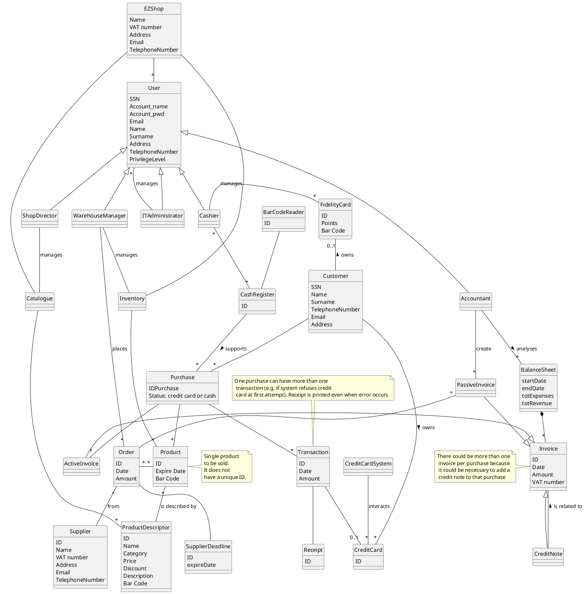

# System Design

Only software components are needed, except for the BarCodeReader which is internal. Both the Credit Card system and the production of the Fidelity Card are external.

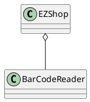

# Deployment Diagram 

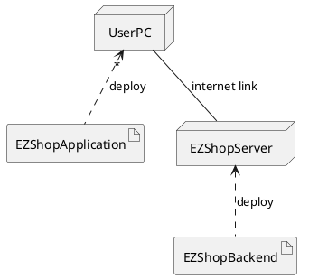

