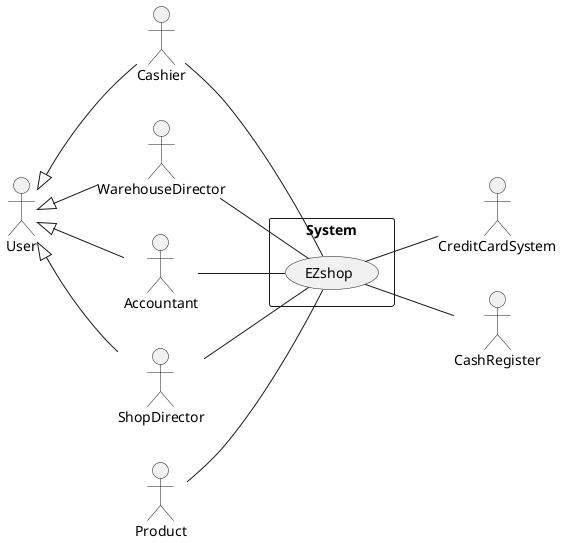

# Requirements Document 

Authors: 
- Mattia Lisciandrello
- Christian Casalini s281823
- Palmucci Leonardo s288126
- Dario Lanfranco s287524

Date:

| Version | Changes |
| ----------------- |:-----------|
| 1 | Added stakeholders and context diagram/interfaces. |

# Contents

- [Essential description](#essential-description)
- [Stakeholders](#stakeholders)
- [Context Diagram and interfaces](#context-diagram-and-interfaces)
	+ [Context Diagram](#context-diagram)
	+ [Interfaces](#interfaces) 
	
- [Stories and personas](#stories-and-personas)
- [Functional and non functional requirements](#functional-and-non-functional-requirements)
	+ [Functional Requirements](#functional-requirements)
	+ [Non functional requirements](#non-functional-requirements)
- [Use case diagram and use cases](#use-case-diagram-and-use-cases)
	+ [Use case diagram](#use-case-diagram)
	+ [Use cases](#use-cases)
    	+ [Relevant scenarios](#relevant-scenarios)
- [Glossary](#glossary)
- [System design](#system-design)
- [Deployment diagram](#deployment-diagram)

# Essential description

Small shops require a simple application to support the owner or manager. A small shop (ex a food shop) occupies 50-200 square meters, sells 500-2000 different item types, has one or a few cash registers 
EZShop is a software application to:
* manage sales
* manage inventory
* manage customers
* support accounting

# Stakeholders

| Stakeholder name  | Description |
| -----------------|:-----------:|
| Buyer | Shop that pays for the system. |
| Software Engineers | Engineers who will produce & design the software and the documentation. |
| Analyst | Who will produce the requirement document. |
| User | Who uses the system. It includes different user profiles. |
| Cashier (profile 1) | Cashier who uses the software. Manages sales. |
| Customer (profile 2) | Is affected indirectly through the cashier. |
| Warehouse director (profile 3) |Manages inventory and orders through the software. |
| Accountant (profile 4) | Handles the accounting through the software. |
| Customer manager (profile 5) | Manages the customers. In most shops it could be the Cashier. |
| Shop director (profile 6) | Director of the shop. Manages the catalogue of products. |
| IT administrator | Who manages the software (Security, DB). |
| Maintainers | Who will repair the software eventually. It could be part of the staff or external. |
| Marketing people | People who sell the software to shops. |
| Product | Involved indirectly and managed by the software. |
| Cash Register | The software involves the cash register since they're part of the output. |

# Context Diagram and interfaces

## Context Diagram
\<Define here Context diagram using UML use case diagram>

\<actors are a subset of stakeholders>

## Interfaces
\<describe here each interface in the context diagram>

\<GUIs will be described graphically in a separate document>

| Actor | Logical Interface | Physical Interface  |
| -------------|:-------------:|:-----:|
| Cashier | GUI | Screen, Keyboard, Mouse |
| Product | Bar code | Bar code reader |
| Cash register | GUI, API | Screen, Keyboard, Printer |
| Credit card system | Credit card | Credit card reader |
| Warehouse director | GUI | Screen, Keyboard, Mouse |
| Accountant | GUI | Screen, Keyboard, Mouse |
| Shop director | GUI | Screen, Keyboard, Mouse |

# Stories and personas
\<A Persona is a realistic impersonation of an actor. Define here a few personas and describe in plain text how a persona interacts with the system>

\<Persona is-an-instance-of actor>

\<stories will be formalized later as scenarios in use cases>

# Functional and non functional requirements

## Functional Requirements

\<In the form DO SOMETHING, or VERB NOUN, describe high level capabilities of the system>

\<they match to high level use cases>

| ID        | Description  |
| ------------- |:-------------:|
|  FR_1     |Handle sells |
|  FR_1.1   |Register payment  |
|  FR_1.2   |Update inventory |
|  FR_1.3   |Send receipt to accounting |
|  FR_1.4   |Handle discounts |
|  FR_1.5   |Handle fidelty card |
|  FR_1.6   |Scan product |
|  FR_1.7   |Add the product to a list of buyings |
|  FR_1.8   |Read credit card |
|  FR_1.9   |Handle cash register |
|  FR_1.9.1 |Print receipt |
|  FR_1.9.2 |Open the cash register  |
|  FR_1.9.3 |Send data to cash register  |
| | |
|  FR_2     |Handle warehouse |
|  FR_2.1   |Handle inventory |
|  FR_2.1.1 |Add product  |
|  FR_2.1.2 |Remove product  |
|  FR_2.1.3 |Update products quantity |
|  FR_2.1.4 |Update products purchase price |
|  FR_2.5   |Handle thresholds |
|  FR_2.6   |Show products (inventory) |
|  FR_2.7   |Manage order |
|  FR_2.7.1 |Add order  |
|  FR_2.7.2 |Remove order |
|  FR_2.7.3 |Modify order  |
|  FR_2.7.4 |Show orders |
|  FR_2.8   |Search a product in the inventory |
| | |
|  FR_3     |Handle catalogue |
|  FR_3.1   |Update price (to sell) of products |
|  FR_3.2   |Add product  |
|  FR_3.3   |Remove product  |
|  FR_3.4   |Show products (catalogue) |
|  FR_3.5   |Search a product in the catalogue |
| | |
|  FR_4     |Handle customers |
|  FR_4.1   |Add fidelty card  |
|  FR_4.2   |Remove fidelty card |
|  FR_4.3   |Handle card points  |
|  FR_4.3.1 |Add card points |
|  FR_4.3.2 |Remove card points |
|  FR_4.4   |Show all fidelty cards & cards points |
|  FR_4.5   |Search a customer |
| | |
|  FR_5     |Support accounting |
|  FR_5.1   |Update finance |
|  FR_5.1.1   |Add invoice |
|  FR_5.1.2   |Modify uncommitted invoice | //not yet sent to Agenzia delle Entrate
|  FR_5.1.3   |Add credit note | //if wrong invoice committed --> correct with a negative-import credit note
|  FR_5.2 | Show accounting data |
|  FR_5.2.1   |Show receipts |
|  FR_5.2.2   |Show invoices |
|  FR_5.2.3 |Show suppliers |
|  FR_5.3   |Show statistics |
|  FR_5.3.1 |Show revenue in a timeframe |
|  FR_5.3.2 |Show best selling products |
|  FR_5.3.3 |Show balance sheet|
|  FR_5.3.4 |Show cash flow |
|  FR_5.4 | Show banking data |
|  FR_5.5 | Show suppliers deadlines timetable |
|  FR_5.6   | Show financial statement | //used to see for what shop's revenues could be used: Are they enough to pay suppliers/debts and also to do new investments?
|  FR_5.7 | Show products (inventory) | //inventory needed to do the annual summary: on 31/12 every shop must declare what there is in the warehouse. Accountant must be able to access to the inventory
| | |
|  FR_6     |Handle accounts |
|  FR_6.1   |Add account |
|  FR_6.2   |Remove account|
|  FR_6.3   |Update account|
|  FR_6.4   |Login |
|  FR_6.5   |Logout |
|  FR_7     |Manage rights | //Authorize access to functions to specific actors according to access rights

FR_1.5 means that fidelty card of a user must be updated and it is directly related to FR__4.
In FR_1.6, whenever you scan a product, you add it to the list of products the customer is buying.

FR_2.5 means that if products go below certain threshold, the director is notified.

FR_.4: fidelty are managed totally by the shop. The customer can choose to get subscribe/unsubscribe and he will be given a card. He will just decide to use or not to use the points, which will be involved in giving discounts to the customer. If he wants to check how many points does he have, he has to get in contact with the shop by himself/with the cashier.

## Non Functional Requirements

\<Describe constraints on functional requirements>

| ID        | Type (efficiency, reliability, ..)           | Description  | Refers to |
| ------------- |:-------------:| :-----:| -----:|
|  NFR_1     | Usability   | Application should be used with no specific training for the users  | All FR|
| NFR_2 | Usability | Insert video-tutorial for using the software for support the accounting | FR_5 |
|  NFR_3     | Performance | All functions should complete in less than 0.5s  |All FR |
|  NFR_4     | Localisation | Decimal numbers use . (dot) as decimal separator  | All FR |
| NFR_5 | Privacy | The data of one customer should not be accessible to users other than users who handle fidelty cards. | All FR |
| NFR_6 | Availability | At least 95% | All FR |
| Domain | // | Currency is Euro | All FR |

# Use case diagram and use cases

## Use case diagram
\<define here UML Use case diagram UCD summarizing all use cases, and their relationships>

\<next describe here each use case in the UCD>
### Use case 1, UC1
| Actors Involved        |  |
| ------------- |:-------------:|
|  Precondition     | \<Boolean expression, must evaluate to true before the UC can start> |
|  Post condition     | \<Boolean expression, must evaluate to true after UC is finished> |
|  Nominal Scenario     | \<Textual description of actions executed by the UC> |
|  Variants     | \<other executions, ex in case of errors> |

##### Scenario 1.1 

\<describe here scenarios instances of UC1>

\<a scenario is a sequence of steps that corresponds to a particular execution of one use case>

\<a scenario is a more formal description of a story>

\<only relevant scenarios should be described>

| Scenario 1.1 | |
| ------------- |:-------------:|
|  Precondition     | \<Boolean expression, must evaluate to true before the scenario can start> |
|  Post condition     | \<Boolean expression, must evaluate to true after scenario is finished> |
| Step#        | Description  |
|  1     |  |
|  2     |  |
|  ...     |  |

##### Scenario 1.2

##### Scenario 1.x

### Use case 2, UC2
..

## Handle catalogue

### Use case x, UCx - Update price (to sell) of products
| Actors Involved        | Shop director |
| ------------- |:-------------:|
|  Precondition     | Account shop director must exist & authenticated ; the catalogue contains at least one product |
|  Post condition     | Price of a product updated |
|  Nominal Scenario     | Shop director selects a product ; The shop director modifies the price of the product in the catalogue ; The application updates the price |
|  Variants     |  The catalogue is empty: no product will be shown |

### Use case x, UCx - Add product
| Actors Involved        | Shop director |
| ------------- |:-------------:|
|  Precondition     | Account shop director must exist & authenticated |
|  Post condition     | One or more products are added in the catalogue|
|  Nominal Scenario     | Shop director selects to add a product ; Shop director selects a product from the inventory ; The application assigns the inventory ID to the product and is added to the catalogue |
|  Variants     | A product can be added only once in a catalogue: each product has an unique ID; a error message is printed.|
|  Variants     | Catalogue doesn't exist; the application creates a catalogue and the product is added |

### Use case x, UCx - Remove product
| Actors Involved        | Shop director |
| ------------- |:-------------:|
|  Precondition     | Account shop director must exist & authenticated ; the catalogue contains at least one product |
|  Post condition     | One or more products are removed from the catalogue |
|  Nominal Scenario     | Shop director selects to remove a product ; Shop director chooses to remove one or more products present in the catalogue ; The application removes the product(s) from the catalogue|
|  Variants     |The catalogue is empty: no product will be shown|

## Handle customers

Actors could be Cashier or other worker in charge to handle the customers.
We'll consider the Cashier as the actor.

### Use case x, UCx - Add fidelty card
| Actors Involved        | Cashier|
| ------------- |:-------------:|
|  Precondition     | Account cashier must exist & authenticated|
|  Post condition     |A fidelty card is added to the database and is given to the customer |
|  Nominal Scenario     | Cashier selects to add a fidelty card; the cashier is prompted with forms to add the customer data ; The application assigns a new ID to the card in the database |
|  Variants     | A customer can have at most one fidelty card active: each fidelty card has an unique ID, along with the customer SSN.  |

### Use case x, UCx - Remove fidelty card
| Actors Involved        | Cashier|
| ------------- |:-------------:|
|  Precondition     | Account cashier must exist & authenticated ; the fidelty card must exist |
|  Post condition     |A fidelty card is removed from the database and is retired from the customer |
|  Nominal Scenario     | Cashier selects to remove a fidelty card; the cashier chooses to remove one or more fidelty card  ; The application removes the card(s) from the database |
|  Variants     | There are no fidelty cards: no card will be shown. |

### Use case x, UCx - Add card points
| Actors Involved        | Cashier |
| ------------- |:-------------:|
|  Precondition     | Account cashier must exist & authenticated; the fidelty card must exist |
|  Post condition     | Points are added to the card|
|  Nominal Scenario     | Cashier selects to add points to a fidelty card; the cashier chooses the amount to add  ; The application updates the card points |
|  Variants     | There are no fidelty cards: no card will be shown. |

### Use case x, UCx - Remove card points
| Actors Involved        | Cashier |
| ------------- |:-------------:|
|  Precondition     | Account cashier must exist & authenticated; the fidelty card must exist |
|  Post condition     | Points are removed from the card|
|  Nominal Scenario     | Cashier selects to remove points from a fidelty card; the cashier chooses the amount to remove ; The application updates the card points |
|  Variants     | There are no fidelty cards: no card will be shown. |

## Handle accounts

In these use cases, the actor is an user from the shop.

### Use case x, UCx - Add account
| Actors Involved        | User  |
| ------------- |:-------------:|
|  Precondition     | User doesn't have an account yet |
|  Post condition     | Account is added to the system |
|  Nominal Scenario     | User creates a new account and inserts his data |
|  Variants     | A user can have only one account, this is checked through the email. |

### Use case x, UCx - Remove account
| Actors Involved        | User |
| ------------- |:-------------:|
|  Precondition     | Account user must exist |
|  Post condition     |Account user is removed from the system|
|  Nominal Scenario     | User deletes his account|
|  Variants     | - |

### Use case x, UCx - Update account
| Actors Involved        | User |
| ------------- |:-------------:|
|  Precondition     | Account user must exist |
|  Post condition     | Account user's info are modified |
|  Nominal Scenario     | User updates his account and modifies the fields he desires|
|  Variants     | - |
### Use case x, UCx - Login
| Actors Involved        | User |
| ------------- |:-------------:|
|  Precondition     | Account user must exist & must not be authenticated |
|  Post condition     | Account user is authenticated |
|  Nominal Scenario     | User makes the login and inserts his email and password |
|  Variants     | Email/password are wrong; an error is printed on the screen |

### Use case x, UCx - Logout
| Actors Involved        | User |
| ------------- |:-------------:|
|  Precondition     | Account user must exist & must be authenticated  |
|  Post condition     | User is not authenticated anymore |
|  Nominal Scenario     | User makes the logout |
|  Variants     | - |

## Support accounting

In these use cases, the actor is an accountant, or a generic user from the shop acting as the accountant, managing the simplified accounting of the shop (hypothesis: annual revenue below 700'000€) taking data from Agenzia delle Entrate informatic system.

### Use case x, UCx - Add invoice
| Actors Involved        | Accountant |
| ------------- |-------------|
|  Precondition     | Accountant account must exist & must be authenticated; Shop's account must exist in Agenzia delle Entrate system |
|  Post condition     | New invoice has been added to the system |
|  Nominal Scenario     | 1. Accountant selects "New invoice" 2. Software asks to user if a new active or passive invoice has to be added 3. Accountant choose the passive option 4. Software gives to user a form to fill out 5. Accountant fills the form with the new invoice data 6. Accountant confirms |
|  Variants     | - Accountant choose the new active invoice option |

### Use case x, UCx - Modify uncommitted invoice
| Actors Involved        | Accountant |
| ------------- |:-------------:|
|  Precondition     | Accountant account must exist & must be authenticated;  Shop's account must exist in Agenzia delle Entrate system;  Uncommitted invoice must exist |
|  Post condition     | Uncommitted invoice has been updated |
|  Nominal Scenario     | 1. Software shows all the uncommitted invoices (invoices not yet sent to Agenzia delle Entrate system) 2. Accountant chooses one of them and selects the "Modify" option 3. Software provides the selected invoice form 4. Accounant modifies the form with new data 5. Accountant confirms |
|  Variants     | - |

### Use case x, UCx - Add credit note
| Actors Involved        | Accountant |
| ------------- |:-------------:|
|  Precondition     | Accountant account must exist & must be authenticated; Shop's account must exist in Agenzia delle Entrate system; At least one wrong invoice is present in the system |
|  Post condition     | New credit note is added to the system to compensate wrong invoices |
|  Nominal Scenario     | 1. Accountant selects "New credit note" 2. Software gives to user a form to fill out 3. Accountant fills the form with the new credit note data (negative import value) 4. Accountant confirms |
|  Variants     | - |

### Use case x, UCx - Show statistics
| Actors Involved        | Accountant |
| ------------- |:-------------:|
|  Precondition     | Accountant account must exist & must be authenticated; Shop's account must exist in Agenzia delle Entrate system |
|  Post condition     | Statistics are shown on screen in a table, in a diagram or a graph |
|  Nominal Scenario     | Accountant selects a specific timeframe and shows the shop's revenue in that time period |
|  Variants     | - |

##### Scenario x.1 

| Scenario |  Show revenue in a timeframe |
| ------------- |:-------------:|
|  Precondition     | Enough data must exist in a specific timeframe |
|  Post condition     | Revenues in a specific timeframe are shown on the screen |
| Step#        | Description  |
|  1     |  User selects a specific timeframe |
|  2     |  System searches the revenues of that timeframe |
|  3    |  System displays the found revenues |

##### Scenario x.2 

| Scenario |  Show best selling products |
| ------------- |:-------------:|
|  Precondition     | At least one product must exist in catalogue |
|  Post condition     | Top 5 best selling products is shown on screen |
| Step#        | Description  |
|  1     |  System searches the best 5 selling products of all time |
|  2    |  System displays the found products (could be less than 5) |

### Use case x, UCx
..

#
## Handle inventory
In these use cases, the actor is the Warehouse Manager or another user with an account with the privileges required to manage the inventory. The actor can inspect the inventory, add new items to it, and update or remove the existing ones.
In addition, the actor should be able to place new orders.

### Use case x, UCx - Add product to the inventory
| Actors Involved 	| 			Warehouse Manager              |
| --------------- 	| ---------------------------------------- |
|  Precondition   	| 1. Warehouse Manager has an account 2. Warehouse Manager is authenticated 3. Inventory exists |
|  Post condition   | Inventory contains a new product		   |
|  Nominal Scenario | 1. Warehouse Manager clicks on 'New Product' icon 2. The software presents a form to fill in with product's infos 3. Warehouse Manager fills in the form 4. The software assigns to the product an incremental and unique ID |
|  Variants         | - Before completing the operation, the Warehouse Manager decides to discard it - The product cannot be added because one or more compulsory fields have not been filled in |

### Use case x, UCx - Remove product from the inventory
| Actors Involved 	| 			Warehouse Manager              |
| --------------- 	| ---------------------------------------- |
|  Precondition     | 1. Warehouse Manager has an account 2. Warehouse Manager is authenticated 3. Inventory exists 4. The account has the necessary privileges to modify the inventory |
|  Post condition   | Target product has been removed from the inventory|
|  Nominal Scenario | 1. Warehouse Manager looks for the product using the search bar 2. The software presents a list of matching products 3. Warehouse Manager selects the target product 4. Warehouse Manager clicks "Remove" button &ensp;(4.1) Software asks for confirmation &ensp;(4.2) Warehouse Manager confirms 5. Software removes the product from the inventory |
|  Variants         | - Target product does not exist in the inventory - Product is removed in another way: &ensp;* right-clicking on product &ensp;* select "Remove" from context menu |

### Use case x, UCx - Update products quantity
| Actors Involved 	| 			Warehouse Manager              |
| --------------- 	| ---------------------------------------- |
|  Precondition   	| 1. Warehouse Manager has an account 2. Warehouse Manager is authenticated 3. Inventory exists |
|  Post condition 	| Target product's quantity has been updated |
|  Nominal Scenario | 1. Warehouse Manager searches for the product using the search bar 2. The software presents a list of matching products 3. Warehouse Manager selects the target product 4. Warehouse Manager clicks "Edit" button 5. Software presents the interface from which product's properties (like quantity and price) can be modified 6. Warehouse Manager updates quantity |
|  Variants         | - Target product does not exist in the inventory  |

### Use case x, UCx - Update products purchase price
| Actors Involved 	| 			Warehouse Manager              |
| --------------- 	| ---------------------------------------- |
|  Precondition   	| 1. Warehouse Manager has an account 2. Warehouse Manager is authenticated 3. Inventory exists |
|  Post condition 	| Target product's purchase price has been updated |
|  Nominal Scenario | 1. Warehouse Manager searches for the product using the search bar 2. The software presents a list of matching products 3. Warehouse Manager selects the target product 4. Warehouse Manager clicks "Edit" button 5. Software presents the interface from which product's properties can be modified 6. Warehouse Manager updates quantity |
|  Variants         | - Target product does not exist in the inventory  |

### Use case x, UCx - Handle quantity thresholds
| Actors Involved 	| 			Warehouse Manager              |
| --------------- 	| ---------------------------------------- |
|  Precondition   	| 1. Warehouse Manager has an account 2. Warehouse Manager is authenticated 3. Inventory exists |
|  Post condition 	| A new threshold has been setted or an existing one has been removed |
|  Nominal Scenario | 1. Warehouse Manager searches for the product using the search bar 2. The software presents a list of matching products 3. Warehouse Manager selects the target product 4. Warehouse Manager clicks "Edit" button 5. Software presents the interface from which product's properties can be modified 6. Warehouse Manager sets, updates or removes threshold for alert generation |
|  Variants         | - Target product does not exist in the inventory  |

[//]: # (TODO: write SET, UPDATE and REMOVE scenarios) 

### Use case x, UCx - Show products
| Actors Involved 	| 			Warehouse Manager              |
| --------------- 	| ---------------------------------------- |
|  Precondition   	| 1. Warehouse Manager has an account 2. Warehouse Manager is authenticated 3. Inventory exists |
|  Post condition 	| A list of products, filtered and sorted as desired, is shown |
|  Nominal Scenario | Warehouse Manager accesses stock's section of the software, where he can look at the complete list of products sorted by ID (default sort) |
|  Variants         |  - A different sorting criteria is selected -  Products are filtered writing something in the search bar |

#
## Manage orders
### Use case x, UCx - Place new order
| Actors Involved 	| 			Warehouse Manager              |
| --------------- 	| ---------------------------------------- |
|  Precondition   	| 1. Warehouse Manager has an account 2. Warehouse Manager is authenticated 3. Inventory exists |
|  Post condition 	| A new order has been placed |
|  Nominal Scenario | 1. Warehouse Manager clicks on 'New Order' icon 2. The software presents the view for placing a new order 3. Warehouse Manager selects products, as well as the desired quantity, and fills in other necessary infos &ensp;(3.1) Software asks for confirmation &ensp;(3.2) Warehouse Manager gives confirmation  4. The software places the order |
|  Variants         | - Before completing the operation, the Warehouse Manager decides to discard it - The order cannot be placed for some reason |

### Use case x, UCx - Place new order
| Actors Involved 	| 			Warehouse Manager              |
| --------------- 	| ---------------------------------------- |
|  Precondition   	| 1. Warehouse Manager has an account 2. Warehouse Manager is authenticated 3. Inventory exists |
|  Post condition 	| A new order has been placed |
|  Nominal Scenario | 1. Warehouse Manager clicks on 'New Order' icon 2. The software presents the view for placing a new order 3. Warehouse Manager selects products, as well as the desired quantity, and fills in other necessary infos &ensp;(3.1) Software asks for confirmation &ensp;(3.2) Warehouse Manager gives confirmation  4. The software places the order |
|  Variants         | - Before completing the operation, the Warehouse Manager decides to discard it - The order cannot be placed for some reason |

|  FR_2.7.1 |Add order  |
|  FR_2.7.2 |Remove order |
|  FR_2.7.3 |Modify order  |
|  FR_2.7.4 |Show orders |
|  FR_2.8   |Search a product in the inventory |

# Glossary

\<use UML class diagram to define important terms, or concepts in the domain of the system, and their relationships> 

\<concepts are used consistently all over the document, ex in use cases, requirements etc>

# System Design
\<describe here system design>

\<must be consistent with Context diagram>

# Deployment Diagram 

\<describe here deployment diagram >

