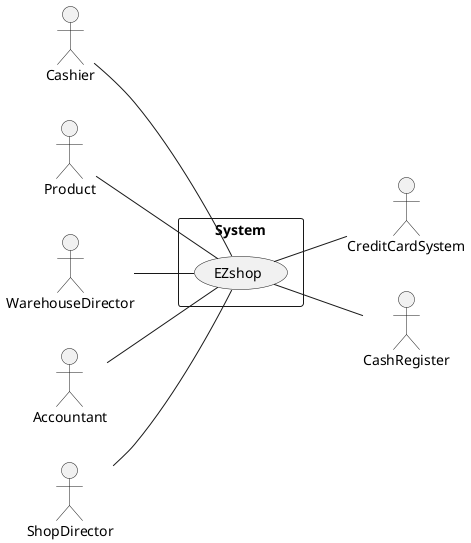

# Requirements Document 

Authors: 
- Mattia Lisciandrello
- Christian Casalini s281823
- Palmucci Leonardo s288126
- Dario Lanfranco s287524

Date:

| Version | Changes |
| ----------------- |:-----------|
| 1 | Added stakeholders and context diagram/interfaces. |

# Contents

- [Essential description](#essential-description)
- [Stakeholders](#stakeholders)
- [Context Diagram and interfaces](#context-diagram-and-interfaces)
	+ [Context Diagram](#context-diagram)
	+ [Interfaces](#interfaces) 
	
- [Stories and personas](#stories-and-personas)
- [Functional and non functional requirements](#functional-and-non-functional-requirements)
	+ [Functional Requirements](#functional-requirements)
	+ [Non functional requirements](#non-functional-requirements)
- [Use case diagram and use cases](#use-case-diagram-and-use-cases)
	+ [Use case diagram](#use-case-diagram)
	+ [Use cases](#use-cases)
    	+ [Relevant scenarios](#relevant-scenarios)
- [Glossary](#glossary)
- [System design](#system-design)
- [Deployment diagram](#deployment-diagram)

# Essential description

Small shops require a simple application to support the owner or manager. A small shop (ex a food shop) occupies 50-200 square meters, sells 500-2000 different item types, has one or a few cash registers 
EZShop is a software application to:
* manage sales
* manage inventory
* manage customers
* support accounting

# Stakeholders

| Stakeholder name  | Description |
| -----------------|:-----------:|
| Buyer | Shop that pays for the system. |
| Software Engineers | Engineers who will produce & design the software and the documentation. |
| Analyst | Who will produce the requirement document. |
| User | Who uses the system. It includes different user profiles. |
| Cashier (profile 1) | Cashier who uses the software. Manages sales. |
| Customer (profile 2) | Is affected indirectly through the cashier. |
| Warehouse director (profile 3) |Manages inventory and orders through the software. |
| Accountant (profile 4) | Handles the accounting through the software. |
| Customer manager (profile 5) | Manages the customers. In most shops it could be the Cashier. |
| Maintainers | Who will repair the software eventually. It could be part of the staff or external. |
| IT administrator | Who manages the software (Security, DB). |
| Shop director | Director of the shop. Manages the catalogue of products. |
| Marketing people | People who sell the software to shops. |
| Product | Involved indirectly and managed by the software. |
| Cash Register | The software involves the cash register since they're part of the output. |

# Context Diagram and interfaces

## Context Diagram
\<Define here Context diagram using UML use case diagram>

\<actors are a subset of stakeholders>

## Interfaces
\<describe here each interface in the context diagram>

\<GUIs will be described graphically in a separate document>

| Actor | Logical Interface | Physical Interface  |
| -------------|:-------------:|:-----:|
| Cashier | GUI | Screen, Keyboard, Mouse |
| Product | Bar code | Bar code reader |
| Cash register | GUI, API | Screen, Keyboard, Printer |
| Credit card system | Credit card | Credit card reader |
| Warehouse director | GUI | Screen, Keyboard, Mouse |
| Accountant | GUI | Screen, Keyboard, Mouse |
| Shop director | GUI | Screen, Keyboard, Mouse | 

# Stories and personas
\<A Persona is a realistic impersonation of an actor. Define here a few personas and describe in plain text how a persona interacts with the system>

\<Persona is-an-instance-of actor>

\<stories will be formalized later as scenarios in use cases>

# Functional and non functional requirements

## Functional Requirements

\<In the form DO SOMETHING, or VERB NOUN, describe high level capabilities of the system>

\<they match to high level use cases>

| ID        | Description  |
| ------------- |:-------------:| 
|  FR1     |Handle sells |
|  FR1.1   |Register payment  |
|  FR1.2   |Update inventory |
|  FR1.3   |Send receipt to accounting |
|  FR1.4   |Handle discounts |
|  FR1.5   |Handle fidelty card |
|  FR1.6   |Scan product |
|  FR1.7   |Add the product to a list of buyings |
|  FR1.8   |Read credit card | 
|  FR1.9   |Handle cash register |
|  FR1.9.1 |Print receipt |
|  FR1.9.2 |Open the cash register  |
|  FR1.9.3 |Send data to cash register  |
| | |
|  FR2     |Handle inventory |
|  FR2.1   |Add product  |
|  FR2.2   |Remove product  |
|  FR2.3   |Update quantity of products  |
|  FR2.4   |Update price (to buy) of products |
|  FR2.5   |Handle thresholds | 
|  FR2.6   |Show products (inventory) |
|  FR2.7   |Manage order |
|  FR2.7.1 |Add order  |
|  FR2.7.2 |Remove order |
|  FR2.7.3 |Modify order  |
|  FR2.7.4 |Show orders |
| | |
|  FR3     |Handle catalogue |
|  FR3.1   |Update price (to sell) of products |
|  FR3.2   |Add product  |
|  FR3.3   |Remove product  |
|  FR3.4   |Show products (catalogue) |
| | |
|  FR4     |Handle customers | 
|  FR4.1   |Add fidelty card  |
|  FR4.2   |Remove fidelty card |
|  FR4.3   |Handle card points  |
|  FR4.3.1 |Add points |
|  FR4.3.2 |Remove points | 
|  FR4.4   |Show all fidelty cards & cards point |
| | |
|  FR5     |Support accounting |
|  FR5.1   |Update finance |
|  FR5.2   |Show statistics |
|  FR5.2.1 |Show sells in a timeframe |
|  FR5.2.2 |Show best selling products |
|  FR5.2.3 |Show balance sheet|
|  FR5.3   |Show financial statement |
|  FR5.3.1 |Show balance sheet |
|  FR5.3.2 |Show cash flow |
|  FR5.3.3 |Show income statement |
| | |
|  FR6     |Handle accounts |
|  FR6.1   |Add account |
|  FR6.2   |Remove account|
|  FR6.3   |Update account|
|  FR6.4   |Login |
|  FR6.5   |Logout |

FR1.5 means that fidelty card of a user must be updated. Is directly related to FR4.
In FR1.6, whenever you scan a product, you add it to the list of products the customer is buying.

FR2.5 means that if products go below certain threshold, the director is notified.

FR.4: fidelty are managed totally by the shop. The customer can choose to get subscribe/unsubscribe and he will be given a card. He will just decide to use or not to use the points, which will be involved in giving discounts to the customer. If he wants to check how many points does he have, he has to get in contact with the shop by himself/with the cashier.

(P.S.: FR5.3 , FR5.3.X are needed?)

## Non Functional Requirements

\<Describe constraints on functional requirements>

| ID        | Type (efficiency, reliability, ..)           | Description  | Refers to |
| ------------- |:-------------:| :-----:| -----:|
|  NFR1     | Usability   | Application should be used with no specific training for the users  | All FR|
|  NFR2     | Performance | All functions should complete in less than 0.5s  |All FR |
|  NFR3     | Localisation | Decimal numbers use . (dot) as decimal separator  | All FR |
| NFR4 | Privacy | The data of one customer should not be accessible to users other than users who handle fidelty cards. | All FR | 
| NFR5 | Availability | At least 95% | All FR |
| Domain | // | Currency is Euro | All FR |

# Use case diagram and use cases

## Use case diagram
\<define here UML Use case diagram UCD summarizing all use cases, and their relationships>

\<next describe here each use case in the UCD>
### Use case 1, UC1
| Actors Involved        |  |
| ------------- |:-------------:| 
|  Precondition     | \<Boolean expression, must evaluate to true before the UC can start> |  
|  Post condition     | \<Boolean expression, must evaluate to true after UC is finished> |
|  Nominal Scenario     | \<Textual description of actions executed by the UC> |
|  Variants     | \<other executions, ex in case of errors> |

##### Scenario 1.1 

\<describe here scenarios instances of UC1>

\<a scenario is a sequence of steps that corresponds to a particular execution of one use case>

\<a scenario is a more formal description of a story>

\<only relevant scenarios should be described>

| Scenario 1.1 | |
| ------------- |:-------------:| 
|  Precondition     | \<Boolean expression, must evaluate to true before the scenario can start> |
|  Post condition     | \<Boolean expression, must evaluate to true after scenario is finished> |
| Step#        | Description  |
|  1     |  |  
|  2     |  |
|  ...     |  |

##### Scenario 1.2

##### Scenario 1.x

### Use case 2, UC2
..

### Use case x, UCx
..

# Glossary

\<use UML class diagram to define important terms, or concepts in the domain of the system, and their relationships> 

\<concepts are used consistently all over the document, ex in use cases, requirements etc>

# System Design
\<describe here system design>

\<must be consistent with Context diagram>

# Deployment Diagram 

\<describe here deployment diagram >

