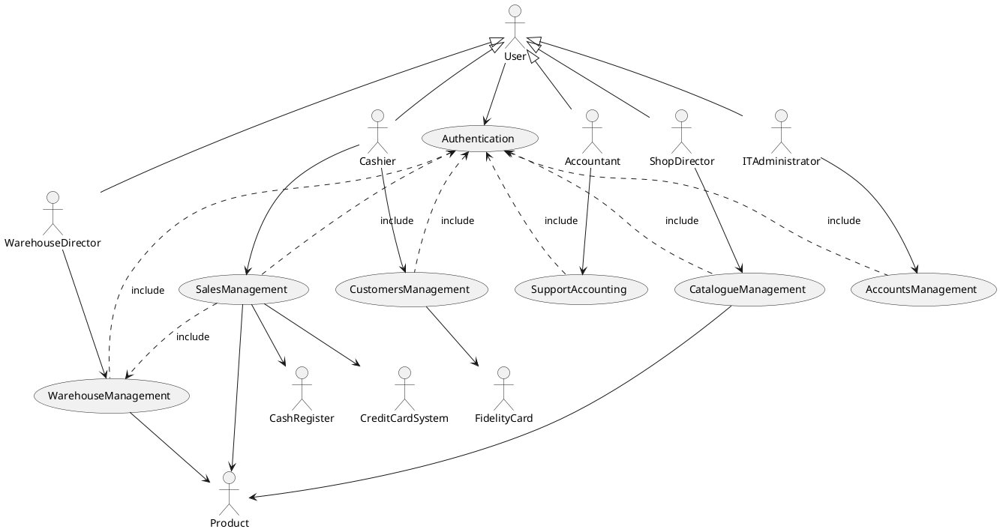
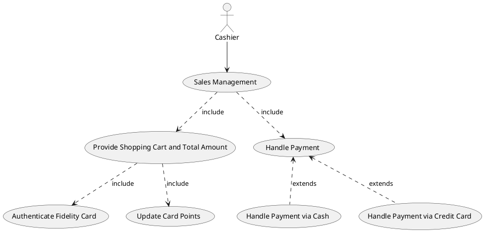
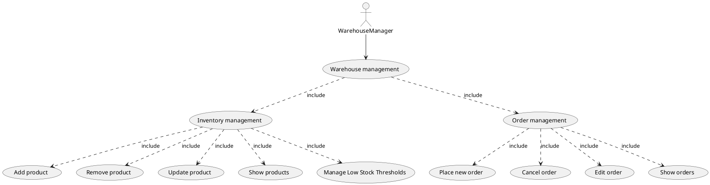
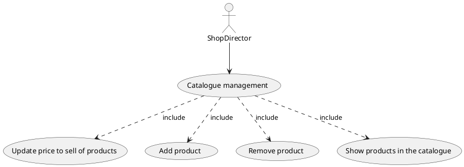
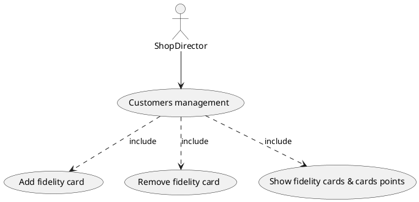
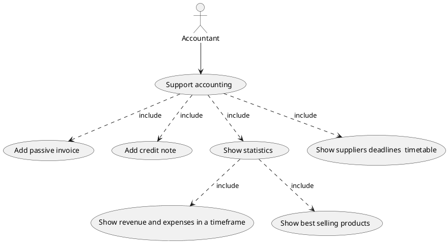
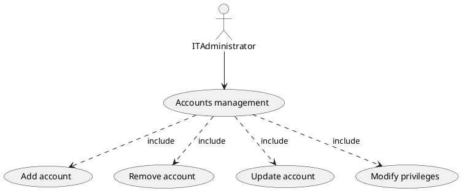
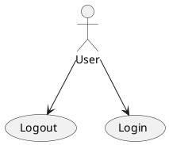
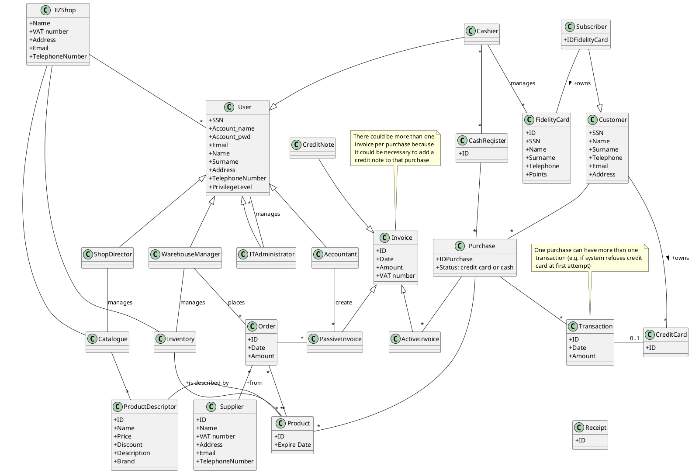
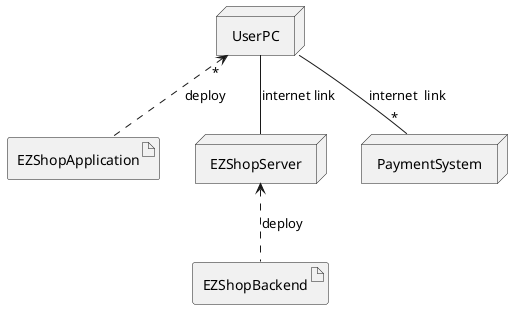

# Requirements Document 

Authors: 
- Mattia Lisciandrello s286329
- Christian Casalini s281823
- Palmucci Leonardo s288126
- Dario Lanfranco s287524 

Date: 10/04/2021

| Version | Changes |
| ------- |---------|
| 7 | Added glossary |

# Contents

- [Essential description](#essential-description)
- [Stakeholders](#stakeholders)
- [Context Diagram and interfaces](#context-diagram-and-interfaces)
	+ [Context Diagram](#context-diagram)
	+ [Interfaces](#interfaces) 
	
- [Stories and personas](#stories-and-personas)
- [Functional and non functional requirements](#functional-and-non-functional-requirements)
	+ [Functional Requirements](#functional-requirements)
	+ [Non functional requirements](#non-functional-requirements)
- [Use case diagram and use cases](#use-case-diagram-and-use-cases)
	+ [Use case diagram](#use-case-diagram)
	+ [Use cases](#use-cases)
    	+ [Relevant scenarios](#relevant-scenarios)
- [Glossary](#glossary)
- [System design](#system-design)
- [Deployment diagram](#deployment-diagram)

# Essential description

Small shops require a simple application to support the owner or manager. A small shop (ex a food shop) occupies 50-200 square meters, sells 500-2000 different item types, has one or a few cash registers 
EZShop is a software application to:
* manage sales
* manage inventory
* manage customers
* support accounting

# Stakeholders

| Stakeholder name  | Description |
| ----------------- | ----------- |
| Buyer | Shop that pays for the system. |
| Software Engineers | Engineers who will produce & design the software and the documentation. |
| Analyst | Who will produce the requirement document. |
| User | Who uses the system. It includes different user profiles. |
| Cashier (profile 1) | Cashier who uses the software. Manages sales. |
| Customer (profile 2) | Is affected indirectly through the cashier. |
| Warehouse manager (profile 3) | Manages inventory and orders through the software. |
| Accountant (profile 4) | Manages the accounting through the software. |
| Customers manager (profile 5) | Manages the customers. In most shops it could be the Cashier. |
| Shop director (profile 6) | Director of the shop. Manages the catalogue of products. |
| IT administrator (profile 7) | Who manages the software (Security/Accounts, DB). |
| Maintainers | Who will repair the software eventually. It could be part of the staff or external. |
| Marketing people | People who sell the software to shops. |
| Product | Involved indirectly and managed by the software. |
| Cash Register | The software involves the cash register since they're part of the output. |
| Fidelity card | Fidely card associated with a customer. |

# Context Diagram and interfaces

## Context Diagram
\<Define here Context diagram using UML use case diagram>

\<actors are a subset of stakeholders>

## Interfaces
\<describe here each interface in the context diagram>

\<GUIs will be described graphically in a separate document>

| Actor 				| Logical Interface | Physical Interface  |
| --------------------- | -----------------	| ------------------- |
| Cashier 				| GUI 				| Screen, Keyboard, Mouse |
| Product 				| Bar code 			| Bar code reader |
| Cash register 		| GUI, API ([Cash Register API](https://developers.mypos.eu/en/doc/in_person_payments/v1_0/356-cash-register-remote-api))			| Screen, Keyboard, Printer |
| Credit card system 	| Web services ([Payment API](https://developers.mypos.eu/en/doc/in_person_payments/v1_0/243-payment-api))		| Internet, POS |
| Warehouse manager 	| GUI 				| Screen, Keyboard, Mouse |
| Accountant 			| GUI 				| Screen, Keyboard, Mouse |
| Shop director 		| GUI 				| Screen, Keyboard, Mouse |
| Fidelity card 		| Bar code 			| Bar code reader | 

# Stories and personas
\<A Persona is a realistic impersonation of an actor. Define here a few personas and describe in plain text how a persona interacts with the system>

\<Persona is-an-instance-of actor>

\<stories will be formalized later as scenarios in use cases>

# Functional and non functional requirements

## Functional Requirements

\<In the form DO SOMETHING, or VERB NOUN, describe high level capabilities of the system>

\<they match to high level use cases>

| ID       		| Description  |
| ------------- | ------------ |
|  FR_1     	| Sales management |
|  FR_1.1   	| Provide Shopping Cart and Total Amount |
|  FR_1.1.1	| Scan product |
|  FR_1.1.2	| Search Product Price in the Catalogue |
|  FR_1.1.3	| Apply Discounts (for any Customer) |
|  FR_1.1.4	| Compute Total Amount |
|  FR_1.2	| Authentication of Fidelity Card |
|  FR_1.2.1	| Scan Fidelity Card |
|  FR_1.2.2	| Validate Fidelity Card |
|  FR_1.2.3	| Apply Discounts (for Customers with a Fidelity Card) |
|  FR_1.2.4	| Update card points |
|  FR_1.3	| Handle Payment (Cash or via Credit Card) |
|  FR_1.3.1	| Scan Credit Card (via Credit Card System) |
|  FR_1.3.2	| Send money through Payment Gateway |
|  FR_1.3.3	| Notify if Payment was successful or not |
|  FR_1.3.4	| Open the Cash Register (after successful Payment)|
|  FR_1.3.5	| Print the Receipt (after successful Payment)|
|  FR_1.3.6	| Send Active Invoice to Accounting (after successful Payment)|
|  FR_1.3.7	| Remove Shopping Cart elements from the Inventory (after successful Payment)|
||
|  FR_2     	| Warehouse management |
|  FR_2.1   	| Inventory management |
|  FR_2.1.1 	| Add product |
|  FR_2.1.2 	| Remove product |
|  FR_2.1.3 	| Update product |
|  FR_2.1.5   	| Manage Low Stock Thresholds |
|  FR_2.1.6   	| Show products (inventory) |
|  FR_2.2   	| Manage order |
|  FR_2.2.1 	| Add order |
|  FR_2.2.2 	| Remove order |
|  FR_2.2.3 	| Modify order |
|  FR_2.2.4 	| Show orders |
||
|  FR_3     	| Catalogue management |
|  FR_3.1   	| Update products selling price |
|  FR_3.2   	| Add product |
|  FR_3.3   	| Remove product  |
|  FR_3.4   	| Show products in the catalogue |
||
|  FR_4     	| Customers management |
|  FR_4.1   	| Add fidelity card |
|  FR_4.2   	| Remove fidelity card |
|  FR_4.3    	| Show fidelity cards & cards points |
||
|  FR_5     	| Support accounting |
|  FR_5.1   	| Update finance |
|  FR_5.1.1   	| Add invoice (passive) |
|  FR_5.1.3   	| Add credit note | //if wrong invoice committed --> correct with a negative-import credit note
|  FR_5.2 		| Show accounting data |
|  FR_5.2.1   	| Show invoices |
|  FR_5.2.2 	| Show suppliers |
|  FR_5.2.3 	| Show balance sheet |
|  FR_5.3   	| Show statistics |
|  FR_5.3.1 	| Show revenue and expenses in a timeframe |
|  FR_5.3.2 	| Show best selling products |
|  FR_5.4 		| Show banking data |
|  FR_5.5 		| Show suppliers deadlines timetable |
|  FR_5.6   	| Show financial statement | //used to see for what shop's revenues could be used: Are they enough to pay suppliers/debts and also to do new investments?
||
|  FR_6     	| Accounts management |
|  FR_6.1   	| Add account |
|  FR_6.2   	| Remove account|
|  FR_6.3   	| Update account|
|  FR_6.4    	| Modify privileges | //Authorize access to functions to specific actors according to access rights
|  FR_7			| Authentication |
|  FR_7.1		| Login |
|  FR_7.2		| Logout |

FR_1.5
It means that fidelity card of a user must be updated and it is directly related to FR_4.
In FR_1.6, whenever you scan a product, you add it to the list of products the customer is buying.

FR_2 
Inventory management is focused solely on the actual items being held within a warehouse. Warehouse management, in contrast, is more concerned with the “journey” of individual items as they flow through the warehouse.

FR_2.1.5
Allow to set, update or remove Low Stock Thresholds so that an alert is generated if a product's quantity goes below the desired threshold.

FR_4
Fidelity cards are managed totally by the shop. The customer can choose to get subscribe/unsubscribe and he will be given a card. He will just decide to use or not to use the points, which will be involved in giving discounts to the customer. If he wants to check how many points does he have, he has to get in contact with the shop by himself/with the cashier.

## Non Functional Requirements

\<Describe constraints on functional requirements>

| ID        |     Type 	    | 								Description  															| Refers to |
| --------- | ------------- | ----------------------------------------------------------------------------------------------------- | --------- |
| NFR_1     | Usability   	| User should learn how to use the software within 30 minutes of training 								| All FR 	|
| NFR_2     | Efficiency	| All functions should complete in less than 0.5s 														| All FR 	|
| NFR_3     | Localisation 	| Decimal numbers use . (dot) as decimal separator  													| All FR 	|
| NFR_4 	| Privacy 		| Customers data should not be accessible to users other than the ones who manage fidelity cards.       | All FR 	|
| NFR_5 	| Availability 	| At least 95% 																							| All FR 	|
| NFR_6     | Security      | User should have access only to functions and resources which they require 							| All FR 	|
|NFR_7|Privacy|Customer credit card data must not be stored in the system |FR1|
| Domain 	| // 			| Currency is Euro  																					| All FR 	|

# Use case diagram and use cases

## Use case diagram
\<define here UML Use case diagram UCD summarizing all use cases, and their relationships>

### Use Case diagram: Sales management

### Use Case diagram: Warehouse management

### Use Case diagram: Catalogue management

### Use Case diagram: Customers management

### Use Case diagram: Support accounting

### Use Case diagram: Accounts management

### Use Case diagram: Authentication

\<next describe here each use case in the UCD>

##  Sales management

### Use case 1, UC1 - Provide Shopping Cart and Total Amount
| Actors Involved   | Cashier |
| ----------------- | ------------- |
|  Precondition     | 1. Cashier is already authenticated  2. Product has a valid Bar Code  |
|  Post condition   | 1. The list of products to buy is ready  2. The total amount to pay is computed and displayed |
|  Nominal Scenario | 1. For every product in the customer's cart:  1.1. The Cashier scans the product using the Bar Code Reader  1.2 The code is readed correctly   1.3 The Application searches the Product in the Catalogue   1.4 The Application searches if a discount should be applied to the Product   1.5 If a Fidelity Card has been scanned, the Application searches if a discount should be applied to the Product for those who have a Fidelity Card   1.6 The Application retrieves the price of the Product and applies the discount if needed  1.7 The Application displays the price of the Product and the new partial amount to pay on the Cashier GUI  2. At the end, the final list of products and the total amount to pay is displayed on the Cashier GUI|
|  Variants      	| - The Bar Code is valid, but the Bar Code Reader cannot read it correctly: the Cashier inputs the Bar Code to the Cashier GUI  - The Customer does not want to buy a Product anymore: the Cashier removes it from the list using the Cashier GUI |

### Use case 2, UC1 - Authentication of a Fidelity Card
| Actors Involved   | Cashier |
| ----------------- | ------------- |
|  Precondition     | 1. Cashier is already authenticated  2. Fidelity Card has a valid Bar Code  3. This scenario can occur at any time during Use Case 1.1|
|  Post condition   | The Fidelity Card is recognized and the amount to pay is updated|
|  Nominal Scenario | 1. The Cashier scans the Fidelity Card using the Bar Code Reader  2. The Application recognizes the Fidelity Card   3. The Application searches, for every scanned Product so far, if a discount should be applied for those who have a Fidelity Card  4. The Application updates the amount to pay according to the results of the previous step|
|  Variants     	| - The Bar Code is valid, but the Bar Code Reader cannot read it correctly: the Cashier inputs the Bar Code to the Cashier GUI |

### Use case 3, UC1 - Handle a Payment via Credit Card
| Actors Involved   | Cashier, Cash Register, Credit Card System |
| ----------------- | ------------- |
|  Precondition     | 1. Cashier is already authenticated  2. Customer has a valid Credit Card  3. The list of products to buy is known  4. The total amount of pay is known|
|  Post condition   | The customer has successfully paid   The receipt is printed   Accounting is updated   Inventory is updated|
|  Nominal Scenario | 1. The Credit Card System shows the amount to pay  2. The Credit Card system receives the customer's Credit Card and recognizes it  3. The Credit Card System bypasses the Application and automatically interacts with the Payment Gateway   4. After that the transaction has terminated successfully, the Credit Card System notifies the Application   5. The Application opens the Cash Register and asks to print the receipt   6. The Cash Register prints the receipt   7. The Application sends the invoice to the Accounting   8. For each Product in the list: remove it from the Inventory|
|  Variants     	| - The Credit Card System is not able to recognize the Card: retry to recognize it  - Transaction does not terminate successfully: the Credit Card System notifies the Application and displays an error message: restart from step 2|

### Use Case 4, UC1 - Handle a Payment via Cash
| Actors Involved   | Cashier, Cash Register |
| ----------------- | ------------- |
|  Precondition     | 1. Cashier is already authenticated  2. The customer has successfully paid by cash  3. The list of products to buy is known  4. The total amount of pay is known|
|  Post condition   | The receipt is printed   Accounting is updated   Inventory is updated|
|  Nominal Scenario | 1. The Cashier tells the Application that the customer has successfully paid by cash  2. The Application opens the Cash Register and asks to print the receipt 3. The Cash Register prints the receipt   4. The Application sends the invoice to the Accounting   5. For each Product in the list: remove it from the Inventory|
|  Variants     	| - |

### Use case x, UCx - Update card points !!!
| Actors Involved   | Cashier		|
| ----------------- | ------------- |
|  Precondition     | 1. Account cashier must exist 2. Cashier is  authenticated 3. The fidelity card must exist |
|  Post condition   | Points are updated on the card|
|  Nominal Scenario | 1. Cashier selects to remove points from a fidelity card   2. Software chooses a list of fidelity cards   3. Cashier selects one   4. Cashier chooses the amount to remove   5. Cashier confirms  |
|  Variants     	| - There are no fidelity cards: no card will be shown |

## Inventory management
In these use cases, the actor is the Warehouse Manager or another user with an account with the privileges required to manage the inventory. The actor can inspect the inventory, add new items to it, and update or remove the existing ones.
In addition, the actor should be able to place new orders, and to cancel or edit the existing ones.

### Use case x, UCx - Add product to inventory
| Actors Involved 	| 			Warehouse Manager              |
| ----------------- | ---------------------------------------- |
| Precondition   	| 1. Warehouse Manager has an account 2. Warehouse Manager is authenticated 3. Inventory exists |
| Post condition    | Inventory contains a new product		   |
| Nominal Scenario  | 1. Warehouse Manager clicks on 'New Product' icon 2. The software presents a form to fill in with product's information 3. Warehouse Manager fills in the form 4. The software assigns to the product an incremental and unique ID |
| Variants          | - Before completing the operation, the Warehouse Manager decides to discard it - The product cannot be added because one or more compulsory fields have not been filled in |

### Use case x, UCx - Remove product from inventory
| Actors Involved 	| 			Warehouse Manager              |
| ----------------- | ---------------------------------------- |
| Precondition      | 1. Warehouse Manager has an account 2. Warehouse Manager is authenticated 3. Inventory exists 4. The account has the necessary privileges to modify the inventory |
| Post condition    | Target product has been removed from the inventory|
| Nominal Scenario  | 1. Warehouse Manager looks for the product using the search bar 2. The software presents a list of matching products 3. Warehouse Manager selects the target product 4. Warehouse Manager clicks "Remove" button &ensp;(4.1) Software asks for confirmation &ensp;(4.2) Warehouse Manager confirms 5. Software removes the product from the inventory |
| Variants          | - Target product does not exist in the inventory - Product is removed in another way: &ensp;* right-clicking on product &ensp;* select "Remove" from context menu |

### Use case x, UCx - Update product
| Actors Involved 	| 			Warehouse Manager              |
| ----------------- | ---------------------------------------- |
| Precondition   	| 1. Warehouse Manager has an account 2. Warehouse Manager is authenticated 3. Inventory exists |
| Post condition 	| Target product's quantity has been updated |
| Nominal Scenario  | 1. Warehouse Manager searches for the product using the search bar 2. The software presents a list of matching products 3. Warehouse Manager selects the target product 4. Warehouse Manager clicks "Edit" button 5. Software presents the interface from which product's properties (like quantity and price) can be modified 6. Warehouse Manager edits one or more properties &ensp;(6.1) Software asks for confirmation &ensp;(6.2) Warehouse Manager confirms 7. Software applies the update |
| Variants          | - Target product does not exist in the inventory  |

### Use case x, UCx - Manage Low Stock Threshold
| Actors Involved 	| 			Warehouse Manager              |
| ----------------- | ---------------------------------------- |
| Precondition   	| 1. Warehouse Manager has an account 2. Warehouse Manager is authenticated 3. Inventory exists |
| Post condition 	| A new threshold has been setted or an existing one has been updated or removed |
| Nominal Scenario  | 1. Warehouse Manager searches for the product using the search bar 2. The software presents a list of matching products 3. Warehouse Manager selects the target product 4. Warehouse Manager clicks "Edit" button 5. Software presents the interface from which product's properties can be modified 6. Warehouse Manager sets, updates or removes the low stock threshold |
| Variants          | - Target product does not exist in the inventory  |

[//]: # (TODO: write SET, UPDATE and REMOVE scenarios?) 

### Use case x, UCx - Show products
| Actors Involved 	| 			Warehouse Manager              |
| ----------------- | ---------------------------------------- |
| Precondition   	| 1. Warehouse Manager has an account 2. Warehouse Manager is authenticated 3. Inventory exists |
| Post condition 	| Software shows a list of products, sorted by ID (default)|
| Nominal Scenario  | Warehouse Manager accesses stock's section of the software, where he can look at the complete list of products sorted by ID (default sort) |
| Variants          |  - A different sorting criteria is selected -  Products are filtered writing something in the search bar or using filters (e.g. date, supplier, ...) |

#
## Manage orders
### Use case x, UCx - Place new order
| Actors Involved 	| 			Warehouse Manager              |
| ----------------- | ---------------------------------------- |
| Precondition   	| 1. Warehouse Manager has an account 2. Warehouse Manager is authenticated 3. Inventory exists |
| Post condition 	| A new order has been placed |
| Nominal Scenario  | 1. Warehouse Manager clicks on 'New Order' icon 2. The software presents the view for placing a new order 3. Warehouse Manager selects products, as well as the desired quantity, and fills in other necessary infos &ensp;(3.1) Software asks for confirmation &ensp;(3.2) Warehouse Manager gives confirmation  4. The software places the order |
| Variants          | - Before completing the operation, the Warehouse Manager decides to discard it - The order cannot be placed for some reason |

### Use case x, UCx - Place new order
| Actors Involved 	| 			Warehouse Manager              |
| ----------------- | ---------------------------------------- |
| Precondition   	| 1. Warehouse Manager has an account 2. Warehouse Manager is authenticated 3. Inventory exists |
| Post condition 	| A new order has been placed |
| Nominal Scenario  | 1. Warehouse Manager clicks on 'New Order' icon 2. The software presents the view for placing a new order 3. Warehouse Manager selects products, as well as the desired quantity, and fills in other necessary infos &ensp;(3.1) Software asks for confirmation &ensp;(3.2) Warehouse Manager gives confirmation  4. The software places the order and assigns to it an incremental and unique ID |
| Variants          | - Before completing the operation, the Warehouse Manager decides to discard it - The order cannot be placed for some reason |

### Use case x, UCx - Cancel existing order
| Actors Involved 	| 			Warehouse Manager              |
| ----------------- | ---------------------------------------- |
| Precondition      | 1. Warehouse Manager has an account 2. Warehouse Manager is authenticated 3. Inventory exists
| Post condition    | Target product has been removed from the inventory|
| Nominal Scenario  | 1. Warehouse Manager looks for the order using the search bar 2. The software presents a list of matching orders 3. Warehouse Manager selects the target order 4. Warehouse Manager clicks "Remove" button &ensp;(4.1) Software asks for confirmation &ensp;(4.2) Warehouse Manager gives confirmation 5. Order is canceled |
| Variants          | - Target order does not exist - It is too late to cancel the order (e.g. it has already been completed) |

### Use case x, UCx - Edit existing order
| Actors Involved 	| 			Warehouse Manager              |
| ----------------- | ---------------------------------------- |
| Precondition      | 1. Warehouse Manager has an account 2. Warehouse Manager is authenticated 3. Inventory exists
| Post condition    | Target product has been removed from the inventory|
| Nominal Scenario  | 1. Warehouse Manager looks for the order using the search bar 2. The software presents a list of matching orders 3. Warehouse Manager selects the target order 4. Warehouse Manager clicks "Edit" button 5. Warehouse Manager makes desired changes to the order and, when done, clicks "Apply" button &ensp;(5.1) Software asks for confirmation &ensp;(5.2) Warehouse Manager gives confirmation 6. Order is canceled |
| Variants          | - Target order does not exist - It is too late to edit the order (e.g. it has already been completed) |

### Use case x, UCx - Show orders
| Actors Involved 	| 			Warehouse Manager              |
| ----------------- | ---------------------------------------- |
| Precondition   	| 1. Warehouse Manager has an account 2. Warehouse Manager is authenticated 3. Inventory exists |
| Post condition 	| Software shows a list of orders, sorted by ID (default) |
| Nominal Scenario  | Warehouse Manager accesses orders section of the software, where he can look at the complete list of orders sorted by ID (default sort) |
| Variants          |  - A different sorting criteria is selected -  Orders are filtered writing something in the search bar or using filters (e.g. date, supplier, ...) |

## Catalogue management

### Use case x, UCx - Update selling price of products
| Actors Involved	| Shop director |
| -----------------	| ------------- |
|  Precondition     | 1. Account shop director must exist   2. Account shop director is authenticated   3. The catalogue contains at least one product |
|  Post condition   | Price of a product updated |
|  Nominal Scenario | 1. Shop director selects "update a product"   2. Software shows a list of products present in the catalogue   3. Shop director selects a product   4. Shop director modifies the price of the product in the catalogue   5. Shop director confirms|
|  Variants     	| - The catalogue is empty: no product will be shown |

### Use case x, UCx - Add product
| Actors Involved	| Shop director |
| -----------------	| ------------- |
|  Precondition     | 1. Account shop director must exist   2. Account shop director is authenticated |
|  Post condition   | One or more products are added in the catalogue |
|  Nominal Scenario |1. Shop director selects "add a product in the catalogue"   2. Software shows a list of products present in the inventory   3. Shop director one or more selects a product and inserts the price to sell for each   4. Shop director confirms   5. The application assigns the inventory ID to the product |
|  Variants     	| - A product can be added only once in a catalogue: each product has an unique ID; an error message is printed. - Catalogue doesn't exist; the application creates a catalogue and the product is added |

### Use case x, UCx - Remove product
| Actors Involved	| Shop director |
| -----------------	| ------------- |
|  Precondition     | 1. Account shop director must exist   2. Account shop director is authenticated   3. The catalogue contains at least one product |
|  Post condition   | One or more products are removed from the catalogue |
|  Nominal Scenario | 1. Shop director selects "remove a product"   2. Software shows a list of products present in the catalogue   3. Shop director selects one or more products   4. Shop director confirms|
|  Variants     	| - The catalogue is empty: no product will be shown|

### Use case x, UCx - Show products in the catalogue
| Actors Involved 	| 			Shop director           |
| ----------------- | ---------------------------------------- |
| Precondition   	| 1. Shop director has an account 2. Shop director is authenticated 3. Catalogue exists |
| Post condition 	| Software shows a list of products present in the catalogue, sorted by ID (default) |
| Nominal Scenario  | 1. Shop director selects "show products in the catalogue"|
| Variants          |  - A different sorting criteria is selected -  Products are filtered writing something in the search bar or using filters (type of product, selling price, ...) |

## Customers management

Actors could be Cashier or other worker in charge to manage the customers.
We'll consider the Cashier as the actor.

### Use case x, UCx - Add fidelity card
| Actors Involved   | Cashier		|
| ----------------- | ------------- |
|  Precondition     | 1. Account cashier must exist 2. Cashier is authenticated|
|  Post condition   | A fidelity card is added to the database and is given to the customer |
|  Nominal Scenario | 1. Cashier selects to add a fidelity card   2. Software shows forms to add the customer data   3. Cashier inserts the customer data   4. Cashier confirms   5. The application assigns a new ID to the card in the database   6. A paper containing a barcode is issued to the customer |
|  Variants     	| - A customer can have at most one fidelity card active: each fidelity card has an unique ID, along with the customer SSN |

### Use case x, UCx - Remove fidelity card
| Actors Involved   | Cashier		|
| ----------------- | ------------- |
|  Precondition     |  1. Account cashier must exist 2. Cashier is  authenticated 3. The fidelity card must exist |
|  Post condition   | One or more fidelity cards are removed from the database |
|  Nominal Scenario | 1. Cashier selects to remove a fidelity card   2. Software shows a list of fidelity cards   3. Cashier chooses to remove one or more fidelity card   4. Cashier confirms |
|  Variants     	| - There are no fidelity cards: no card will be shown |

### Use case x, UCx - Show fidelity cards & cards points
| Actors Involved 	| 			Cashier       |
| ----------------- | ---------------------------------------- |
| Precondition   	| 1. Cashier has an account 2. Cashier is authenticated 3. At least one fidelity card exists|
| Post condition 	| Software shows a list of fidelity cards, sorted by ID |
| Nominal Scenario  | 1. Cashier selects "show all fidelity cards & cards points"|
| Variants          | Fidelity cards are filtered writing something in the search bar (SSN, name, surname, telephone, ID) |

## Support accounting

In these use cases, the actor is an accountant, or a generic user from the shop acting as the accountant, managing the simplified accounting of the shop (hypothesis: annual revenue below 700'000€) taking data from Agenzia delle Entrate informatic system.

### Use case x, UCx - Add invoice (passive)
| Actors Involved   | Accountant  |
| ----------------- | ----------- |
|  Precondition     | 1. Accountant account must exist 2. Accountant must be authenticated|
|  Post condition   | New invoice has been added to the system |
|  Nominal Scenario | 1. Accountant selects "New invoice" 2. Software gives to user a form to fill out 5. Accountant fills the form with the new invoice data 6. Accountant confirms |
|  Variants     	| - Accountant want to abort the operation without submit the new invoice addition: accountant click on 'Cancel' icon |

### Use case x, UCx - Add credit note
| Actors Involved   | Accountant  |
| ----------------- | ----------- |
|  Precondition     | 1. Accountant account must exist 2. Accountant must be authenticated 3. At least one incorrectly added invoice is present in the system |
|  Post condition   | New credit note is added to the system to compensate wrong invoices |
|  Nominal Scenario | 1. Accountant selects "New credit note" 2. Software gives to user a form to fill out 3. Accountant fills the form with the new credit note data (negative import value) 4. Accountant confirms |
|  Variants     	| - |

### Use case x, UCx - Show statistics
| Actors Involved   | Accountant  |
| ----------------- | ----------- |
|  Precondition     | 1. Accountant account must exist 2. Accountant must be authenticated |
|  Post condition   | Statistics are shown on screen by means of a table, a diagram or a graph |
|  Nominal Scenario | Accountant selects a specific timeframe and shows the shop's revenue and expenses in that time period |
|  Variants     	| - Accountant decide to make application displaying the best selling products |

##### Scenario x.1 

| Scenario 			| Show revenue and expenses in a timeframe |
| ----------------- | --------------------------- |
| Precondition     	| Enough data must exist in a specific timeframe |
| Post condition   	| Revenues and expenses in a specific timeframe are shown on the screen |
| Step#        		| Description  |
| 1     			| User selects a specific timeframe |
| 2     			| User selects a filter for the search results (e.g. by supplier, by product, etc.) |
| 3     			| System searches both revenues and expenses of that timeframe which satisfy selected filters |
| 4    				| System displays found revenues and expenses and shows a diagram about those data |

##### Scenario x.2 

| Scenario 			| Show best selling products  |
| ----------------- | --------------------------- |
| Precondition      | At least one product must exist in catalogue |
| Post condition    | The Top 5 best selling products list is shown on screen |
| Step#          	| Description  |
| 1     			| User selects a filter by supplier for the search results |
| 2 			    | System searches the best 5 selling products of all time (products which lead to the highest revenues considering the whole shop history) which satisfy selected filter |
| 3				    | System displays the found products (could be less than 5) and shows a graph about those data |

### Use case x, UCx - Show suppliers deadlines timetable
| Actors Involved   | Accountant  |
| ----------------- | ----------- |
|  Precondition     | 1. Accountant account must exist 2. Accountant must be authenticated 3. The Shop has got at least one supplier 4. Suppliers deadline timetable is generated from invoices data |
|  Post condition   | A list of deadlines are shown on screen |
|  Nominal Scenario | 1. User selects a filter by supplier for the search results  2. Application displays deadlines distinguishing them by selected suppliers and sorting them by date  |
|  Variants     	| - All deadlines have been satisfied: an "Up to date with payments" message is displayed - One or more deadlines are expired: an alert message is generated  |

## Accounts management

### Use case x, UCx - Add account
| Actors Involved   | ITAdministrator	|
| ----------------- | --------- |
|  Precondition     | User doesn't have an account yet |
|  Post condition   | Account user is added to the system |
|  Nominal Scenario | 1. ITAdministrator selects "create a new account"   2. Software shows forms to insert the user data   3. ITAdministrator inserts the user data 4. ITAdministrator confirms |
|  Variants     	| - A user can have only one account: SSNs must be unique |

### Use case x, UCx - Remove account
| Actors Involved   | ITAdministrator	|
| ----------------- | --------- |
|  Precondition     | Account user must exist |
|  Post condition   | Account user is removed from the system|
|  Nominal Scenario | 1. ITAdministrator selects "delete an account"   2. Software shows a list of accounts   3. ITAdministrator chooses one of them   4. ITAdministrator confirms  |
|  Variants     	| - |

### Use case x, UCx - Update account
| Actors Involved   | ITAdministrator	|
| ----------------- | --------- |
|  Precondition     | Account user must exist |
|  Post condition   | Account user's info are modified |
|  Nominal Scenario | 1. ITAdministrator selects "update an account"   2. Software shows a list of accounts   3. ITAdministrator chooses one of them   4. Software shows forms to insert the user data   5. ITAdministrator inserts the user data 6. ITAdministrator confirms|
|  Variants     	| - |

### Use case x, UCx - Modify privileges

| Actors Involved   | ITAdministrator	|
| ----------------- | --------- |
|  Precondition     | Account user must exist |
|  Post condition   | Account user's privileges are modified |
|  Nominal Scenario | 1. ITAdministrator selects "update privileges of an account"   2. Software shows a list of accounts   3. ITAdministrator chooses one of them   4. Software shows the current privileges and forms to insert new ones   5. ITAdministrator chooses the privileges  6. ITAdministrator confirms|
|  Variants     	| - |

## Authentication

In these use cases, the actor is an user from the shop.

### Use case x, UCx - Login
| Actors Involved   | User		|
| ----------------- | --------- |
|  Precondition     | Account user must exist & must not be authenticated |
|  Post condition   | Account user is authenticated |
|  Nominal Scenario | 1. User selects "login"   2. Software show forms to insert email and password   3. User inserts his email and password |
|  Variants     	| - Email/password are wrong; an error is printed on the screen |

### Use case x, UCx - Logout
| Actors Involved   | User		|
| ----------------- | --------- |
|  Precondition     | Account user must exist & must be authenticated  |
|  Post condition   | User is not authenticated anymore |
|  Nominal Scenario | 1. User selects logout |
|  Variants     	| - |

# Glossary

\<use UML class diagram to define important terms, or concepts in the domain of the system, and their relationships> 

\<concepts are used consistently all over the document, ex in use cases, requirements etc>

# System Design
\<describe here system design>

\<must be consistent with Context diagram>

Not really meaningful in this case. Only software components are needed.

# Deployment Diagram 

\<describe here deployment diagram >

