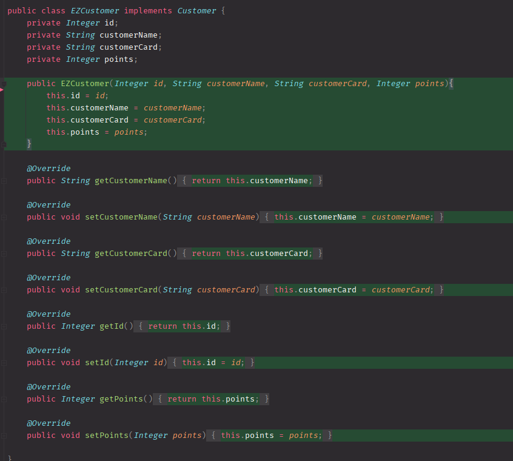

# Unit Testing Documentation

Authors:
- Mattia Lisciandrello s286329
- Christian Casalini s281823
- Palmucci Leonardo s288126
- Dario Lanfranco s287524

Date: 11/05/2021

| Version | Changes |
| ------- |---------|
| 1 | Added first version of Unit Test Report document. |

# Contents

- [Black Box Unit Tests](#black-box-unit-tests)

- [White Box Unit Tests](#white-box-unit-tests)

# Black Box Unit Tests

    <Define here criteria, predicates and the combination of predicates for each function of each class.
    Define test cases to cover all equivalence classes and boundary conditions.
    In the table, report the description of the black box test case and (traceability) the correspondence with the JUnit test case writing the 
    class and method name that contains the test case>
    <JUnit test classes must be in src/test/java/it/polito/ezshop   You find here, and you can use,  class TestEzShops.java that is executed  
    to start tests
    >

 ### **Class *EZShop* - method *isValidBarCode***

**Criteria for method *isValidBarCode*:**
	

 - Validity of Bar code

**Predicates for method *isValidBarCode*:**

| Criteria                | Predicate |
| ------------------------ | --------- |
| Validity of BarCode       | Valid     |
|                          | NULL/Invalid format    |

**Boundaries**:

| Criteria | Boundary values |
| -------- | --------------- |
|          |                 |
|          |                 |

**Combination of predicates**:

| Validity of Bar code | Valid / Invalid | Description of the test case | JUnit test case |
-------|-------|-------|-------|
|Valid|Valid|  boolean isValid = ez.isValidBarCode("6291041500213");  -> return true| Class TestEZShop_VerifyBarCode, method testBarCode_13digits()|
|NULL/Invalid format|Invalid| boolean isValid = ez.isValidBarCode("33235");  -> return false   or: isValid = ez.isValidBarCode(null);  -> return false|testBarCode_nullInput() and testBarCode_notEnoughDigits()|

### **Class *EZShop* - method *isValidBarCode***

**Criteria for method *isValidCard*:**

- Validity of Loyalty card code

**Predicates for method *isValidCard*:**

| Criteria                | Predicate |
| ------------------------ | --------- |
| Validity of Loyalty card code     | Valid     |
|                          | NULL/Invalid format    |

**Boundaries**:

| Criteria | Boundary values |
| -------- | --------------- |
|          |                 |
|          |                 |

**Combination of predicates**:

|Validity of Loyalty card code | Valid / Invalid | Description of the test case | JUnit test case |
-------|-------|-------|-------|
|Valid|Valid|  boolean isValid = ez.isValidCard("2332543219");  -> return true| Class TestEZShop_IsValidCard, method testLoyaltyCode_10digits()|
|NULL/Invalid format | Invalid| boolean isValid = ez.isValidCard("33235");   -> return false   or: boolean isValid = ez.isValidCard(null)   -> Return false| Methods testLoyaltyCode_notEnoughDigits(), testLoyaltyCode_nullInput()|

### **Class *class_name* - method *name***

**Criteria for method *name*:**

-
-

**Predicates for method *name*:**

| Criteria | Predicate |
| -------- | --------- |
|          |           |
|          |           |
|          |           |
|          |           |

**Boundaries**:

| Criteria | Boundary values |
| -------- | --------------- |
|          |                 |
|          |                 |

**Combination of predicates**:

| Criteria 1 | Criteria 2 | ... | Valid / Invalid | Description of the test case | JUnit test case |
|-------|-------|-------|-------|-------|-------|
|||||||
|||||||
|||||||
|||||||
|||||||

# White Box Unit Tests

### Test cases definition
    
    <JUnit test classes must be in src/test/java/it/polito/ezshop>
    <Report here all the created JUnit test cases, and the units/classes under test >
    <For traceability write the class and method name that contains the test case>

| Unit name               | JUnit test case          |
|-------------------------|--------------------------|
| Method isValidBarCode() | TestEZShop_VerifyBarCode |
| Method isValidCard()    | TestEZShop_IsValidCard   |
| EZCustomer              | TestEZShop_Customer      |

### Code coverage report

    <Add here the screenshot report of the statement and branch coverage obtained using
    the Eclemma tool. >

### Loop coverage analysis

    <Identify significant loops in the units and reports the test cases
    developed to cover zero, one or multiple iterations >

|Unit name | Loop rows | Number of iterations | JUnit test case |
|---|---|---|---|
|||||
|||||
||||||

