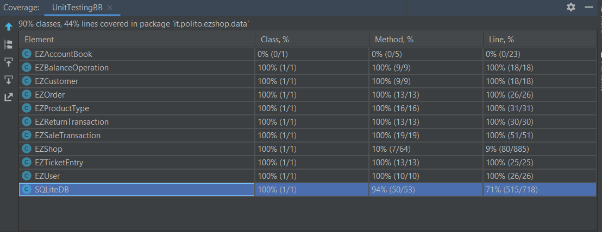

# Unit Testing Documentation

Authors:
- Mattia Lisciandrello s286329
- Christian Casalini s281823
- Leonardo Palmucci s288126
- Dario Lanfranco s287524

Date: 09/06/2021

| Version | Changes |
| ------- |---------|
| 1 | Added first version of Unit Test Report document. |
| 2 | Modified the document and first version of WB testing. |
| 3 | Added some new black box tests |
| 4 | Added BB tests for EZOrder and EZReturnTransaction |
| 5 | Added BB tests for DB (User and SaleTransaction) |
| 6 | Added BB tests for DB (ProductType and ReturnTransaction) |
| 7 | Added last missing BB tests |
| 8 | Added BB tests for RFID validity check |

Leaf classes (TestEZShop_Customer, User and so on) and DB methods don't include involve a lot of controls and checks on the
data since they're checked at a higher level in EZShop. 
Boundaries tables are not reported in most cases because they were empty.

# Contents

- [Black Box Unit Tests](#black-box-unit-tests)

- [White Box Unit Tests](#white-box-unit-tests)

# Black Box Unit Tests

 ### **Class *EZShop* - method *isValidBarCode***

**Criteria for method *isValidBarCode*:**
	

 - Validity of BarCode
 - BarCode matches a regexp
 - BarCode matches an algorithm

**Predicates for method *isValidBarCode*:**

| Criteria                | Predicate |
| ------------------------ | --------- |
| Validity of BarCode          | Valid        |
|                              | NULL         |
| Barcode matches a regexp     | Yes          |
|                              | No           |
| BarCode matches an algorithm | Yes          |
|                              | No           |

**Combination of predicates**:

| Validity of BarCode | BarCode matches a regexp | BarCode matches an algorithm | Valid / Invalid | Description of the test case                                                                                                                                                                                             | JUnit test case                                                         |
|---------------------|--------------------------|------------------------------|-----------------|--------------------------------------------------------------------------------------------------------------------------------------------------------------------------------------------------------------------------|-------------------------------------------------------------------------|
| Valid               | Yes                      | Yes                          | Valid           | boolean isValid = ez.isValidBarCode("6291041500213");  -> return true  or: isValid = ez.isValidBarCode("6291041500213"); -> return true or: isValid = ez.isValidBarCode("54326476412231"); -> return true | Class TestEZShop_VerifyBarCode, method testBarCode_12/13/14digits(); |
| ""                  | ""                       | No                           | Invalid         | boolean isValid =  ez.isValidBarCode("54326476412234"); -> return false                                                                                                                                               | testBarCode_algorithm():                                                |
| ""                  | No                       | *                            | Invalid         | boolean isValid = ez.isValidBarCode("54326476412b31"); -> return false                                                                                                                                                | testBarCode_alphanumeric(),  testBarCode_notEnoughDigits()           |
| NULL                | *                        | *                            | Invalid         | boolean isValid = ez.isValidBarCode(null) -> return false                                                                                                                                                             | testBarCode_nullInput();                                                |

### **Class *EZShop* - method *isValidCard***

**Criteria for method *isValidCard*:**

- Validity of Loyalty card code
- Loyalty card matches a regexp

**Predicates for method *isValidCard*:**

| Criteria                | Predicate |
| ------------------------ | --------- |
| Validity of Loyalty card code     | Valid                  |
|                                   | NULL                   |
| Loyalty card matches a regexp     | Yes                    |
|                                   | No                     |

**Combination of predicates**:
    
| Validity of Loyalty card code | Loyalty card matches a regexp | Valid / Invalid | Description of the test case                                     | JUnit test case                                           |
|-------------------------------|-------------------------------|-----------------|------------------------------------------------------------------|-----------------------------------------------------------|
| Valid                         | Yes                           | Valid           | boolean isValid = ez.isValidCard("2332543219");  -> return true  | Class TestEZShop_IsValidCard, testLoyaltyCode_10digits(); |
| ""                            | No                            | Invalid         | boolean isValid = ez.isValidCard("33235"); -> return false       | testLoyaltyCode_notEnoughDigits():                        |
| NULL                          | *                             | Invalid         | boolean isValid = ez.isValidCard(null) -> return false            | testLoyaltyCode_nullInput();                              |

### **Class *EZShop* - method *isValidPosition***

**Criteria for method *isValidPosition*:**

- Validity of Position string
- Position matches a regexp

**Predicates for method *isValidPosition*:**

| Criteria                | Predicate |
| ------------------------ | --------- |
| Validity of Position string       | Valid                  |
|                                   | NULL                   |
| Position matches a regexp         | Yes                    |
|                                   | No                     |

**Combination of predicates**:

| Validity of Position string | Position matches a regexp | Valid / Invalid | Description of the test case                                          | JUnit test case                                                   |
|-----------------------------|---------------------------|-----------------|-----------------------------------------------------------------------|-------------------------------------------------------------------|
| Valid                       | Yes                       | Valid           | boolean isValid = ez.isValidPosition("55-ADB-44"); -> return true  | Class TestEZShop_IsValidPosition, method testPosition_Valid(); |
| ""                          | No                        | Invalid         | boolean isValid = ez.isValidPosition("33235"); -> return false     | testPosition_notValid();                                          |
| NULL                        | *                         | Invalid         | boolean isValid = ez.isValidPosition(null) -> return false         | testPosition_nullInput();                                         |

### **Class *EZShop* - method *isValidCreditCard***

**Criteria for method *isValidCreditCard*:**

- Credit card string is valid or null
- Credit card string matches a regexp (no alphanumeric or special characters are allowed)
- Validity of credit card string (validity decided by means of Luhn algorithm)

**Predicates for method *isValidCreditCard*:**

| Criteria                  | Predicate                                 |
| ----------------------  | ------------------------------------    |
| Credit card string is valid or null   |            Valid               |
|                                       |            NULL                 |
| Credit card string matches a regexp   |            Yes                |
|                                       |            No                 |
| Validity of credit card string (Luhn) | Valid                      |
|                                       | Invalid format        |

**Combination of predicates**:

|valid or null|Credit card matches regexp|Validity of Credit card | Valid / Invalid | Description of the test case | JUnit test case |
----|------|-------|-------|-------|-----|
|NULL|*|*|Invalid|boolean isValid = ez.isValidCreditCard(null);   -> return false|Class TestEZShop_IsValidCreditCard, method testCreditCardValidity_null()|
|Valid|Yes|Valid|Valid|  boolean isValid = ez.isValidCreditCard("4485370086510891");  -> return true| Class TestEZShop_IsValidCreditCard, method testCreditCardValidity_correct()|
|''|''|NULL/Invalid format | Invalid | boolean isValid = ez.isValidCreditCard("1849264958268091"); | Class TestEZShop_IsValidCreditCard, method testCreditCardValidity_notRespectingLuhnAlgo() |
|''|No| * | Invalid| boolean isValid = ez.isValidCreditCard("4Z85a70b8F51c89D1")  -> return false   or: isValidCreditCard("345");  -> return false   or: isValidCreditCard("#4485370086510891");   -> return false   or: isValidCreditCard(";-!");   -> return false   | Class TestEZShop_IsValidCreditCard, methods testCreditCardValidity_alphanumeric(), testCreditCardValidity_lessDigits(), testCreditCardValidity_hashtag(), testCreditCardValidity_specialCharacters() |

### **Class *EZShop* - method *getCreditInTXTByCreditCard***

**Criteria for method *getCreditInTXTByCreditCard*:**

- Validity of credit card string
- Correct card balance (verifying CreditCards.txt file)

**Predicates for method *getCreditInTXTByCreditCard*:**

| Criteria | Predicate |
| -------- | --------- |
|    Validity of credit card string      |     Valid                    |
|                                        |     NULL/Invalid format      |
|    Correct card balance                |     Correct                  |
|                                        |     Incorrect                |

**Combination of predicates**:

| Validity of credit card string | Correct card balance | Valid / Invalid | Description of the test case | JUnit test case |
-------|-------|-------|-------|-------|
|NULL/Invalid|*|Invalid|boolean value = ez.getCreditInTXTbyCardNumber(null);  or:  boolean value = ez.getCreditInTXTbyCardNumber("4Z85a70b8F51c89D1"); or: boolean value = ez.getCreditInTXTbyCardNumber("345"); or: boolean value = ez.getCreditInTXTbyCardNumber("#"); or: boolean value = ez.getCreditInTXTbyCardNumber(";-!");|Class TestEZShop_getCreditInTXTByCreditCard, methods testGetCredit_null(), testGetCredit_alphanumeric(), testGetCredit_lessDigits(), testGetCredit_hashtag(), testGetCredit_specialCharacters() |
|Valid|Correct|Valid| value = ez.getCreditInTXTbyCardNumber("4485370086510891");|Class TestEZShop_getCreditInTXTByCreditCard, method testGetCredit_correct()|
|''|Incorrect|Invalid|''|''|

### **Class *EZShop* - method *updateCreditInTXTbyCreditCard***

**Criteria for method *updateCreditInTXTbyCreditCard*:**

- Validity of credit card string
- Correct updating of card balance (verifying CreditCards.txt file)

**Predicates for method *updateCreditInTXTbyCreditCard*:**

| Criteria | Predicate |
| -------- | --------- |
|    Validity of credit card string      |     Valid                    |
|                                        |     NULL/Invalid format      |
|    Correct updating of card balance    |     Correct                  |
|                                        |     Incorrect                |

**Combination of predicates**:

| Validity of credit card string | Correct updating of card balance | Valid / Invalid | Description of the test case | JUnit test case |
-------|-------|-------|-------|-------|
|NULL/Invalid|*|Invalid|boolean isCorrect = ez.updateCreditInTXTbyCardNumber(null, 50.0); or: boolean isCorrect = ez.updateCreditInTXTbyCardNumber("A4DJSKID91864F", 50.0); or: boolean isCorrect = ez.updateCreditInTXTbyCardNumber("#", -50.0); or: boolean isCorrect = ez.updateCreditInTXTbyCardNumber(";-!", -50.0); | Class TestEZShop_updateCreditInTXTbyCreditCard, methods testUpdateCredit3_nullCard(), testUpdateCredit4_invalidCard(), testUpdateCredit5_hashtag(), testUpdateCredit6_specialCharacters() |
|Valid|Correct|Valid|boolean isCorrect = ez.updateCreditInTXTbyCardNumber("4485370086510891", 50.0); or: boolean isCorrect = ez.updateCreditInTXTbyCardNumber("4485370086510891", -50.0); or:  boolean isCorrect = ez.updateCreditInTXTbyCardNumber("4485370086510891", Double.MIN_VALUE); or: boolean isCorrect = ez.updateCreditInTXTbyCardNumber("4485370086510891", -Double.MIN_VALUE);|Class TestEZShop_updateCreditInTXTbyCreditCard, methods testUpdateCredit1_correct(), testUpdateCredit2_negativeDouble(), testUpdateCredit7_Min(), testUpdateCredit8_Min_Neg()|
|''|Incorrect|Invalid|''|''|

### **Class *EZShop* - method *isValidRFID***

**Criteria for method *setCustomerName*:**
- String is a sequence of 12 digits

**Predicates for method *setCustomerName*:**

| Criteria | Predicate |
| -------- | --------- |
|    String is !null    |     True      |
|										| False |
| String is a sequence of 12 digits | True |
|	| False |

**Combination of predicates**:

| String is !null | String is a sequence of 12 digits | Valid / Invalid | Description of the test case | JUnit test case |
|-------|-------|-------|-------|-------|
|True|True|Valid| isValidRFID("000000000000") -> return true |Class TestEZShop_IsValidRFID, method testValidRFID();|
||False|Invalid| isValidRFID("1010") -> return false |Class TestEZShop_IsValidRFID, method testInvalidRFID();|
|False|False (cannot be True)|Invalid| isValidRFID(null) -> return false |Class TestEZShop_IsValidRFID, method testNullRFID();|

**Criteria for method *setCustomerName*:**
- Validity of customer name string

**Predicates for method *setCustomerName*:**

| Criteria | Predicate |
| -------- | --------- |
|    Validity of customer name string     |       Valid    |

**Combination of predicates**:

| Criteria 1 | Valid / Invalid | Description of the test case | JUnit test case |
|-------|-------|-------|-------|
|*|Valid| customer.setCustomerName("Francesco");|Class TestEZShop_Customer, method testCustomer()|

### **Class *EZCustomer* - method *setCustomerCard***
**Criteria for method *setCustomerCard*:**
- Validity of customer card string

**Predicates for method *setCustomerCard*:**

| Criteria | Predicate |
| -------- | --------- |
|   Validity of customer card string    |     Valid     |

**Combination of predicates**:

| Criteria 1 | Valid / Invalid | Description of the test case | JUnit test case |
|-------|-------|-------|-------|
|*|Valid|customer.setCustomerCard("0000000501");|Class TestEZShop_Customer, method testCustomer()|

### **Class *EZCustomer* - method *setId***
**Criteria for method *setId*:**
- Validity of id integer

**Predicates for method *setId*:**

| Criteria | Predicate |
| -------- | --------- |
|    Validity of id integer      |     Valid      |

**Combination of predicates**:

| Criteria 1 | Valid / Invalid | Description of the test case | JUnit test case |
|-------|-------|-------|-------|
|*|Valid|customer.setId(-1);|Class TestEZShop_Customer, method testCustomer()|

### **Class *EZCustomer* - method *setPoints***
**Criteria for method *setPoints*:**
- Validity of points integer

**Predicates for method *setPoints*:**

| Criteria | Predicate |
| -------- | --------- |
|      Validity of points integer    |      Valid     |

**Combination of predicates**:

| Criteria 1 | Valid / Invalid | Description of the test case | JUnit test case |
|-------|-------|-------|-------|
|*|Valid|customer.setPoints(50);|Class TestEZShop_Customer, method testCustomer()|

### **Class *EZUser* - method *setUsername***
**Criteria for method *setUsername*:**
- Validity of username string

**Predicates for method *setUsername*:**

| Criteria | Predicate |
| -------- | --------- |
|     Validity of username string     |     Valid      |

**Combination of predicates**:

| Criteria 1 | Valid / Invalid | Description of the test case | JUnit test case |
|-------|-------|-------|-------|
|*|Valid|user.setUsername("Francesco");|Class TestEZShop_User, method testUser()|

### **Class *EZUser* - method *setPassword***
**Criteria for method *setPassword*:**
- Validity of password string

**Predicates for method *setPassword*:**

| Criteria | Predicate |
| -------- | --------- |
|     Validity of password string     |      Valid     |

**Combination of predicates**:

| Criteria 1 | Valid / Invalid | Description of the test case | JUnit test case |
|-------|-------|-------|-------|
|*|Valid|user.setPassword("nopwd");|Class TestEZShop_User, method testUser()|

### **Class *EZUser* - method *setId***
**Criteria for method *setId*:**
- Validity of id integer

**Predicates for method *setId*:**

| Criteria | Predicate |
| -------- | --------- |
| Validity of id integer       |     Valid      |

**Combination of predicates**:

| Criteria 1 | Valid / Invalid | Description of the test case | JUnit test case |
|-------|-------|-------|-------|
|*|Valid|user.setId(-2);|Class TestEZShop_User, method testUser()|

### **Class *EZUser* - method *setRole***
**Criteria for method *setRole*:**
- Validity of role

**Predicates for method *setRole*:**

| Criteria | Predicate |
| -------- | --------- |
| Validity of role  |  Valid    |
|                   | NULL      |

**Combination of predicates**:

| Criteria 1 | Valid / Invalid | Description of the test case | JUnit test case |
|-------|-------|-------|-------|
|Yes|Valid|user.setRole("ShopManager");|Class TestEZShop_User, method testUser()|
|No |Invalid|user.setRole(null);       |""                                      |

### **Class *EZUser* - method *hasRequiredRole***
**Criteria for method *hasRequiredRole*:**
- Validity of role
- Role is equal to one of the required roles

**Predicates for method *hasRequiredRole*:**

| Criteria | Predicate |
| -------- | --------- |
| Validity of role                           |  Valid    |
|                                            | NULL      |
| Role is equal to one of the required roles | Yes    |
|                                            | No      |

**Combination of predicates**:

| Criteria 1 | Criteria 2 | Valid / Invalid | Description of the test case | JUnit test case |
|-------|-------|-------|-------|-------|
|Yes|Yes|Valid|user.setRole("ShopManager");   boolean b2 = user.hasRequiredRole("ShopManager");|Class TestEZShop_User, method testUser()|
|Yes|No|Invalid|user.setRole("ShopManager");   boolean b2 = user.hasRequiredRole("Cashier");|Class TestEZShop_User, method testUser()|
|No|*|Invalid|user.setRole("ShopManager");   boolean b2 = user.hasRequiredRole(null);|Class TestEZShop_User, method testUser()|

### **Class *EZProduct* - method *setRFID***

**Criteria for method *setRFID*:**
- Validity of RFID

**Predicates for method *setProductDescription*:**

| Criteria | Predicate |
| -------- | --------- |
| Validity of RFID  |      Valid     |

**Combination of predicates**:

| Criteria 1 | Valid / Invalid | Description of the test case | JUnit test case |
|-------|-------|-------|-------|
|*|Valid| p.setRFID("000000000000"); |Class TestEZShop_Product, method testProduct()|

### **Class *EZProduct* - method *setProdTypeID***

**Criteria for method *setProdTypeID*:**
- Validity of Product Type ID

**Predicates for method *setProductDescription*:**

| Criteria | Predicate |
| -------- | --------- |
| Validity of Product Type ID  |      Valid     |

**Combination of predicates**:

| Criteria 1 | Valid / Invalid | Description of the test case | JUnit test case |
|-------|-------|-------|-------|
|*|Valid| p.setProdTypeID("1"); |Class TestEZShop_Product, method testProduct()|

### **Class *EZProduct* - method *setSaleID***

**Criteria for method *setSaleID*:**
- Validity of Sale Transaction ID

**Predicates for method *setProductDescription*:**

| Criteria | Predicate |
| -------- | --------- |
| Validity of Sale Transaction ID  |      Valid     |

**Combination of predicates**:

| Criteria 1 | Valid / Invalid | Description of the test case | JUnit test case |
|-------|-------|-------|-------|
|*|Valid| p.setSaleID("2"); |Class TestEZShop_Product, method testProduct()|

### **Class *EZProduct* - method *setReturnID***

**Criteria for method *setReturnID*:**
- Validity of Return Transaction ID

**Predicates for method *setProductDescription*:**

| Criteria | Predicate |
| -------- | --------- |
| Validity of Return Transaction ID  |      Valid     |

**Combination of predicates**:

| Criteria 1 | Valid / Invalid | Description of the test case | JUnit test case |
|-------|-------|-------|-------|
|*|Valid| p.setReturnID("3"); |Class TestEZShop_Product, method testProduct()|

### **Class *EZProductType* - method *setProductDescription***

**Criteria for method *setProductDescription*:**
- Validity of product description

**Predicates for method *setProductDescription*:**

| Criteria | Predicate |
| -------- | --------- |
|Validity of product description  |      Valid     |

**Combination of predicates**:

| Criteria 1 | Valid / Invalid | Description of the test case | JUnit test case |
|-------|-------|-------|-------|
|*|Valid| p.setProductDescription("Cookie");|Class TestEZShop_ProductType, method testProductType()|

### **Class *EZProductType* - method *setBarCode***
**Criteria for method *setBarCode*:**
- Validity of Bar code

**Predicates for method *setBarCode*:**

| Criteria | Predicate |
| -------- | --------- |
|Validity of bar code  |      Valid     |

**Combination of predicates**:

| Criteria 1 | Valid / Invalid | Description of the test case | JUnit test case |
|-------|-------|-------|-------|
|*|Valid|  p.setBarCode("6291041500213");|Class TestEZShop_ProductType, method testProductType()|

### **Class *EZProductType* - method *setId***
**Criteria for method *setId*:**
- Validity of Bar code

**Predicates for method *setId*:**

| Criteria | Predicate |
| -------- | --------- |
|Validity of id  |      Valid     |

**Combination of predicates**:

| Criteria 1 | Valid / Invalid | Description of the test case | JUnit test case |
|-------|-------|-------|-------|
|*|Valid|  p.setId(-2);|Class TestEZShop_ProductType, method testProductType()|

### **Class *EZProductType* - method *setQuantity***
**Criteria for method *setQuantity*:**
- Validity of quantity integer

**Predicates for method *setQuantity*:**

| Criteria | Predicate |
| -------- | --------- |
|Validity of quantity integer  |      Valid     |

**Combination of predicates**:

| Criteria 1 | Valid / Invalid | Description of the test case | JUnit test case |
|-------|-------|-------|-------|
|*|Valid|  p.setQuantity(5);|Class TestEZShop_ProductType, method testProductType()|

### **Class *EZProductType* - method *setNote***
**Criteria for method *setNote*:**
- Validity of note string

**Predicates for method *setNote*:**

| Criteria | Predicate |
| -------- | --------- |
|Validity of note string |      Valid     |

**Combination of predicates**:

| Criteria 1 | Valid / Invalid | Description of the test case | JUnit test case |
|-------|-------|-------|-------|
|*|Valid|  p.setNote("Expires on Sunday");|Class TestEZShop_ProductType, method testProductType()|

### **Class *EZProductType* - method *setLocation***
**Criteria for method *setLocation*:**
- Validity of location string

**Predicates for method *setLocation*:**

| Criteria | Predicate |
| -------- | --------- |
|Validity of location string |      Valid     |

**Combination of predicates**:

| Criteria 1 | Valid / Invalid | Description of the test case | JUnit test case |
|-------|-------|-------|-------|
|*|Valid|  p.setLocation("32-ABU-45");|Class TestEZShop_ProductType, method testProductType()|

### **Class *EZProductType* - method *setPricePerUnit***
**Criteria for method *setPricePerUnit*:**
- Validity of price double

**Predicates for method *setPricePerUnit*:**

| Criteria | Predicate |
| -------- | --------- |
|Validity of price double |      Valid     |

**Combination of predicates**:

| Criteria 1 | Valid / Invalid | Description of the test case | JUnit test case |
|-------|-------|-------|-------|
|*|Valid|p.setPricePerUnit(10.5); |Class TestEZShop_ProductType, method testProductType()|

### **Class *EZProductType* - method *editQuantity***
**Criteria for method *editQuantity*:**
- Validity of quantity to be added

**Predicates for method *editQuantity*:**

| Criteria | Predicate |
| -------- | --------- |
|Validity of quantity to be added |      Valid     |

**Combination of predicates**:

| Criteria 1 | Valid / Invalid | Description of the test case | JUnit test case |
|-------|-------|-------|-------|
|*|Valid|p.editQuantity(40);|Class TestEZShop_ProductType, method testProductType()|

### **Class *EZSaleTransaction* - method *setTicketNumber***
**Criteria for method *setTicketNumber*:**

- Valid setting (checked by means of the related get method)

**Predicates for method *setTicketNumber*:**

| Criteria | Predicate |
| -------- | --------- |
|    Valid setting      |       Valid         |
|                       |      Invalid        |

**Combination of predicates**:

| Valid setting | Valid / Invalid | Description of the test case | JUnit test case |
|-------|-------|-------|-------|
|Valid|Valid| sale.setTicketNumber(200); |Class TestEZShop_SaleTransaction, method testSaleTransaction()|
|Invalid|Invalid|''|''|

### **Class *EZSaleTransaction* - method *setEntries***
**Criteria for method *setEntries*:**

- Valid setting (checked by means of the related get method)

**Predicates for method *setEntries*:**

| Criteria | Predicate |
| -------- | --------- |
|    Valid setting      |       Valid         |
|                       |      Invalid        |

**Combination of predicates**:

| Valid setting | Valid / Invalid | Description of the test case | JUnit test case |
|-------|-------|-------|-------|
|Valid|Valid| sale.setEntries(list); |Class TestEZShop_SaleTransaction, method testSaleTransaction()|
|Invalid|Invalid|''|''|

### **Class *EZSaleTransaction* - method *setDiscountRate***
**Criteria for method *setDiscountRate*:**

- Valid setting (checked by means of the related get method)

**Predicates for method *setDiscountRate*:**

| Criteria | Predicate |
| -------- | --------- |
|    Valid setting      |       Valid         |
|                       |      Invalid        |

**Combination of predicates**:

| Valid setting | Valid / Invalid | Description of the test case | JUnit test case |
|-------|-------|-------|-------|
|Valid|Valid| sale.setDiscountRate(0.90); |Class TestEZShop_SaleTransaction, method testSaleTransaction()|
|Invalid|Invalid|''|''|

### **Class *EZSaleTransaction* - method *setPrice***
**Criteria for method *setPrice*:**

- Valid setting (checked by means of the related get method)

**Predicates for method *setPrice*:**

| Criteria | Predicate |
| -------- | --------- |
|    Valid setting      |       Valid         |
|                       |      Invalid        |

**Combination of predicates**:

| Valid setting | Valid / Invalid | Description of the test case | JUnit test case |
|-------|-------|-------|-------|
|Valid|Valid| sale.setPrice(400.12); |Class TestEZShop_SaleTransaction, method testSaleTransaction()|
|Invalid|Invalid|''|''|

### **Class *EZSaleTransaction* - method *setStatus***
**Criteria for method *setStatus*:**

- Valid setting (checked by means of the related get method)

**Predicates for method *setStatus*:**

| Criteria | Predicate |
| -------- | --------- |
|    Valid setting      |       Valid         |
|                       |      Invalid        |

**Combination of predicates**:

| Valid setting | Valid / Invalid | Description of the test case | JUnit test case |
|-------|-------|-------|-------|
|Valid|Valid| sale.setStatus(EZSaleTransaction.STPayed); |Class TestEZShop_SaleTransaction, method testSaleTransaction()|
|Invalid|Invalid|''|''|

### **Class *EZSaleTransaction* - method *setAttachedCard***
**Criteria for method *setAttachedCard*:**

- Valid setting (checked by means of the related get method)

**Predicates for method *setAttachedCard*:**

| Criteria | Predicate |
| -------- | --------- |
|    Valid setting      |       Valid         |
|                       |      Invalid        |

**Combination of predicates**:

| Valid setting | Valid / Invalid | Description of the test case | JUnit test case |
|-------|-------|-------|-------|
|Valid|Valid| sale.setAttachedCard("0000000001"); |Class TestEZShop_SaleTransaction, method testSaleTransaction()|
|Invalid|Invalid|''|''|

### **Class *EZSaleTransaction* - method *setReturns***
**Criteria for method *setReturns*:**

- Valid setting (checked by means of the related get method)

**Predicates for method *setReturns*:**

| Criteria | Predicate |
| -------- | --------- |
|    Valid setting      |       Valid         |
|                       |      Invalid        |

**Combination of predicates**:

| Valid setting | Valid / Invalid | Description of the test case | JUnit test case |
|-------|-------|-------|-------|
|Valid|Valid| sale.setReturns(list_r); |Class TestEZShop_SaleTransaction, method testSaleTransaction()|
|Invalid|Invalid|''|''|

### **Class *EZSaleTransaction* - method *hasRequiredStatus***
**Criteria for method *hasRequiredStatus*:**

- Valid input

**Predicates for method *hasRequiredStatus*:**

| Criteria | Predicate |
| -------- | --------- |
|    Valid input        |       Valid         |
|                       |      Invalid        |

**Combination of predicates**:

| Valid input | Valid / Invalid | Description of the test case | JUnit test case |
|-------|-------|-------|-------|
|Valid|Valid| sale.hasRequiredStatus(null) |Class TestEZShop_SaleTransaction, method testSaleTransaction()|
|Invalid|Invalid|sale.hasRequiredStatus(EZSaleTransaction.STClosed)|''|

### **Class *EZSaleTransaction* - method *updatePrice***
**Criteria for method *updatePrice*:**

- Correct updating of the price (checked by means of the related get method)

**Predicates for method *updatePrice*:**

| Criteria | Predicate |
| -------- | --------- |
|    Correct price updating     |      Yes         |
|                               |      No          |

**Combination of predicates**:

| Correct price updating | Valid / Invalid | Description of the test case | JUnit test case |
|-------|-------|-------|-------|
|Yes|Valid| sale.updatePrice(30.20); or: sale.updatePrice(-30.20); |Class TestEZShop_SaleTransaction, method testSaleTransaction()|
|No|Invalid|''|''|

### **Class *EZAccountBook* - method *updateBalance***
**Criteria for method *updateBalance*:**

- Correct updating of the balance (checked by means of the related get method)

**Predicates for method *updateBalance*:**

| Criteria | Predicate |
| -------- | --------- |
|    Correct balance updating      |       Yes         |
|                                  |       No          |

**Combination of predicates**:

| Correct balance updating | Valid / Invalid | Description of the test case | JUnit test case |
|-------|-------|-------|-------|
|Valid|Valid| book.updateBalance(100.55); | Class TestEZShop_AccountBook, method TestEZShop_AccountBook()|
|Invalid|Invalid|''|''|

### **Class *EZAccountBook* - method *setCurrentBalance***
**Criteria for method *setCurrentBalance*:**

- Valid setting (checked by means of the related get method)

**Predicates for method *setCurrentBalance*:**

| Criteria | Predicate |
| -------- | --------- |
|    Valid setting      |       Valid         |
|                       |      Invalid        |

**Combination of predicates**:

| Valid setting | Valid / Invalid | Description of the test case | JUnit test case |
|-------|-------|-------|-------|
|Valid|Valid| book.setCurrentBalance(12345.67); |Class TestEZShop_AccountBook, method TestEZShop_AccountBook()|
|Invalid|Invalid|''|''|

### **Class *EZAccountBook* - method *addBalanceOperation***
**Criteria for method *addBalanceOperation*:**

- Amount  
- Validity of DB object
- Validity of list of balance operations

**Predicates for method *addBalanceOperation*:**

| Criteria | Predicate |
| -------- | --------- |
|    Amount                                    |       >= 0          |
|                                              |        < 0          |
|    Validity of DB object                     |       Valid         |
|                                              |        NULL         |
|    Validity of list of balance operations    |       Valid         |
|                                              |        NULL         |

**Boundaries**:

| Criteria | Boundary values |
| -------- | --------------- |
|     Amount     |        0         |

**Combination of predicates**:

|Validity of DB object|Amount|Validity of list of balance operations| Valid / Invalid | Description of the test case | JUnit test case |
------|------|-----|-------|-------|----------|
|Invalid|*|*|Invalid| book.addBalanceOperation(null, 150.33, balanceOperations) | Class TestEZShop_AccountBook, method TestEZShop_AccountBook() |
|*|*|Invalid|Invalid| book.addBalanceOperation(shopDB2, 150.33, null) | '' |
|Valid| \>= 0|Valid|Valid| book.addBalanceOperation(shopDB2, 150.33, balanceOperations)|''|
|''| < 0 |''|Valid|book.addBalanceOperation(shopDB2, -150.33, balanceOperations) or: book.addBalanceOperation(shopDB2, -10.0, balanceOperations) |''|

### **Class *EZOrder* - method *setBalanceID***

**Criteria for method *setBalanceID*:**

- Valid insertion of a new Balance Operation ID

**Predicates for method *setBalanceID*:**

| Criteria | Predicate |
| -------- | --------- |
|    Valid Balance Operation ID    |      Valid (any Integer, including NULL)      |

**Combination of predicates**:

| Return Transaction ID | Valid / Invalid | Description of the test case | JUnit test case |
|-------|-------|-------|-------|
|*|Valid| order.setBalanceId(20) |Class TestEZShop_Order, method testOrder()|

### **Class *EZOrder* - method *setProductCode***

**Criteria for method *setProductCode*:**

- Valid insertion of the Product Code of the Product to order

**Predicates for method *setProductCode*:**

| Criteria | Predicate |
| -------- | --------- |
|    Valid Product Order    |      Valid (any String, including NULL)      |

**Combination of predicates**:

| Return Transaction ID | Valid / Invalid | Description of the test case | JUnit test case |
|-------|-------|-------|-------|
|*|Valid| order.setProductCode(sProductCode) |Class TestEZShop_Order, method testOrder()|

### **Class *EZOrder* - method *setPricePerUnit***

**Criteria for method *setPricePerUnit*:**

- Valid insertion of the Price Per Unit of the Product to order

**Predicates for method *setPricePerUnit*:**

| Criteria | Predicate |
| -------- | --------- |
|    Valid Price Per Unit    |      Valid (any double)      |

**Combination of predicates**:

| Return Transaction ID | Valid / Invalid | Description of the test case | JUnit test case |
|-------|-------|-------|-------|
|*|Valid| order.setPricePerUnit(24.10) |Class TestEZShop_Order, method testOrder()|

### **Class *EZOrder* - method *setQuantity***

**Criteria for method *setQuantity*:**

- Valid insertion of the Quantity of the Product to order

**Predicates for method *setQuantity*:**

| Criteria | Predicate |
| -------- | --------- |
|    Valid Product Quantity    |      Valid (any int)      |

**Combination of predicates**:

| Return Transaction ID | Valid / Invalid | Description of the test case | JUnit test case |
|-------|-------|-------|-------|
|*|Valid| order.setQuantity(70) |Class TestEZShop_Order, method testOrder()|

### **Class *EZOrder* - method *setStatus***

**Criteria for method *setStatus*:**

- Valid insertion of a new Status for the Order

**Predicates for method *setStatus*:**

| Criteria | Predicate |
| -------- | --------- |
|    Valid Status    |      Valid (any String, including NULL)      |

**Combination of predicates**:

| Return Transaction ID | Valid / Invalid | Description of the test case | JUnit test case |
|-------|-------|-------|-------|
|*|Valid| order.setStatus("COMPLETED") | Class TestEZShop_Order, method testOrder() |

### **Class *EZOrder* - method *setOrderId***

**Criteria for method *setOrderId*:**

- Valid insertion of a new Order ID

**Predicates for method *setOrderId*:**

| Criteria | Predicate |
| -------- | --------- |
|    Valid Order ID    |      Valid (any Integer, including NULL)      |

**Combination of predicates**:

| Return Transaction ID | Valid / Invalid | Description of the test case | JUnit test case |
|-------|-------|-------|-------|
|*|Valid| order.setOrderId(150) |Class TestEZShop_Order, method testOrder()|

### **Class *EZReturnTransaction* - method *setReturnID***

**Criteria for method *setReturnID*:**

- Valid insertion of a new Return Transaction ID

**Predicates for method *setReturnID*:**

| Criteria | Predicate |
| -------- | --------- |
|    Valid Return Transaction ID    |      Valid (any Integer, including NULL)      |

**Combination of predicates**:

| Return Transaction ID | Valid / Invalid | Description of the test case | JUnit test case |
|-------|-------|-------|-------|
|*|Valid| returnTransaction.setReturnId(3) |Class TestEZShop_ReturnTransaction, method testReturnTransaction()|

### **Class *EZReturnTransaction* - method *setReturnedValue***

**Criteria for method *setReturnedValue*:**

- Valid insertion of a new Returned Value

**Predicates for method *setReturnedValue*:**

| Criteria | Predicate |
| -------- | --------- |
|    Valid Returned Value    |      Valid (any double)      |

**Combination of predicates**:

| Returned Value | Valid / Invalid | Description of the test case | JUnit test case |
|-------|-------|-------|-------|
|*|Valid| returnTransaction.setReturnedValue(10) |Class TestEZShop_ReturnTransaction, method testReturnTransaction()|

### **Class *EZReturnTransaction* - method *updateReturnedValue***

**Criteria for method *updateReturnedValue*:**

- Valid insertion of a new value to add to the returnedValue of the Return Transaction

**Predicates for method *updateReturnedValue*:**

| Criteria | Predicate |
| -------- | --------- |
|    Valid Value to add    |      Valid (any double)      |
| Valid Current Value of returnedValue | Valid (any double) |

**Combination of predicates**:

| toBeAdded | returnedValue | Valid / Invalid | Description of the test case | JUnit test case |
|-------|-------|-------|-------|-------|
|*|*|Valid| returnTransaction.updateReturnedValue(25) |Class TestEZShop_ReturnTransaction, method testReturnTransaction()|

### **Class *EZReturnTransaction* - method *setItsSaleTransactionId***

**Criteria for method *setItsSaleTransactionId*:**

- Valid insertion of the Sale Transaction ID associated to the Return Transaction

**Predicates for method *setItsSaleTransactionId*:**

| Criteria | Predicate |
| -------- | --------- |
|    Valid Sale Transaction ID    |      Valid (any Integer, including NULL)      |

**Combination of predicates**:

| Return Transaction ID | Valid / Invalid | Description of the test case | JUnit test case |
|-------|-------|-------|-------|
|*|Valid| returnTransaction.setItsSaleTransactionId(2) |Class TestEZShop_ReturnTransaction, method testReturnTransaction()|

### **Class *EZReturnTransaction* - method *setEntries***

**Criteria for method *setEntries*:**

- Valid insertion of a new list of Ticket Entries

**Predicates for method *setEntries*:**

| Criteria | Predicate |
| -------- | --------- |
|    Valid list of Ticket Entries    |      Valid (any List of TicketEntry)      |
|  | Valid (null) |

**Combination of predicates**:

| Entries | Valid / Invalid | Description of the test case | JUnit test case |
|-------|-------|-------|-------|
|!NULL|Valid| list = new LinkedList<>(); EZTicketEntry entry = new EZTicketEntry("0000", "hello", 2, 98, 0.5); list.add(entry); returnTransaction.setEntries(list) |Class TestEZShop_ReturnTransaction, method testReturnTransaction()|
|NULL|Valid| returnTransaction.setEntries(null) -> should set an Empty List instead of null |Class TestEZShop_ReturnTransaction, method testReturnTransaction()|

### **Class *EZReturnTransaction* - method *setStatus***

**Criteria for method *setStatus*:**

- Valid insertion of the Status of the Return Transaction

**Predicates for method *setStatus*:**

| Criteria | Predicate |
| -------- | --------- |
|    Valid Return Transaction Status    |      Valid (any String)      |

**Combination of predicates**:

| Return Transaction ID | Valid / Invalid | Description of the test case | JUnit test case |
|-------|-------|-------|-------|
|*|Valid| returnTransaction.setStatus(EZReturnTransaction.RTPayed) |Class TestEZShop_ReturnTransaction, method testReturnTransaction()|

### **Class *SQLiteDB* - method *insertUser***

**Criteria for method *insertUser*:**

 - Validity of username
 - Uniqueness of username
 - Validity of password
 - Validity of role

**Predicates for method *insertUser*:**

| Criteria | Predicate |
| -------- | --------- |
| Validity of username        |    Valid       |
|                        | NULL  |
| Uniqueness of username       | Yes |
|                              | No |
| Validity of password         |    Valid       |
|                        | NULL  |
| Validity of role         |     Valid      |
|                        | NULL  |

**Combination of predicates**:

| Criteria 1 | Criteria 2 | Criteria 3 | Criteria 4 | Valid / Invalid | Description of the test case | JUnit test case |
|-------|-------|-------|-------|-------|-------|-------|
|Yes|Yes|Yes|Yes|Valid|  int uID = shopDB.insertUser("Rosario", "testpwd", "ShopManager");| TestEZShop_SQLiteDB, method testUserDB() |
|""|No|*|*|Invalid|  int uID = shopDB.insertUser("Rosario", "testpwd", "ShopManager");   int uID2 = shopDB.insertUser("Rosario", "testpwd", "ShopManager"); -> return -1| TestEZShop_SQLiteDB, method testUserDB() |
|*|*|NULL|*|Invalid|  int uID = shopDB.insertUser("Rosario", null, null); -> return -1| TestEZShop_SQLiteDB, method testUserDB() |
|*|*|*|NULL|Invalid|  int uID = shopDB.insertUser("Rosario", "testpwd", null); -> return -1| TestEZShop_SQLiteDB, method testUserDB() |
|NULL|*|*|*|Invalid|  int uID = shopDB.insertUser(null, null, null); -> return -1| TestEZShop_SQLiteDB, method testUserDB() |

### **Class *SQLiteDB* - method *updateUser***

**Criteria for method *updateUser*:**

- Validity of id integer
- Validity of username
- Uniqueness of username
- Validity of password
- Validity of role

**Predicates for method *updateUser*:**

| Criteria | Predicate |
| -------- | --------- |
| Validity of id integer | Valid |
|                        | NULL  |
| Validity of username        |    Valid       |
|                        | NULL  |
| Uniqueness of username       | Yes |
|                              | No |
| Validity of password         |    Valid       |
|                        | NULL  |
| Validity of role         |     Valid      |
|                        | NULL  |

**Combination of predicates**:

| Criteria 1 | Criteria 2 | Criteria 3 | Criteria 4 | Criteria 5 | Valid / Invalid | Description of the test case | JUnit test case |
|-------|-------|-------|-------|-------|-------|-------|-------|
|Valid|*|Yes|*|*|Valid| int uID = shopDB.insertUser("Rosario", "testpwd", "ShopManager");    boolean update = shopDB.updateUser(uID, "Rosario2", "testpwd2", "Cashier"); -> return true| TestEZShop_SQLiteDB, method testUserDB() |
|Valid|*|No|*|*|Invalid| int uID = shopDB.insertUser("Rosario", "testpwd", "ShopManager");   int uID3 = shopDB.insertUser("sheldon", "testpwd", "ShopManager");   boolean update2 = shopDB.updateUser(uID, "sheldon", "testpwd2", "Cashier"); -> return false| TestEZShop_SQLiteDB, method testUserDB() |
|NULL|*|*|*|*|Invalid|   boolean update = shopDB.updateUser(null, "Rosario2", "testpwd2", "Cashier"); -> return false| TestEZShop_SQLiteDB, method testUserDB() |
|*|NULL|*|*|*|Invalid|   int uID = shopDB.insertUser("Rosario", "testpwd", "ShopManager");   boolean update = shopDB.updateUser(uID, null, null, null); -> return false| TestEZShop_SQLiteDB, method testUserDB() |
|*|*|*|NULL|*|Invalid|   int uID = shopDB.insertUser("Rosario", "testpwd", "ShopManager");   boolean update = shopDB.updateUser(uID, "Rosario", null, null); -> return false| TestEZShop_SQLiteDB, method testUserDB() |
|*|*|*|*|NULL|Invalid|   int uID = shopDB.insertUser("Rosario", "testpwd", "ShopManager");   boolean update = shopDB.updateUser(uID, "Rosario", "testpwd", null); -> return false| TestEZShop_SQLiteDB, method testUserDB() |

### **Class *SQLiteDB* - method *deleteUser***

**Criteria for method *deleteUser*:**

- Validity of id integer

**Predicates for method *deleteUser*:**

| Criteria | Predicate |
| -------- | --------- |
| Validity of id integer | Valid |
|                        | NULL  |

**Combination of predicates**:

| Criteria 1 | Valid / Invalid | Description of the test case | JUnit test case |
|-------|-------|-------|-------|
|Valid|Valid| int uID = shopDB.insertUser("Rosario", "testpwd", "ShopManager");    boolean update = shopDB.deleteUser(uID); -> return true| TestEZShop_SQLiteDB, method testUserDB() |
|NULL|Invalid|   boolean update = shopDB.deleteUser(null) -> return false| TestEZShop_SQLiteDB, method testUserDB() |

### **Class *SQLiteDB* - method *updateReturnTransaction***

**Criteria for method *updateReturnTransaction*:**

- Validity of input transactionId
- Validity of input status String

**Predicates for method *updateReturnTransaction*:**

| Criteria | Predicate |
| -------- | --------- |
| Validity of input transactionId        | Valid |
|                                        | NULL  |
| Validity of input status String        | Valid |
|                                        | NULL  |

**Combination of predicates**:

|Validity of input transactionId| Validity of input barCode String | Valid / Invalid | Description of the test case | JUnit test case |
|-------|---|--------|-------|-------|
|Valid|Valid|Valid| boolean  -> return true  | TestEZShop_SQLiteDB, method testReturnTransaction() |
|NULL|*|Invalid| boolean  -> return false | TestEZShop_SQLiteDB, method testReturnTransaction() |
|*|NULL|Invalid|  boolean  -> return false | TestEZShop_SQLiteDB, method testReturnTransaction() |

### **Class *SQLiteDB* - method *deleteProductPerSale***

**Criteria for method *deleteProductPerSale*:**

- Validity of input barCode String
- Validity of input transactionId

**Predicates for method *deleteProductPerSale*:**

| Criteria | Predicate |
| -------- | --------- |
| Validity of input barCode String       | Valid |
|                                        | NULL  |
| Validity of input transactionId        | Valid |
|                                        | NULL  |

**Combination of predicates**:

Integer st1 = shopDB.insertSaleTransaction(null, defaultValue, defaultValue, EZSaleTransaction.STOpened);

| Validity of input barCode String |Validity of input transactionId| Valid / Invalid | Description of the test case | JUnit test case |
|-------|---|--------|-------|-------|
|Valid|Valid|Valid| boolean delete = shopDB.deleteProductPerSale("4627828478338", st1); -> return true | TestEZShop_SQLiteDB, method testProductPerSales() |
|NULL|*|Invalid| boolean delete = shopDB.deleteProductPerSale(null, st1); -> return false | TestEZShop_SQLiteDB, method testProductPerSales() |
|*|NULL|Invalid|  boolean delete = shopDB.deleteProductPerSale("4627828478338", null); -> return false | TestEZShop_SQLiteDB, method testProductPerSales() |

### **Class *SQLiteDB* - method *deleteAllProductsPerSale***

**Criteria for method *deleteAllProductsPerSale*:**

- Validity of input transactionId

**Predicates for method *deleteAllProductsPerSale*:**

| Criteria | Predicate |
| -------- | --------- |
| Validity of input transactionId        | Valid |
|                                        | NULL  |

**Combination of predicates**:

Integer st1 = shopDB.insertSaleTransaction(null, defaultValue, defaultValue, EZSaleTransaction.STOpened);

|Validity of input transactionId| Valid / Invalid | Description of the test case | JUnit test case |
|----------|--------|-------|-------|
|Valid|Valid| boolean delete = shopDB.deleteAllProductsPerSale(null); -> return true  | TestEZShop_SQLiteDB, method testProductPerSales() |
|NULL|Invalid| boolean delete = shopDB.deleteAllProductsPerSale(st1); -> return false | TestEZShop_SQLiteDB, method testProductPerSales() |

### **Class *SQLiteDB* - method *updateProductPerSale***

**Criteria for method *updateProductPerSale*:**

- Validity of input barCode String
- Validity of input transactionId

**Predicates for method *updateProductPerSale*:**

| Criteria | Predicate |
| -------- | --------- |
| Validity of input barCode String       | Valid |
|                                        | NULL  |
| Validity of input transactionId        | Valid |
|                                        | NULL  |

**Combination of predicates**:

Integer st2 = shopDB.insertSaleTransaction(null, defaultValue, defaultValue, EZSaleTransaction.STOpened);

| Validity of input barCode String |Validity of input transactionId| Valid / Invalid | Description of the test case | JUnit test case |
|-------|---|--------|----|------------|
|Valid|Valid|Valid| boolean update = shopDB.updateProductPerSale("4627828478338", st2, 5, 0.60); -> return true | TestEZShop_SQLiteDB, method testProductPerSales() |
|NULL|*|Invalid| boolean update = shopDB.updateProductPerSale(null, st2, 5, 0.60); -> return false | TestEZShop_SQLiteDB, method testProductPerSales() |
|*|NULL|Invalid| boolean update = shopDB.updateProductPerSale("4627828478338", null, 5, 0.60); -> return false | TestEZShop_SQLiteDB, method testProductPerSales() |

### **Class *SQLiteDB* - method *deleteProductType***

**Criteria for method *deleteProductType*:**

- Id is null

**Predicates for method *deleteProductType*:**

| Criteria | Predicate |
| -------- | --------- |
| Id is !null | True |
|  | False |

**Combination of predicates**:

| Id is !null | Valid / Invalid | Description of the test case | JUnit test case |
|-------|-------|-------|-------|
|True|Valid| int id = insertProductType(...) deleteProduct(id) -> return true | TestEZShop_SQLiteDB, method testProdType() |
|False|Invalid| deleteProduct(null) -> return false | TestEZShop_SQLiteDB, method testProdType() |

### **Class *SQLiteDB* - method *updateProductType***

**Criteria for method *updateProductType*:**

- Id is !null
- Quantity is !null
- Location is !null
- Note is !null
- ProductDescription is !null
- BarCode is !null

**Predicates for method *updateProductType*:**

| Criteria | Predicate |
| -------- | --------- |
| Id is !null | True |
| | False |
| Quantity is !null |    True    |
|  | False |
| Location is !null | True |
|  | False |
| Note is !null | True |
|  | False |
| ProductDescription is !null | True |
|  | False |
| BarCode is !null | True |
|  | False |

**Combination of predicates**:

int id = insertProductType(...)

| Id is !null | Quantity is !null | Location is !null | Note is !null | ProductDescription is !null | BarCode is !null | Valid / Invalid | Description of the test case | JUnit test case |
|-------|-------|-------|-------|-------|-------|-------|-------|-------|
|True|True|True|True|True|True|Valid| updateProductType(id, 2, "abc", "abc", "niceProd", "6291041500213" , 1.0) -> return true | TestEZShop_SQLiteDB, method testProdType() |
|False|*|*|*|*|*|Invalid| updateProductType(null, 2, "abc", "abc", "niceProd", "6291041500213", 1.0) -> return false | TestEZShop_SQLiteDB, method testProdType() |
|*| False             |*|*|*|*|Invalid| updateProductType(id, null, "abc", "abc", "niceProd", "6291041500213", 1.0) -> return false | TestEZShop_SQLiteDB, method testProdType() |
|*|*|False|*|*|*|Invalid| updateProductType(id, 2, null, "abc", "niceProd", "6291041500213", 1.0) -> return false | TestEZShop_SQLiteDB, method testProdType() |
| *           |*|*|False|*|*|Invalid| updateProductType(id, 2, "abc", null, "niceProd", "6291041500213", 1.0) -> return false | TestEZShop_SQLiteDB, method testProdType() |
|*|*|*|*|False|*|Invalid| updateProductType(id, 0, "abc", "abc", null, "6291041500213", 1.0) -> return false | TestEZShop_SQLiteDB, method testProdType() |
|*|*|*|*|*|False|Invalid| updateProductType(id, -1, "abc", "abc", "niceProd", null, 1.0) -> return false | TestEZShop_SQLiteDB, method testProdType() |

### **Class *SQLiteDB* - method *insertReturnTransaction***

**Criteria for method *insertReturnTransaction*:**

- Status is !null

**Predicates for method *insertReturnTransaction*:**

| Criteria | Predicate |
| -------- | --------- |
| Status is !null | True |
|  | False |

**Combination of predicates**:

LinkedList<TicketEntry> list; TicketEntry entry = new TicketEntry(...); list.add(entry); 

| Status is !null | Valid / Invalid | Description of the test case | JUnit test case |
|-------|-------|-------|-------|
| True | Valid | insertReturnTransaction(list, 1, 1.0, "OPENED") -> return positive int | TestEZShop_SQLiteDB, method testInsDelTransaction() |
| False | Invalid | insertReturnTransaction(list, 1, 1.0, null) -> return -1     | TestEZShop_SQLiteDB, method testInsDelTransaction() |

### **Class *SQLiteDB* - method *deleteTransaction***

**Criteria for method *deleteTransaction*:**

- Value of id integer

**Predicates for method *deleteTransaction*:**

| Criteria | Predicate |
| -------- | --------- |
| TransactionID is !null | True |
|  | False     |

**Combination of predicates**:

| Existence of the Transaction | Valid / Invalid | Description of the test case | JUnit test case |
|-------|-------|-------|-------|
|True|Valid| int id = insertReturnTransaction(...) deleteTransaction(id) -> return true | TestEZShop_SQLiteDB, method testInsDelTransaction() |
|False|Invalid| deleteTransaction(null) -> return false | TestEZShop_SQLiteDB, method testInsDelTransaction() |

### **Class *SQLiteDB* - method *insertBalanceOperation***

**Criteria for method *insertBalanceOperation*:**

- Validity of input date
- Validity of input type String

**Predicates for method *insertBalanceOperation*:**

| Criteria | Predicate |
| -------- | --------- |
| Validity of input date | Valid |
|  | NULL     |
| Validity of input type String | Valid |
|  | NULL     |

**Combination of predicates**:

LocalDate cDate = LocalDate.now();
double cMoney = 12.50;
String cType = "CREDIT";

int id = shopDB.insertBalanceOperation(cDate, cMoney, cType);

| Validity of input date | Validity of input type String | Valid / Invalid | Description of the test case | JUnit test case |
|-------|-------|---|----|-------|
|NULL|*|Invalid | int failID = shopDB.insertBalanceOperation(null, cMoney, cType); | TestEZShop_SQLiteDB, method testBalanceOperation() |
|*|NULL| Invalid |failID = shopDB.insertBalanceOperation(cDate, cMoney, null); | TestEZShop_SQLiteDB, method testBalanceOperation() |
|Valid|Valid| Valid| int id = shopDB.insertBalanceOperation(cDate, cMoney, cType); | TestEZShop_SQLiteDB, method testBalanceOperation() |

### Class *SQLiteDB* - method *deleteBalanceOperation***

**Criteria for method *deleteBalanceOperation*:**

- Validity of id integer

**Predicates for method *deleteBalanceOperation*:**

| Criteria | Predicate |
| -------- | --------- |
| Validity of id integer | Valid |
|                        | NULL  |

**Combination of predicates**:

LocalDate cDate = LocalDate.now();
double cMoney = 12.50;
String cType = "CREDIT";

int id = shopDB.insertBalanceOperation(cDate, cMoney, cType);

| Criteria 1 | Valid / Invalid | Description of the test case | JUnit test case |
|-------|-------|-------|-------|
|Valid|Valid|shopDB.deleteBalanceOperation(id); -> return true| TestEZShop_SQLiteDB, method testBalanceOperation() |
|NULL|Invalid| shopDB.deleteBalanceOperation(null) -> return false| TestEZShop_SQLiteDB, method testBalanceOperation() |

### Class *SQLiteDB* - method *updateBalanceOperation***

**Criteria for method *updateBalanceOperation*:**

- Validity of id integer
- Validity of input date
- Validity of input type String

**Predicates for method *updateBalanceOperation*:**

| Criteria | Predicate |
| -------- | --------- |
| Validity of id integer | Valid |
|                        | NULL  |
| Validity of input date | Valid |
|  | NULL     |
| Validity of input type String | Valid |
|  | NULL     |

**Combination of predicates**:

| Validity of id integer | Validity of input date | Validity of input type String | Valid / Invalid | Description of the test case | JUnit test case |
|-------|-------|---|----|-------|-------|
|Valid|Valid|Valid| Valid| boolean updated = shopDB.updateBalanceOperation(id, LocalDate.now(), 16.80, cType); -> return true | TestEZShop_SQLiteDB, method testBalanceOperation() |
|*|NULL|*|Invalid | boolean updated = shopDB.updateBalanceOperation(id, null, 16.80, cType); -> return false| TestEZShop_SQLiteDB, method testBalanceOperation() |
|*|*|NULL| Invalid | boolean updated = shopDB.updateBalanceOperation(id, LocalDate.now(), 16.80, null); -> return false| TestEZShop_SQLiteDB, method testBalanceOperation() |
|NULL|*|*| Invalid | boolean updated = shopDB.updateBalanceOperation(null, LocalDate.now(), 16.80, null); -> return false| TestEZShop_SQLiteDB, method testBalanceOperation() |

### **Class *SQLiteDB* - method *insertOrder***

**Criteria for method *insertOrder*:**

- Validity of BalanceID
- Validity of ProductCode
- Existence of ProductCode
- Validity of Status

**Predicates for method *insertOrder*:**

| Criteria | Predicate |
| -------- | --------- |
| Validity of BalanceID     | Valid |
|                           | NULL  |
| Validity of ProductCode   | Valid |
|                           | NULL  |
| Existence of ProductCode  | Yes   |
|                           | No    |
| Validity of Status        | Valid |
|                           | NULL  |

**Combination of predicates**:

int cBalanceID = 2; 
String cProductCode = "7293829484929"; 
double cPricePerUnit = 8.40; 
int cQuantity = 12; 
String cStatus = "COMPLETED"; 

| Criteria 1 | Criteria 2 | Criteria 3  | Criteria 4   | Valid / Invalid | Description of the test case | JUnit test case |
|------------|------------|-------------|--------------|-----------|-------|-------|
| Valid      | Valid      | Yes         | Valid        | Valid     |  int id = shopDB.insertOrder(cBalanceID, cProductCode, cPricePerUnit, cQuantity, cStatus); | TestEZShop_SQLiteDB, method testOrder() |
| NULL       | *          | *           | *            | Invalid   |  int failID = shopDB.insertOrder(null, cProductCode, cPricePerUnit, cQuantity, cStatus);   | TestEZShop_SQLiteDB, method testOrder() |
| Valid      | Valid      | No          | Valid        | Valid     |  failID = shopDB.insertOrder(cBalanceID, "4762834629", cPricePerUnit, cQuantity, cStatus); | TestEZShop_SQLiteDB, method testOrder() |
| *          | NULL       | *           | *            | Invalid   |  failID = shopDB.insertOrder(cBalanceID, null, cPricePerUnit, cQuantity, cStatus);         | TestEZShop_SQLiteDB, method testOrder() |
| *          | *          | *           | NULL         | Invalid   |  failID = shopDB.insertOrder(cBalanceID, cProductCode, cPricePerUnit, cQuantity, null);    | TestEZShop_SQLiteDB, method testOrder() |

### **Class *SQLiteDB* - method *updateOrder***

**Criteria for method *updateOrder*:**

- Validity of id
- Existence of id
- Validity of BalanceID
- Validity of ProductCode
- Validity of Status

**Predicates for method *updateOrder*:**

| Criteria | Predicate |
| -------- | --------- |
| Validity of id            | Valid |
|                           | NULL  |
| Existence of id           | Yes   |
|                           | No    |
| Validity of BalanceID     | Valid |
|                           | NULL  |
| Validity of ProductCode   | Valid |
|                           | NULL  |
| Validity of Status        | Valid |
|                           | NULL  |

**Combination of predicates**:

int cBalanceID = 2; 
String cProductCode = "7293829484929"; 
double cPricePerUnit = 8.40; 
int cQuantity = 12; 
String cStatus = "COMPLETED"; 

| Criteria 1 | Criteria 2 | Criteria 3  | Criteria 4   | Criteria 5   | Valid / Invalid | Description of the test case | JUnit test case |
|------------|------------|-------------|--------------|--------------|-----------|-------|-------|
| Valid      | Yes        | Valid       | Valid        | Valid        | Valid     |  boolean updated = shopDB.updateOrder(id, cBalanceID, "2747364827", cPricePerUnit, cQuantity, cStatus); | TestEZShop_SQLiteDB, method testOrder() |
| Valid      | No         | Valid       | Valid        | Valid        | Valid     |  updated = shopDB.updateOrder(failID, cBalanceID, "2749964827", cPricePerUnit, cQuantity, cStatus);     | TestEZShop_SQLiteDB, method testOrder() |
| NULL       | *          | *           | *            | *            | Invalid   |  updated = shopDB.updateOrder(null, cBalanceID, "2749964827", cPricePerUnit, cQuantity, cStatus);       | TestEZShop_SQLiteDB, method testOrder() |
| *          | *          | NUL         | *            | *            | Invalid   |  updated = shopDB.updateOrder(id, null, "2749964827", cPricePerUnit, cQuantity, cStatus);               | TestEZShop_SQLiteDB, method testOrder() |
| *          | *          | *           | NULL         | *            | Invalid   |  updated = shopDB.updateOrder(id, cBalanceID, null, cPricePerUnit, cQuantity, cStatus);                 | TestEZShop_SQLiteDB, method testOrder() |
| *          | *          | *           | *            | NULL         | Invalid   |  updated = shopDB.updateOrder(id, cBalanceID, cProductCode, cPricePerUnit, cQuantity, null);            | TestEZShop_SQLiteDB, method testOrder() |

### **Class *SQLiteDB* - method *deleteOrder***

**Criteria for method *deleteOrder*:**

- Validity of id
- Existence of id

**Predicates for method *deleteOrder*:**

| Criteria | Predicate |
| -------- | --------- |
| Validity of id            | Valid |
|                           | NULL  |
| Existence of id           | Yes   |
|                           | No    |

**Combination of predicates**:

| Criteria 1 | Criteria 2 | Valid / Invalid | Description of the test case | JUnit test case |
|------------|------------|-----------|-------|-------|
| Valid      | Yes        | Valid     |  boolean deleted = shopDB.deleteOrder(id); | TestEZShop_SQLiteDB, method testOrder() |
| Valid      | No         | Valid     |  deleted = shopDB.deleteOrder(failID);     | TestEZShop_SQLiteDB, method testOrder() |
| NULL       | *          | Invalid   |  deleted = shopDB.deleteOrder(null);       | TestEZShop_SQLiteDB, method testOrder() |

# White Box Unit Tests

### Test cases definition

    <JUnit test classes must be in src/test/java/it/polito/ezshop>
    <Report here all the created JUnit test cases, and the units/classes under test >
    <For traceability write the class and method name that contains the test case>

| Unit name                | JUnit test case            |
|--------------------------|----------------------------|
| Method isValidCard()     | TestEZShop_IsValidCard     |
| Method isValidBarCode()  | TestEZShop_VerifyBarCode   |
| Method isValidPosition() | TestEZShop_IsValidPosition |
| Method isValidCreditCard() | TestEZShop_isValidCreditCard |
| Method getCreditInTXTByCreditCard() | TestEZShop_getCreditInTXTByCreditCard |
| Method updateCreditInTXTbyCreditCard() | TestEZShop_updateCreditInTXTbyCreditCard |

### Code coverage report

EZAccountBook's coverage is 0% because it's part of integration testing; for the same reason, EZShop's coverage is low.

### Loop coverage analysis

    <Identify significant loops in the units and reports the test cases
    developed to cover zero, one or multiple iterations >

|Unit name | Loop rows | Number of iterations | JUnit test case |
|---|---|---|---|
|isValidCard() |//|//|TestEZShop_IsValidCard|
|isValidBarCode()|8-22|0|TestEZShop_VerifyBarCode, method testBarCode_notEnoughDigits()|
|isValidBarCode()|8-22|12+|TestEZShop_VerifyBarCode, method testBarCode_12digits(), 13digits(), 14digits()|
|isValidPosition()|//|//|TestEZShop_IsValidPosition|
|isValidCreditCard()|11-22|equals to the number of characters in credit card string |Methods in TestEZShop_isValidCreditCard (testCreditCardValidity_correct, testCreditCardValidity_null, etc.)|
|getCreditInTXTByCreditCard()|14-25|equals to the number of lines in CreditCards.txt file|Methods in TestEZShop_getCreditInTXTByCreditCard (testGetCredit_correct, testGetCredit_null, etc.) |
|updateCreditInTXTbyCreditCard()|17-36|equals to the number of lines in CreditCards.txt file|Methods in TestEZShop_updateCreditInTXTbyCreditCard (testUpdateCredit1_correct, testUpdateCredit2_negativeDouble, etc.)|

